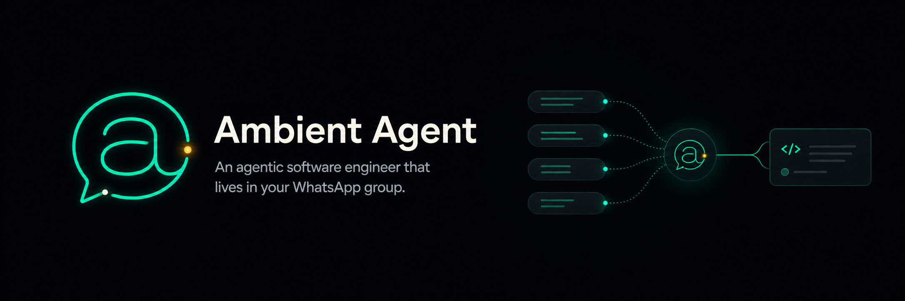
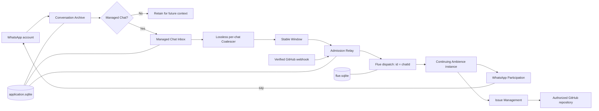

<div align="center">

  

  <h1>Ambient Agent</h1>

  <p><strong>An agentic software engineer that lives in your WhatsApp group.</strong></p>

  <p>
    Ambient Agent follows the team conversation, remembers the work, decides when to contribute,
    and uses explicit capabilities to move software forward like a regular teammate.
  </p>

  <p>
    <a href="https://www.npmjs.com/package/ambient-agent"></a>
    <a href="https://github.com/AaronAbuUsama/whatsappd-github-agent/actions/workflows/ci.yml"></a>
    
    
    <a href="./LICENSE"></a>
  </p>

</div>

> [!WARNING]
> Ambient Agent is a super-alpha release. It proves the smallest useful version of the product: a continuing
> WhatsApp participant with durable GitHub Issue Management. Use a WhatsApp account and GitHub repository you can
> safely test with.

## What is Ambient Agent?

Ambient Agent is an experimental, extensible agentic engineer for WhatsApp. Add it to a group where software work is
already being discussed and it becomes part of that conversation: it reads the shared context, retains useful working
memory, stays quiet when it has nothing to add, and acts when the team needs help.

Today, that help is deliberately narrow. Ambient Agent can develop a bug report or feature request with the group,
search for duplicates, create and organize a GitHub issue, participate in its discussion, and close or reopen it. Issue
Management is the first complete Capability, not the final product.

The direction is a complete ambient software-delivery teammate:

| Capability             | Status        | Intended contribution                                                                 |
| ---------------------- | ------------- | ------------------------------------------------------------------------------------- |
| WhatsApp Participation | Available now | Follow a Managed Chat, use its history, remain private, or Say once when useful       |
| Issue Management       | Available now | Develop, find, create, correct, discuss, close, and reopen authorized GitHub issues   |
| Code Review            | Next          | Read pull requests, checks, and discussion; review changes and report actionable work |
| Implementation         | Planned       | Take a ready issue, change code, run checks, and open a pull request                  |
| Planning               | Planned       | Turn product intent into structured, sequenced, reviewable work                       |
| Delivery               | Planned       | Coordinate readiness and releases while preserving explicit human approval            |
| Cross-chat memory      | Planned       | Connect relevant context across conversations without weakening chat isolation        |

The goal is not an autonomous black box that silently owns production. It is a visible team member that can carry work
from intake to implementation and review, while keeping consequential approval boundaries explicit. In particular,
merge authority remains a human decision until a narrower, auditable policy is deliberately designed.

## What makes it ambient?

Most chat agents wait for a command, answer once, and forget. Ambient Agent is designed around a different pattern.

### It participates without requiring invocation

Every accepted message in a Managed Chat is processed. A mention or direct question can make a Window flush
immediately, but no wake word is required. Ambience decides whether a contribution would help.

### It is one continuing presence

Each Managed Chat is mapped to one continuing Ambience instance using the WhatsApp `chatId`. Later messages return to
the same canonical context rather than creating isolated one-shot conversations.

### It is private by default

The model's ordinary prose is private working context. Nothing is posted back to WhatsApp unless Ambience explicitly
calls the chat-bound `say` Tool. Thinking and speaking are different operations.

### It listens at conversation speed

A per-chat Coalescer turns bursts of messages into stable, lossless Windows. Ambience reads the conversation as a
sequence of meaningful moments instead of being interrupted once per message.

### It acts through named Capabilities

Ambience does not receive one universal command Tool. Each kind of work arrives as a cohesive Capability: a versioned
Skill explains the judgment and policy, typed Tools provide direct abilities, and provider adapters remain private.

This is the reusable design pattern. The current product applies it to software delivery in WhatsApp, but the same
Ambient Agent + Capability + Admission pattern can support other ambient agentic systems.

## How it works



The separation is intentional:

| Boundary                       | What it owns                                                                                   |
| ------------------------------ | ---------------------------------------------------------------------------------------------- |
| **Ambience**                   | Conversational judgment and continuing private context                                         |
| **Skill**                      | Versioned process and policy: how to approach a kind of work                                   |
| **Tool**                       | One typed, validated application ability with an observable result                             |
| **Host adapter**               | WhatsApp, GitHub, or another provider's concrete API mechanics                                 |
| **`application.sqlite`**       | Conversation Events, inbox state, Windows, admissions, webhook receipts, and operation ledgers |
| **`flue.sqlite`**              | Canonical Agent streams, accepted submissions, and independent run records                     |
| **Managed credentials**        | WhatsApp session material, GitHub authorization, and ChatGPT OAuth                             |
| **`ambient-agent` executable** | Setup, validation, dependency composition, diagnostics, and foreground runtime lifecycle       |

This structure prevents prompt text from becoming application control flow. Skills can guide behavior without gaining
new powers; Tools can perform effects without deciding when they are appropriate; provider code can change without
rewriting the Agent.

## Install and run

### Requirements

- macOS or Linux
- Node.js 22.19 or newer
- a ChatGPT Plus or Pro account
- a WhatsApp account that can be linked as a companion device
- a fine-grained GitHub token scoped to the repository Ambient Agent may manage

Install the CLI:

```bash
npm install --global ambient-agent
```

Run guided setup:

```bash
ambient-agent init
```

Setup will:

1. open the ChatGPT device-login flow;
2. pair or restore the managed WhatsApp session;
3. synchronize chats and let you choose the Managed Chat;
4. discover or request a GitHub repository and scoped credential;
5. verify the selected services; and
6. show a final review before installing anything.

Then verify and start it:

```bash
ambient-agent status
ambient-agent doctor --live
ambient-agent start
```

`start` runs in the foreground. Use `Ctrl-C` for a clean stop; let systemd or another process manager own background
supervision in a deployment.

No model API key or application `.env` file is required. Ambient Agent owns its managed configuration and credentials.
The default data directory is `~/.ambient-agent` on every platform (ADR 0015). Override it with
`--data-dir <absolute-path>`. An installation created at the former platform-native default
(`~/Library/Application Support/ambient-agent` on macOS, `${XDG_DATA_HOME:-~/.local/share}/ambient-agent` on Linux)
is adopted automatically and atomically on the first run; if both directories exist, the CLI fails closed and
prints both paths.

Useful lifecycle commands:

| Command                       | Purpose                                                                   |
| ----------------------------- | ------------------------------------------------------------------------- |
| `ambient-agent`               | Start setup when unconfigured; otherwise report current status            |
| `ambient-agent init`          | Create a validated managed installation                                   |
| `ambient-agent auth`          | Replace only the managed ChatGPT authorization                            |
| `ambient-agent config`        | Review or change the Managed Chat, repository, token, or runtime port     |
| `ambient-agent start`         | Start the non-interactive foreground runtime                              |
| `ambient-agent status`        | Inspect configuration, databases, credentials, runtime health, and counts |
| `ambient-agent doctor`        | Diagnose installation integrity and unresolved work                       |
| `ambient-agent doctor --live` | Add bounded real GitHub and model readiness checks                        |

For stopped-runtime backup, restore, and Uncertain-work procedures, see
[Ambience recovery](./docs/architecture/ambience-recovery.md).

## Extend Ambient Agent

Capabilities are the canonical extension unit. The two shipped examples live together:

```text
src/capabilities/
├── whatsapp-participation/
│   ├── SKILL.md
│   ├── tools.ts
│   └── whatsapp-port.ts
└── issue-management/
    ├── SKILL.md
    ├── tools.ts
    ├── issue-repository.ts
    ├── operation-store.ts
    └── runtime.ts
```

To add Code Review, for example:

1. Add `src/capabilities/code-review/SKILL.md` with the review policy and its own version.
2. Define provider-neutral review interfaces rather than exposing Octokit objects to the Agent.
3. Add narrowly scoped, typed Tools for direct reads and effects.
4. Put real GitHub mechanics in a private adapter under `src/host/`.
5. Configure the adapter from managed dependencies in `src/app.ts`.
6. Import the Skill and Tool factory in `src/agents/ambience.ts`.
7. Add deterministic contract tests, behavioral Evaluation Scenarios, and separately gated live evidence.

Registration is explicit—there is no dynamic plugin scan:

```ts
import codeReview from "../capabilities/code-review/SKILL.md" with { type: "skill" };
import { createCodeReviewTools } from "../capabilities/code-review/tools.js";

export default defineAgent(({ id }) => ({
  skills: [whatsappParticipation, issueManagement, codeReview],
  tools: [...createWhatsAppParticipationTools(id), ...createIssueManagementTools(), ...createCodeReviewTools()],
}));
```

### Tool, Action, or Workflow?

- Use a **Tool** for a direct typed application function: read a pull request, search issues, add a comment, or Say.
- Use an **Action** when a reusable operation needs its own narrowly instructed agent harness.
- Use a **Bounded Workflow** for independent, inspectable work such as implementing an issue or performing a substantial
  review. A Bounded Workflow finishes or fails and returns control to Ambience; it does not become a second chat
  participant.

The stable base currently ships Tools only. Actions and software-delivery Bounded Workflows are extension seams, not
hidden features.

### Rules that keep extensions trustworthy

- Bind chat-specific Tools to `chatId` when constructing them; do not accept an arbitrary chat ID from the model.
- Keep Instructions short. Put changing process and policy in versioned Skills.
- Keep provider clients behind Capability-owned interfaces.
- Give every external mutation an application-owned Operation Identity before crossing the provider boundary.
- Never turn a lost response into an automatic retry. Observe first; preserve an honest `Uncertain` state when causation
  cannot be proven.
- Store application facts in `application.sqlite`; let Flue exclusively own `flue.sqlite`.
- Test structural integrity deterministically. Evaluate model judgment separately. Record live provider proof as a third,
  explicit evidence class.

## Memory today and tomorrow

Today, one Managed Chat maps to one continuing Ambience context. WhatsApp history Tools are permanently scoped to that
chat, so one group cannot accidentally reach another group's working context.

The Conversation Archive already retains normalized events observed across the configured WhatsApp account, including
events outside the Managed Chat. Ambience cannot currently search that cross-chat history. Cross-chat and cross-thread
memory will require an explicit Capability with its own authorization, relevance, and privacy rules rather than silently
removing the existing boundary.

## Develop from source

```bash
git clone https://github.com/AaronAbuUsama/whatsappd-github-agent.git
cd whatsappd-github-agent
pnpm install --frozen-lockfile

pnpm run typecheck
pnpm test
GITHUB_WEBHOOK_SECRET=ci-build-only-secret pnpm run build
```

The package exposes `dist/cli/main.js` as the `ambient-agent` executable. To test an exact local artifact rather than the
registry release:

```bash
pnpm pack --pack-destination ./artifacts
npm install --global ./artifacts/ambient-agent-*.tgz
ambient-agent --data-dir "$HOME/.ambient-agent-dev" init
```

Behavioral evaluations run through the same public Flue HTTP interface used by production:

```bash
FLUE_BASE_URL=http://127.0.0.1:3583 pnpm run evals
```

Live model and provider checks are separately gated. They are not substitutes for deterministic tests, and deterministic
green checks are not presented as proof of real provider delivery.

### Releases

Add a Changeset with `pnpm changeset` whenever a pull request changes the published package. After changes merge to
`main`, GitHub Actions maintains a `Release packages` pull request containing the version and changelog. Merging that
reviewed release pull request asks npm to publish through Trusted Publishing; the repository does not store a long-lived
npm token.

npm publishing additionally requires the `ambient-agent` package to trust this repository and
`.github/workflows/release.yml` in npm's package settings. That external binding is not proven by the deterministic test
suite. The first successful live publish is the proof that GitHub OIDC and npm registry acceptance work together. A
Changesets pull request created by `GITHUB_TOKEN` may also require a maintainer to approve its CI run; approve it and wait
for current-head Node 22 and Node 24 checks before merging.

## Documentation

- [Production architecture](./docs/architecture/ambient-agent.md) — the full runtime, ownership, and extension model
- [Architecture decisions](./docs/adr/) — the load-bearing trade-offs in short form
- [Domain language](./CONTEXT.md) — the vocabulary used throughout the product and code
- [Stable-base live receipt](./docs/proof/ambient-agent-stable-base-live.md) — packaged WhatsApp, GitHub, OAuth, and
  process-replacement evidence
- [Ambience recovery](./docs/architecture/ambience-recovery.md) — local durability and operator recovery boundaries

## Current limits

This release does not yet provide pull-request review, implementation Bounded Workflows, planning, delivery automation,
cross-chat Agent memory, media understanding, active-active ownership, horizontal failover, or cross-host recovery. The
supported runtime is one foreground Node process owning one managed local installation.

Ambient Agent uses `whatsappd`, which ultimately connects through the unofficial WhatsApp Web protocol. Automated use
may carry account risk. Use a dedicated account and a repository with appropriately restricted permissions while the
project remains alpha.

## Contributing

The project grows in vertical Capability slices: one useful behavior, its direct abilities, deterministic integrity,
behavioral evaluation, and honest live evidence. Open an issue before broad architectural work so the Capability boundary
and human approval surface are explicit.

## License

[MIT](./LICENSE) © Aaron AbuUsama
