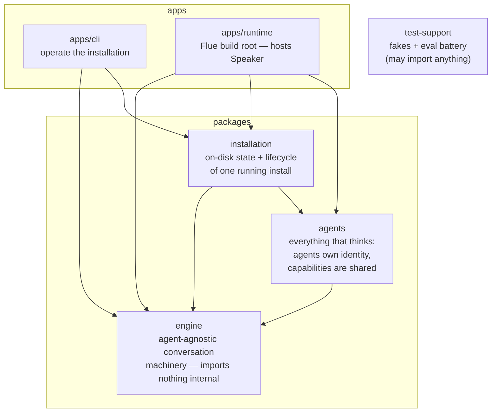
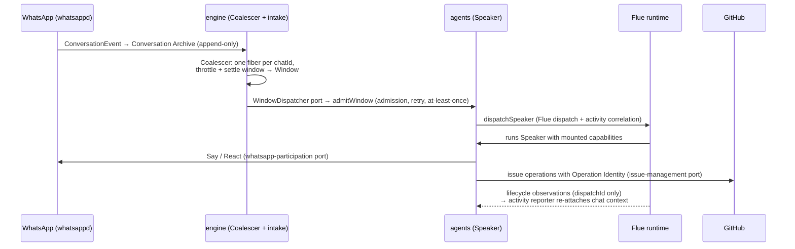

# Architecture map

> This is the **code taxonomy** — which package owns what. For the definitive
> description of how the agentic system *works* (the Brain, Speakers, the Graph, the
> Digest, the control loop), see [`SYSTEM-ARCHITECTURE.md`](./SYSTEM-ARCHITECTURE.md).

The ratified taxonomy (#117 → #131): three packages, two apps, one arrow diagram —
enforced, not aspirational (`tests/speaker/hard-cut.test.ts`).

**Rules** (verbatim from the hard-cut test): engine → nothing internal; agents → engine;
installation → agents+engine; apps/runtime → all packages; apps/cli → installation+engine
(**never** agents); test-support → anything. Additionally: capabilities may never import
from an agent folder, and no package may publish a `./*` wildcard export.

## How a message becomes work

## Where things live — quick answers

- **"Any agent needs this"** → `packages/engine`. Precedent: operation-store and input
  contracts moved down in #131.
- **"A kind of work an agent can do"** → `packages/agents/src/capabilities/<name>/`
  (SKILL.md + tools + port). Shared across agents.
- **"Who an agent is"** → `packages/agents/src/<agent>/` (instructions, composition,
  dispatch).
- **"On-disk state of an install"** → `packages/installation`.
- **Deployables** → `apps/` (cli = operate, server = host). Both are bundled; internal
  packages are compiled in, the server's `package.json` dependency list is the flue-build
  externals manifest.

## Domain vocabulary

`CONTEXT.md` at the repo root is the ratified glossary (Capability, Skill, Window,
Managed Chat, Operation Identity, Uncertain, …). Name things from it; propose additions
there first. For the conceptual system (Brain, Speakers, Graph, Digest, control loop) see
[`SYSTEM-ARCHITECTURE.md`](./SYSTEM-ARCHITECTURE.md).

## Per-package docs

Each workspace has a README: [engine](../packages/engine/README.md) ·
[agents](../packages/agents/README.md) ·
[installation](../packages/installation/README.md) ·
[test-support](../packages/test-support/README.md) ·
[cli](../apps/cli/README.md) · [server](../apps/runtime/README.md)
