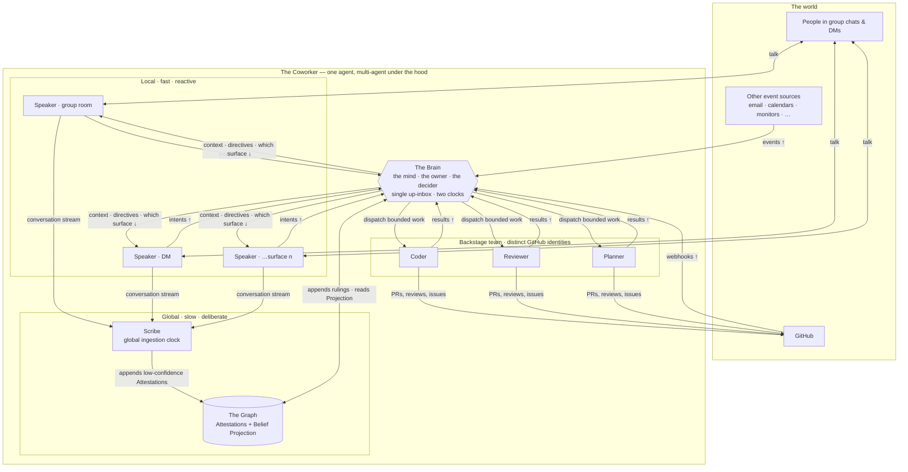
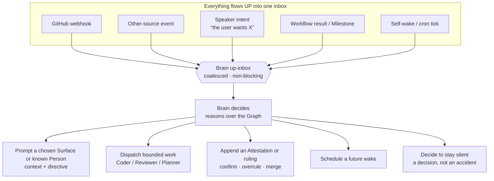
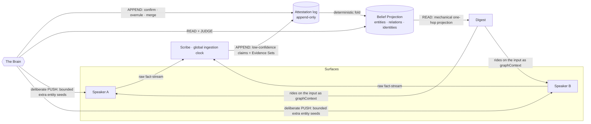
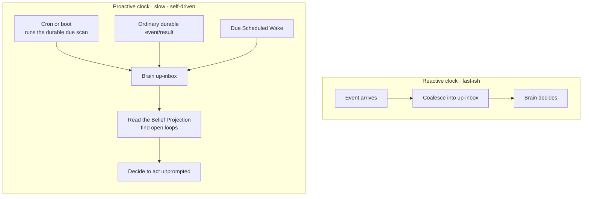
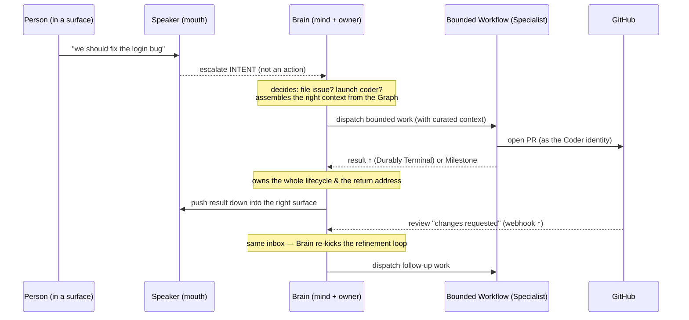

# The Coworker — Definitive System Architecture

This is the canonical description of how the coworker agentic system works, written
from first principles as the definitive pattern — not as a change, a migration, or a
diff against any prior shape. It describes the architecture _as designed_.

Read it as the single source of truth for the **conceptual** system: what the agents
are, what the graph and the digest are, how state is owned, how work flows, and where
the system extends. For **code layout** (which package owns what) see
[`ARCHITECTURE.md`](./ARCHITECTURE.md); for **ratified vocabulary** see
[`CONTEXT.md`](../CONTEXT.md). Where this document evolves a glossary term, §12 says so
explicitly so the language stays cohesive.

> One reading rule: most of this architecture is already realized in code, some of it is
> designed and not yet built. The body describes the definitive system in the present
> tense because that is what it _is_ meant to be. **§13 is the honest map of where the
> implementation stands today and the distance left to close.** Nothing in the body is
> hidden behind "future"; the gap lives in one place.

---

## 1. First principles

Everything below follows from eight principles. If a design question isn't answered by
the sections that follow, answer it by returning to these.

1. **One coworker, many surfaces.** To the people using it, the system is _one_ colleague
   you talk to — with one identity, one memory, one point of view — no matter which chat,
   DM, or channel you reach it through. It is multi-agent under the hood; it is one agent
   in the felt experience. "The coworker" always means the _whole_ system, never any one
   part of it.

2. **Separate deciding from speaking.** The part that _thinks_ and the part that _talks_
   are different things. Thinking is global, deliberate, and slow. Talking is local,
   reactive, and fast. Fusing them produces either a bottleneck or a scatterbrain; keeping
   them apart is the central move of this architecture.

3. **A global mind; local mouths.** There is exactly one mind — the **Brain** — and many
   **Speakers**, each bound to one surface. The Brain owns what is true and what to do.
   A Speaker owns only how to converse in its own room.

4. **State is owned, not scattered.** Durable shared meaning is represented in one
   **Graph** — an append-only Attestation log plus a derived Belief Projection — under one
   authority, the Brain. Knowledge is never a pile of per-chat context that has to be
   reconciled later. There is one ontology and one authority over its interpretation.

5. **Everything flows up; decisions flow down.** The Brain has a single conceptual inbox.
   External events and internal intents both flow _up_ into it. It decides, then pushes
   context, directives, and speech _down_ into surfaces. This one loop is the routing
   story, the delegation story, and the control story at once.

6. **Non-blocking everywhere.** No part of the system waits on another part to make
   progress. A busy chat is fully _processed_ but not replied-to per message. Starting
   work never freezes a conversation. Slow reasoning never stalls fast reaction.

7. **Nothing real is ever dropped.** Every event, intent, result, and open loop has a
   guaranteed home. If something cannot be routed, it lands with the Brain, which is the
   home of last resort. Silence is a decision the Brain makes, never an accident.

8. **Knowledge is tentative by default.** Derived meaning is recorded honestly, not
   certainly. An unresolved fact is a low-confidence memory, not a blocked write — and a
   low-confidence memory is a question the coworker may later ask, whose answer raises the
   confidence. The graph self-heals; it is never a store of truth to be protected.

---

## 2. The system at a glance

The rest of this document defines every box and every arrow.

---

## 3. The core abstractions

Each abstraction has exactly one job. The power of the system is in the _composition_,
so read these as a set, not a list.

### 3.1 The Coworker

The whole system. The product-level identity — the colleague a team talks to. It has one
name, one memory (the Graph), and one felt point of view. It is realized by all the parts
below working together. **No single part is "the coworker."** In particular, the Brain is
not the coworker — it is the coworker's mind.

### 3.2 The Brain (Master Agent)

The single global mind. There is exactly one, process-wide. It is **silent** in that it is
not bound to any surface and never has "its own chat" — but it is not passive: it speaks
_through_ surfaces it chooses, decides _what to do_, and owns all durable work and meaning.
Application stores hold the inbox, Graph, clocks, and work ledgers; the Brain is their domain
authority rather than their persistence mechanism. Its
responsibilities, each detailed later:

- **Owns the Graph** (§5): it is the single authority over the ontology. It appends
  confirm/overrule/merge rulings and reads the resulting Belief Projection; it never
  rewrites another author's Attestation.
- **Runs the control loop** (§4): a single up-inbox receives every event and every
  intent; the Brain decides and pushes down.
- **Runs on two clocks** (§6): reactive (events/intents) and proactive (its own cron
  floor + event wakes + self-scheduling). It can wake itself.
- **Owns all work** (§7): every issue, PR, job, and task is dispatched by the Brain, which
  therefore owns each work item's full lifecycle — including where its result returns and
  when a loop (e.g. a PR needing refinement) must be re-kicked.
- **Chooses the surface and the voice** (§8): whether to say something in a group room, as
  a DM, or across rooms — and which Speaker carries it.

The Brain is deliberately kept _out of every hot path_. It reasons and decides; it does
not sit between a person and a reply, nor between the ingestion clock and a graph write.

### 3.3 Speakers (surface mouths)

A Speaker is a **local, fast, reactive conversational agent bound to exactly one
surface.** Its entire job is to converse well in its own room. It is autonomous within
that room — it reacts to its own messages, on its own fast cadence, holding that
conversation's working context across turns — but it is deliberately _dumb about the
wider world_:

- It does **not** create issues, launch jobs, or write the ontology.
- It does **not** know or decide anything cross-surface.
- When conversation implies work or a cross-surface consequence, it **escalates an intent
  up to the Brain** (§7) rather than acting.

A Speaker holds only transient conversational state; all durable meaning it observes flows
up (to the Brain as intent, and to the Scribe as a fact stream). Speakers have autonomy of
_expression_; the Brain has authority over _substance_.

### 3.4 Surfaces

A **surface** is one place the coworker can listen and speak: a group chat, a direct
message with one person, and — by extension — any future channel (§11). Each surface has
stable application identity and exactly one continuing Speaker. Its provider chat address is
a replaceable **Surface Binding**, not the Surface's identity.

Discovery and authorization are separate. Provider sync may observe and archive any chat but
does not activate it. Operator-configured groups seed the registry. To prompt a Speaker, the
Brain selects either an existing Surface or a known Person. Trusted application code resolves a
Person target to an existing direct Surface or atomically materializes an ordinary direct
Surface as part of that same prompt admission; the model never supplies a raw chat address.
This is one routing operation, not a separate "open Surface" effect or DM lifecycle. Intake and
Say both revalidate an active binding and fail closed. Re-pairing the same provider account
preserves Surface/Speaker identity; replacing the account retires old bindings rather than
silently moving them.

### 3.5 The Scribe (global ingestion clock)

The Scribe is the coworker's **ingestion arm**: one application-owned global clock that
turns raw conversation into proposed Attestations. It reads the fact-stream from _all_
surfaces, forms bounded cross-surface Scribe Batches, and runs bounded concurrent stateless
extraction attempts. Each attempt receives all required context and appends low-confidence
claims with trusted Evidence Sets. It never speaks, holds no external identity or private
memory, and writes _proposals_, not verdicts — the Brain owns integration and rulings.

The Scribe is the busiest, most expensive worker in the system (it runs on the raw
message firehose and must derive meaning), which is exactly why its clock is **global**:
live ingestion and Historical Replay form globally ordered cross-surface batches, while
bounded concurrency prevents one slow extraction from becoming a throughput bottleneck.

### 3.6 The Graph (the owned ontology)

The Graph is the coworker's **single durable memory**: an append-only log of Attestations
and a deterministic Belief Projection folded from them. It is the derived-meaning layer
above the raw sources (the Conversation Archive locally, providers such as GitHub
remotely), never the source of truth. It holds what the coworker needs cheaply that those
sources cannot answer: **who is who across platforms, what connects to what, the social
facts no external system records, and the permanent evidence trail behind every belief.**
Detailed in §5.

### 3.7 The Digest (context projection)

The Digest is **not a stored thing and no one deliberately pushes it by default** — it is a
live read-projection of the Graph, computed fresh for a Speaker turn from the identities in
view. It is the cheap, automatic way a Speaker gets relevant memory without asking. The
Brain, when it deliberately pushes, stores only a bounded selection of extra entity seeds;
trusted code recomputes and merges them through the same projector and `graphContext` pipe.
Detailed in §5.4 — the default pull and the Brain's push are one mechanism at two intensities,
not a cached second payload.

### 3.8 Specialists and Bounded Workflows (the backstage team)

Durable work runs in **Bounded Workflows** — finite, autonomous units of work with
validated input, their own run record, and a terminal result. A **Specialist** is the
narrowly-instructed agent inside one such workflow (the Coder, the Reviewer, the Planner).
Specialists are the coworker's **team**: they show up on GitHub as _distinct identities on
purpose_ — the coworker gets work done through a visible team — while the coworker as a
whole remains one felt identity to the people it talks to. A workflow does not pause for
conversation; its result, failures, and rare Milestones return _up to the Brain_.

### 3.9 The Coalescer (the timing layer, no model)

The Coalescer is pure timing with no intelligence. It answers one question — _when has
enough happened to act?_ — and it answers it in two places: for each Speaker (batch a
burst of chat into one Window; an @-mention fires immediately) and for the global Scribe
(batch the fact-stream on a laggy cadence with no immediate-fire). It never decides _what_
to do, only _when_ a batch is ready. Keeping timing modelless is what makes the system
non-blocking and cheap.

---

## 4. The control loop — one up-inbox, push down

The heart of the system is a single loop. Read it and principles 5–7 fall out.

**Why one inbox.** External events (a webhook, a monitor alert) and internal intents (a
Speaker saying "the user wants a bug filed") are the _same kind of thing_ from the Brain's
point of view: something happened that may require a decision. Collapsing them into one
inbox is what makes routing, delegation, and control one mechanism instead of three.

**Why non-blocking.** The up-inbox is coalesced (§9) and the Brain reasons off every hot
path. A person waiting for a reply waits on their Speaker, not the Brain. A Speaker
escalating an intent does not block on the Brain's decision — dispatching work is
off the conversational hot path, so the extra hop costs nothing a person can feel.

**Why nothing drops.** Because the Brain is the home of last resort. An event that
correlates to no surface still lands in the inbox; the Brain decides where it belongs
(route it, DM someone, open a loop, or deliberately hold it). "Uncorrelated" is a decision
the Brain makes, never a silent discard.

**How one decision settles.** Trusted application code claims a bounded immutable set of
ready inbox items as one Brain Batch. New arrivals wait for another Batch; crash recovery
reuses the open Batch and exact membership. The Brain chooses consequences through separate
typed tools. Asynchronous Brain Effects are first recorded in an application-owned durable
outbox, then delivered at least once to the existing Speaker or workflow seam with stable
application identity. Local effects such as appending an Attestation or creating a Scheduled
Wake may complete in the same database transaction that records them. Final settlement reads
those application records and atomically settles the Batch plus exactly its claimed inputs;
the model never serves as the receipt ledger.

**How speech flows down.** The Brain sends an authoritative Directive to one selected
Surface's Speaker. It carries a bounded Brief whose important items link to immutable source
evidence. The Speaker must attempt the objective and owns wording and local expression. A
delivered message, known failure, ambiguous delivery, or a Speaker turn that settles without
Saying produces a durable Directive Outcome back to the Brain. Directive input is instruction,
not conversation evidence, so it never enters the Scribe stream.

The Brain selects a stable `surfaceId`, never a provider chat id or an originating chat return
address. Immediately before dispatch and Say, the application resolves and authorizes the
current Surface Binding. Each logical Say records a Surface Delivery before crossing the
provider boundary; provider acknowledgment plus its outbound Conversation Archive event proves
delivery, while an ambiguous result remains Uncertain and is never blindly retried.

---

## 5. State and knowledge — the Graph, the Scribe, the Digest

This is the part of the system most worth getting exactly right, because "global context"
lives here and it is easy to muddle. There are three distinct roles around one hub.

### 5.1 What the Graph holds

The Graph has two parts in one application-owned durable store beside the raw conversation
record:

- **Attestation log** — immutable claims of the form
  `{author, claim, confidence, evidenceSet, timestamp}`. The author is the Scribe, a
  deterministic ingester, or the Brain. Correction and disagreement append another
  Attestation; no claim or provenance is updated or deleted.
- **Belief Projection** — the current typed ontology of entities, relations, and
  cross-platform identities, deterministically folded from the log. It is the only ordinary
  Graph read surface and can be rebuilt from Attestations.

The projection contains:

- **Entities** — typed nodes: Person, Agent, Thread, Topic, Commitment, Repository, Issue,
  PullRequest, Project, Milestone, Goal, with the properties and derived confidence currently
  supported by their Attestations.
- **Relations** — typed directed edges (`discusses`, `works_on`, `made_by`, `blocks`,
  `resolves`, `part_of`, `advances`, …). Every relation exists to power a named read; facts a
  raw source already serves fresh are not duplicated as Graph truth.
- **Cross-platform identity** — one real actor is one node, however many platform handles
  it has. Claims and Brain merge rulings cause a WhatsApp sender and a GitHub login to
  converge on one projected entity. _That convergence is the cross-thread memory._

### 5.2 Confidence — knowledge is tentative by design

Every Attestation carries its author's 0–1 confidence in that one claim. The Belief
Projection derives current confidence from independent supporting Evidence Sets; retrying or
re-reading the same evidence does not amplify belief. Brain rulings are authoritative inputs
to the fold without erasing the observations they confirm or overrule.

Low confidence is not a defect — it is a _question the coworker may raise_. A later answer
adds new evidence and another Attestation. This keeps ingestion honest and fast: the Scribe
never blocks on ambiguity, and the full reasoning trail remains inspectable.

### 5.3 Provenance — every fact knows where it came from

Every Attestation carries a non-empty Evidence Set of immutable raw-source references: which
surface and message, which external delivery, or which provider record. Trusted application
code resolves those references; the model does not invent them. Because the log is
append-only, provenance is permanent rather than overwritten by a later observation.

Provenance is first-class because the Brain reasons _across sources_. It must know whether a
belief came from a group, a DM, a webhook, or another provider both to weigh it and to decide
where a consequence belongs. As the system gains sources (§11), Evidence Sets keep one Graph
coherent across all of them.

### 5.4 The Digest — pull by default, push by decision

The Digest is a **read-projection of the Graph, filtered to what a turn needs**. It exists
at two intensities that share one pipe:

- **Mechanical pull (the default).** On every Speaker turn, deterministic code — _no model,
  no cache_ — seeds from the identities already in view, walks one hop out of the Graph,
  and staples the result onto the Speaker's input. Recomputed live every turn, so a fact
  another surface's ingestion wrote seconds ago is visible now. This is the cheap,
  automatic "relevant memory, for free" that keeps Speakers dumb but not ignorant. Nobody
  decides to send it; it is a live query.
- **Deliberate push (when the Brain acts).** When the Brain routes an event, relays
  cross-surface information, or nudges an open loop, it selects a small bounded set of extra
  entity ids with the Directive. At delivery, trusted code recomputes the normal pull and
  those extra seeds from one Belief Projection version, unions them by stable entity/relation
  identity, and attaches the result through the **same `graphContext` channel**. The model
  never authors Graph rows, confidence, provenance, traversal depth, or a serialized Digest.

The target `graphContext` records its schema version, Projection high-water mark, generation
time, pull/push seed selection, supporting Attestation ids, and any deterministic truncation.
Push uses the existing one-hop walk and named secondary roll-ups; arbitrary depth is not an
escape hatch. The durable Directive stores only seed selection. The computed Digest remains
ephemeral and is recomputed after restart, so it cannot become a stale cache.

Understanding this collapses the earlier confusion: "the digest" and "the Brain pushing
context" are not two systems. They are one context-injection mechanism, one seeded by a fixed
rule and one extended by a decision. The Directive's Brief remains separate: it preserves the
causal source evidence for _this decision_, while Digest is current ambient ontology and may
legitimately change before delivery.

### 5.5 Who appends vs who rules — single _authority_, multiple authors

The Scribe, deterministic ingesters, and Brain are all Attestation authors, but only the Brain
authors rulings:

- A **Scribe attempt appends proposals** off the Brain's clock: low-confidence claims backed
  by trusted Evidence Sets. Concurrent attempts do not coordinate or learn from one another;
  their durable deltas enter the Brain's up-inbox.
- A **deterministic ingester appends anchored claims** from provider records when no model
  judgment is required.
- The **Brain appends rulings** — confirm, overrule, merge — while integrating deltas on its
  own clock. A ruling changes the Belief Projection, never another author's history.

The distinction that matters is authority, not sole write access. Making the Brain extract
every proposal would put it in the ingestion hot path. Allowing proposals to overwrite current
state would destroy provenance. Append-only authorship plus one ruling authority avoids both.

---

## 6. The two clocks — reactive and proactive

A Speaker has one clock: it reacts to its room. The Brain has two, and the second is what
makes the coworker _self-driving_ rather than merely responsive.

- **Cron floor.** Deployment cron and boot run the same application-owned sweep. It admits
  one coalesced Proactive Sweep when none is outstanding and admits every due Scheduled Wake;
  it never calls the Brain directly. The floor guarantees liveness if event wiring misses
  something.
- **Event wakes.** Ordinary durable events and workflow outcomes already wake the Brain by
  entering its up-inbox. No Graph watcher is required. `overdue` remains a derived read signal
  the Brain observes during a normal decision or Proactive Sweep.
- **Self-scheduling.** The Brain may create an independently durable Scheduled Wake ("check
  this loop in two hours"). A process timer is only a liveness hint; the application database
  is the source of truth, and boot reconciliation preserves the wake across a crash.

The proactive clock is where the coworker's _initiative_ lives: chasing an overdue
commitment, following up on an open loop, noticing that two surfaces need to be connected.
It runs at a deliberately slower cadence than any Speaker — reasoning is not conversation.

---

## 7. Work — everything routes through the Brain

The coworker's _doing_ (as opposed to its _talking_) is centralized in the Brain. A Speaker
never launches work; it escalates intent. The Brain owns every work item end to end.

**Why centralize.** Three things fall out of routing all work through the Brain, and the
third is the decisive one:

1. **Speakers stay dumb.** Removing issue-creation and job-launching from the mouth is what
   makes "the Speaker only converses" true rather than aspirational.
2. **The Brain owns the context that goes into work.** It assembles a job's context from
   the Graph it owns — the mouth never had the whole picture anyway.
3. **The Brain owns every loop.** A PR that comes back needing refinement must be re-kicked
   _somehow_. Because the result returns up to the same inbox that launched it, the Brain —
   the one place with provenance, return routing, and the full ontology — owns the entire
   PR/issue/job lifecycle, including re-dispatch. Control of a loop lives where the whole
   picture lives.

**Cost of centralizing** (paid honestly): the Speaker needs one seam — _escalate an intent
without acting_ — inverting a direct tool call into an upward signal. The latency of the
extra hop is irrelevant: launching work is off the conversational hot path and the work
itself takes minutes. Everything else (the Brain being the owner, tracking return
addresses) is already inherent to the Brain's role.

**No-drop under failure.** A launched job that dies without delivering is reconciled: on
boot, any unsettled launch becomes an explicit "interrupted" result the Brain surfaces —
so a crash mid-job is told, never silently lost. This is the same "nothing real is ever
dropped" guarantee (principle 7) applied to work.

---

## 8. Communication and identity — one face, a visible team

Two identity facts hold simultaneously, and the architecture is built to keep both true:

- **To the people it talks to, the coworker is one identity.** One name, one memory, one
  point of view, across every surface. A DM with it and a group room with it are the same
  colleague. This is delivered by the single Brain + single Graph behind all the mouths —
  the Speakers are voices, not separate selves.
- **On GitHub, the team is deliberately distinct.** The Coder, Reviewer, and Planner act
  under their own identities on purpose — the coworker "gets work done through its team,"
  and that team is visible. The backstage multiplicity and the front-of-house singularity
  are not in conflict; they are two views of one system.

The Brain chooses **surface and voice** as part of every decision (§4, D1): say it in the
group room, continue a DM with a specific person, or carry information across rooms. Because a
surface is just a place with a Speaker, "DM someone" and "reply in the group" share one prompt
operation. The target is either an existing stable Surface or a known Person whom trusted code
resolves to the same ordinary Surface registry during prompt admission. Configured groups remain
operator-authorized. Discovery alone never grants participation, and a source Surface is
provenance rather than a forced return address.

Note that no infrastructural role _is_ the identity. Owning a webhook secret, or filing
issues under a particular app, are jobs done by parts of the team; they are not the
coworker's face. The felt identity is the whole coworker, spoken through whichever surface
the Brain chose — never any single backstage app.

---

## 9. How non-blocking is achieved

Principle 6 is load-bearing and worth making concrete. Non-blocking is achieved by three
independent mechanisms, each modelless where it can be:

- **Coalescing** absorbs bursts into batches, so volume never turns into a per-message
  storm — for both Speakers (Windows) and the Scribe (the global fact-stream). Timing
  carries no model, so it is instant and cheap.
- **Off-hot-path reasoning.** The Brain sits on no hot path. A person waits on a Speaker; a
  Speaker escalates without blocking; ingestion writes without waiting on the Brain; the
  Brain reasons on its own clock.
- **Asynchronous work with durable return.** Bounded work is dispatched and forgotten; its
  result returns up to the inbox when Durably Terminal. Nothing waits synchronously on a
  job, and nothing is lost if one dies.

---

## 10. Invariants — what must always hold

These are the properties any change must preserve. They are the first principles restated
as testable guarantees.

| Invariant                  | What it means                                                         | How the architecture secures it                                                 |
| -------------------------- | --------------------------------------------------------------------- | ------------------------------------------------------------------------------- |
| **One identity**           | The coworker feels like one colleague across all surfaces             | Single Brain + single Graph behind all Speakers (§8)                            |
| **Single authority**       | Exactly one owner of durable meaning                                  | Brain alone authors rulings; other authors append evidence-backed claims (§5.5) |
| **Non-blocking**           | No part waits on another to progress                                  | Coalescing + off-hot-path Brain + async work (§9)                               |
| **No silent drop**         | Every event, intent, result, loop has a home                          | Brain is the home of last resort; jobs reconcile on boot (§4, §7)               |
| **Provenance-complete**    | Every derived fact knows its origin                                   | Every Attestation has a permanent non-empty Evidence Set (§5.3)                 |
| **Self-healing knowledge** | Ambiguity never blocks; the graph corrects itself                     | Append-only claims + derived confidence + Brain rulings (§5.2, §5.5)            |
| **Dumb mouths**            | Speakers converse only; they never act or own state                   | Work + ontology authority live in the Brain (§3.3, §7)                          |
| **Fail-closed surfaces**   | Observation never silently grants participation                       | Active account-scoped binding is revalidated at intake and Say (§3.4, §8)       |
| **Honest delivery**        | Provider acknowledgment, known failure, and ambiguity remain distinct | Surface Delivery + Conversation Archive evidence + Uncertain (§4)               |

---

## 11. Extension points — how the system grows without changing shape

The architecture is designed so that growth is _additive_. New capability slots into an
existing seam; it does not reshape the core. The canonical growth axes:

- **New surface types** (email, Slack, SMS, a web dashboard). A surface is "a place with a
  Speaker." A new channel is a new Speaker type bound to a new surface kind, registered in
  the surface registry. The Brain, Graph, and control loop are untouched — the Brain gains
  a new place it _can_ choose to speak.
- **New event sources** (monitors, calendars, CI, external webhooks). Everything already
  flows _up_ into one inbox. A new source is a new arrow into that inbox (§4). Provenance
  (§5.3) keeps the resulting facts coherent with the rest of the Graph. No new routing
  concept is needed — routing is "the Brain decides," and it already does.
- **New backstage agents / capabilities** (a Designer, a Researcher, a Deployer). A new
  kind of durable work is a new Bounded Workflow with its own Specialist and GitHub
  identity, dispatched by the Brain like any other. The team grows; the front stays one
  face (§8).
- **New ontology** (entity/relation types). The Graph is typed but the type set is a
  boundary concern, not a structural one — new entity and relation types extend the
  ontology the Scribe proposes and the Brain curates, without changing how any of them
  flow.
- **Multiple projects per surface, or multiple surfaces per project.** Because work routes
  through the Brain and the Graph relates surfaces to repositories/projects explicitly, the
  mapping of "which surface cares about which project" is data in the Graph, not
  hard-wired configuration — the Brain resolves it per decision.

If a proposed extension seems to require reshaping the core loop, that is a signal the
extension is fighting the architecture — re-derive it from §1 first.

---

## 12. Language — how this evolves the ratified glossary

This document reuses [`CONTEXT.md`](../CONTEXT.md) vocabulary verbatim wherever it can
(the Graph, Entity, Relation, Confidence, Provenance, Commitment, Cross-platform identity,
Managed Chat, Surface Inbox, Window, Coalescer, Capability, Skill, Tool, Surface-bound Tool,
Bounded Workflow, Specialist,
Admission, Operation Identity, Durably Terminal, Milestone). It introduces or sharpens a
few terms, which should be ratified back into `CONTEXT.md`:

- **The Coworker** — the whole system as one felt identity. Supersedes any usage that
  treated a single per-chat instance as "the agent." The coworker is the _whole_, never a
  part.
- **The Brain (Master Agent)** — the single global mind, owner, and decider. New;
  the anchor of this architecture.
- **Speaker** — the surface-bound conversational mouth. Sharpens the older per–Managed-Chat
  instance ("Ambience"): it is now explicitly _a mouth, not the whole_, and explicitly
  _dumb_ (converses only; escalates intent; never acts or owns state).
- **Surface / Surface Binding / Surface Delivery** — stable application identity for one
  authorized place with a Speaker; its account-scoped provider address; and durable evidence
  for one logical Say. Discovery is observation, never authorization.
- **Scribe** — sharpened from "silent _per-thread_ agent" to one global ingestion clock
  driving bounded concurrent stateless attempts. Its role is to append evidence-backed
  proposals, never own memory or authority.
- **Attestation / Evidence Set / Belief Projection** — the Graph's persistence and read
  vocabulary. Claims are append-only; current understanding is a rebuildable projection.
- **Digest** — one versioned read-projection over one `graphContext` channel. Mechanical pull
  supplies local seeds; deliberate push supplies bounded extra seeds and is recomputed live.
- **Intent escalation** — a Speaker signalling the Brain that conversation implies work or
  a cross-surface consequence, without acting on it.
- **Brain Batch / Brain Effect** — the durable decision boundary and one typed consequence
  leaving it through application-owned admission, distinct from a model turn or Flue id.
- **Scheduled Wake / Proactive Sweep** — durable exact reconsideration and the coalesced
  liveness floor; neither is a process timer or a second queue.

---

## 13. Where we are today, and the distance to close

The architecture above is definitive. This section is the honest map of the current
implementation against it — kept in one place so the body can describe the system as it is
meant to be. "Distance" is descriptive, not a plan.

| Abstraction                         | Definitive architecture                                                                | Where the code is today                                                                                                                                                                                                                                                                                                                                                                                                                                                           | Distance                                                                                                                |
| ----------------------------------- | -------------------------------------------------------------------------------------- | --------------------------------------------------------------------------------------------------------------------------------------------------------------------------------------------------------------------------------------------------------------------------------------------------------------------------------------------------------------------------------------------------------------------------------------------------------------------------------- | ----------------------------------------------------------------------------------------------------------------------- |
| **Graph**                           | Append-only Attestation log + derived Belief Projection                                | Current `packages/engine/src/graph/store.ts` is a **mutable current-state store**: entity/relation upserts overwrite provenance and fold confidence in place                                                                                                                                                                                                                                                                                                                      | **Replace mutable writes with Attestation inserts; derive the existing read shape as the Belief Projection**            |
| **Digest**                          | Versioned live projection; local pull + bounded Brain-selected seeds, one channel      | Pull side built: `graph/digest.ts` (live one-hop, no cache) attached at the funnel by `capabilities/graph/digest.ts`; current shape lacks Projection version/evidence/caps and the funnel replaces rather than composes context                                                                                                                                                                                                                                                   | **Extend the existing projector/shape and compose at the funnel; persist only Directive seed selection**                |
| **Scribe**                          | One global clock; bounded concurrent stateless attempts; per-Attestation Evidence Sets | Built but **per-chat**: `scribe/coalescer.ts` forks one loop per chatId. Provenance is implicit per batch and writes target the mutable Graph                                                                                                                                                                                                                                                                                                                                     | **Build global live/replay batching; push full context into each attempt; append evidence-set-idempotent proposals**    |
| **Speaker**                         | Dumb mouth: converses only, escalates intent                                           | Intent escalation and Directive-only Saying are built (`intent-escalation/*`, `directive-delivery/*`), but the Speaker remains **overloaded**: it still mounts issue-management + delegation and holds ontology-write authority (`speaker/agent.ts`)                                                                                                                                                                                                                              | **Remove issue/delegation/ontology-write from the Speaker**                                                             |
| **Brain**                           | Single global mind: up-inbox, two clocks, owns state + work                            | The reactive global actor now exists: immutable Intents and Batches, one `global` Flue instance, durable prompt/silence effects, recovery, and next-Batch wake (`brain/*`). It does not yet own GitHub work, ontology rulings, or proactive time                                                                                                                                                                                                                                  | **Move routing, work-dispatch, and ontology curation onto the Brain; add the proactive clock**                          |
| **Control loop**                    | One up-inbox; events + intents up; push down                                           | The conversation path is built: Speaker Intent → durable Brain inbox/Batch → Directive or deliberate silence → selected Speaker, with durable delivery Outcome. GitHub ingress still **broadcasts to every surface**, and uncorrelated events are still **dropped** (`ingress.ts`)                                                                                                                                                                                                | **Route GitHub events/results through the same Brain-owned up-inbox**                                                   |
| **Two clocks**                      | Reactive + proactive (cron floor + event wakes + self-schedule)                        | Only the reactive clock exists. Overdue commitments are _flagged_ in the digest but nothing acts on them                                                                                                                                                                                                                                                                                                                                                                          | **Add the proactive clock**; reuse the durable-ledger + boot-sweep pattern for self-scheduled wakes                     |
| **Surfaces**                        | Stable registry + account-scoped bindings + one Speaker + durable delivery evidence    | Configured group/DM JIDs seed stable account-scoped Surfaces; Brain prompts select a Surface UUID and trusted code resolves its active binding. Each Directive Say records before transport and settles as delivered/failed/Uncertain from provider + Archive evidence (`surfaces/registry.ts`, `surfaces/delivery.ts`). The Flue Speaker id is still the provider chat JID, known-Person target resolution is absent, and specialist return remains hard-coded to the first chat | **Resolve known-Person targets through the registry and remove the remaining first-chat/provider-id routing shortcuts** |
| **Work / delegation**               | All work dispatched by the Brain; Brain owns each lifecycle incl. refinement           | Async delegation + durable return + boot reconciliation are built and solid (`capabilities/delegation/*`), but launched **by the Speaker**, returning to the launching **chat**                                                                                                                                                                                                                                                                                                   | **Move the launcher to the Brain**; return address becomes the Brain, which owns the loop                               |
| **Specialists / Bounded Workflows** | Backstage team, distinct GitHub identities, results up                                 | Built and matches (Coder/Reviewer/Planner as Specialists; distinct app identities)                                                                                                                                                                                                                                                                                                                                                                                                | **None** conceptually — rewire the launcher/return only                                                                 |
| **Coalescer**                       | Modelless timing for Speakers and Scribe                                               | Built and matches: `engine/src/coalescer/*` (Speaker Windows + Scribe batch)                                                                                                                                                                                                                                                                                                                                                                                                      | **None** — the Scribe instance goes global (see Scribe row)                                                             |

**Reading the distance.** The load-bearing implementation primitives already exist: the
typed Graph read surface, live Digest pull, reactive Brain conversation loop, asynchronous
delegation with durable return, and modelless coalescing. Two corrections remain. First,
finish concentrating routing, work, and ontology authority in the Brain. Second, stop
mutating Graph beliefs in place: preserve
the current query surface as a derived Belief Projection over append-only Attestations. The
distance is still mostly concentration of authority and honest persistence boundaries, not a
parallel replacement platform.
