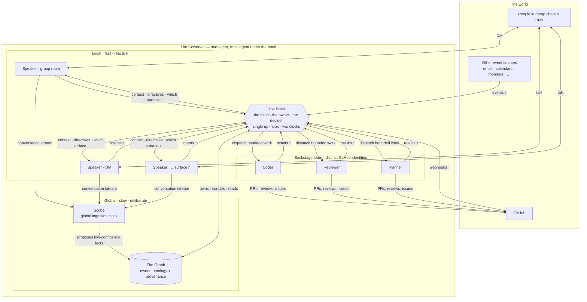
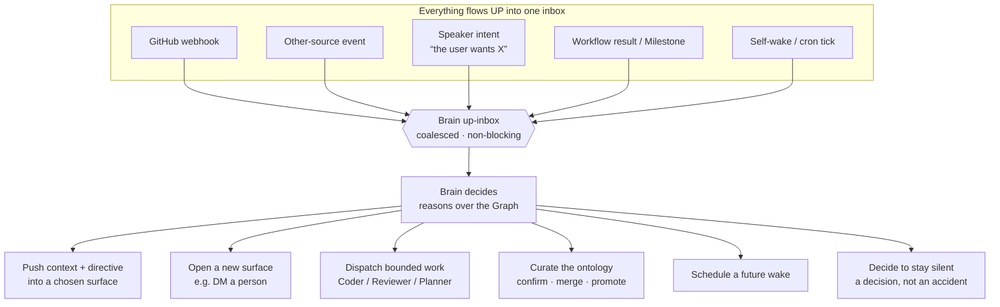
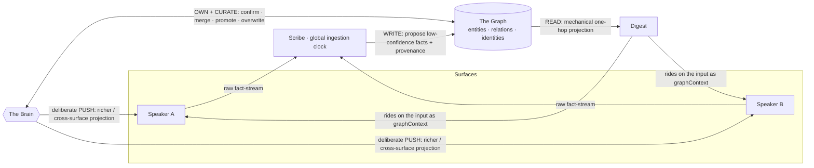
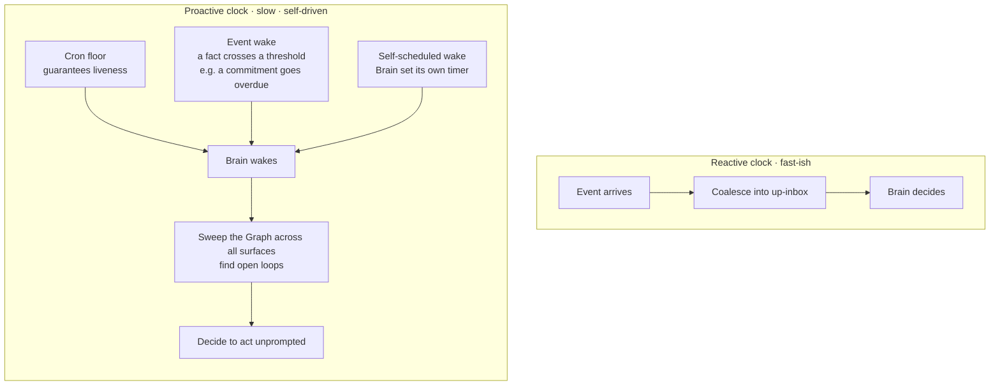
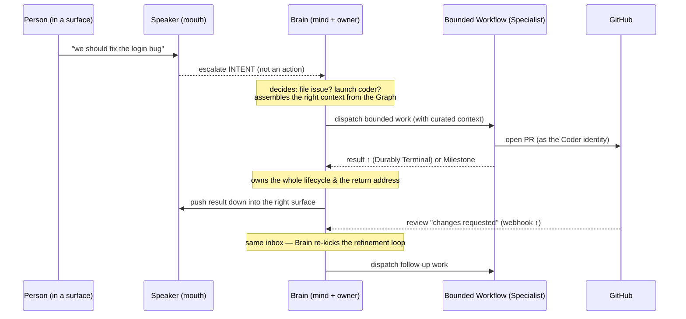

# The Coworker — Definitive System Architecture

This is the canonical description of how the coworker agentic system works, written
from first principles as the definitive pattern — not as a change, a migration, or a
diff against any prior shape. It describes the architecture *as designed*.

Read it as the single source of truth for the **conceptual** system: what the agents
are, what the graph and the digest are, how state is owned, how work flows, and where
the system extends. For **code layout** (which package owns what) see
[`ARCHITECTURE.md`](./ARCHITECTURE.md); for **ratified vocabulary** see
[`CONTEXT.md`](../CONTEXT.md). Where this document evolves a glossary term, §12 says so
explicitly so the language stays cohesive.

> One reading rule: most of this architecture is already realized in code, some of it is
> designed and not yet built. The body describes the definitive system in the present
> tense because that is what it *is* meant to be. **§13 is the honest map of where the
> implementation stands today and the distance left to close.** Nothing in the body is
> hidden behind "future"; the gap lives in one place.

---

## 1. First principles

Everything below follows from eight principles. If a design question isn't answered by
the sections that follow, answer it by returning to these.

1. **One coworker, many surfaces.** To the people using it, the system is *one* colleague
   you talk to — with one identity, one memory, one point of view — no matter which chat,
   DM, or channel you reach it through. It is multi-agent under the hood; it is one agent
   in the felt experience. "The coworker" always means the *whole* system, never any one
   part of it.

2. **Separate deciding from speaking.** The part that *thinks* and the part that *talks*
   are different things. Thinking is global, deliberate, and slow. Talking is local,
   reactive, and fast. Fusing them produces either a bottleneck or a scatterbrain; keeping
   them apart is the central move of this architecture.

3. **A global mind; local mouths.** There is exactly one mind — the **Brain** — and many
   **Speakers**, each bound to one surface. The Brain owns what is true and what to do.
   A Speaker owns only how to converse in its own room.

4. **State is owned, not scattered.** All durable meaning lives in one place — the
   **Graph** — under one owner, the Brain. Knowledge is never a pile of per-chat context
   that has to be reconciled later. There is one ontology, and one authority over it.

5. **Everything flows up; decisions flow down.** The Brain has a single conceptual inbox.
   External events and internal intents both flow *up* into it. It decides, then pushes
   context, directives, and speech *down* into surfaces. This one loop is the routing
   story, the delegation story, and the control story at once.

6. **Non-blocking everywhere.** No part of the system waits on another part to make
   progress. A busy chat is fully *processed* but not replied-to per message. Starting
   work never freezes a conversation. Slow reasoning never stalls fast reaction.

7. **Nothing real is ever dropped.** Every event, intent, result, and open loop has a
   guaranteed home. If something cannot be routed, it lands with the Brain, which is the
   home of last resort. Silence is a decision the Brain makes, never an accident.

8. **Knowledge is tentative by default.** Derived meaning is recorded honestly, not
   certainly. An unresolved fact is a low-confidence memory, not a blocked write — and a
   low-confidence memory is a question the coworker may later ask, whose answer raises the
   confidence. The graph self-heals; it is never a store of truth to be protected.

---

## 2. The system at a glance

The rest of this document defines every box and every arrow.

---

## 3. The core abstractions

Each abstraction has exactly one job. The power of the system is in the *composition*,
so read these as a set, not a list.

### 3.1 The Coworker

The whole system. The product-level identity — the colleague a team talks to. It has one
name, one memory (the Graph), and one felt point of view. It is realized by all the parts
below working together. **No single part is "the coworker."** In particular, the Brain is
not the coworker — it is the coworker's mind.

### 3.2 The Brain (Master Agent)

The single global mind. There is exactly one, process-wide. It is **silent** in that it is
not bound to any surface and never has "its own chat" — but it is not passive: it speaks
*through* surfaces it chooses, decides *what to do*, and *owns all durable state*. Its
responsibilities, each detailed later:

- **Owns the Graph** (§5): it is the single authority over the ontology — it curates,
  confirms, merges, and can overwrite anything.
- **Runs the control loop** (§4): a single up-inbox receives every event and every
  intent; the Brain decides and pushes down.
- **Runs on two clocks** (§6): reactive (events/intents) and proactive (its own cron
  floor + event wakes + self-scheduling). It can wake itself.
- **Owns all work** (§7): every issue, PR, job, and task is dispatched by the Brain, which
  therefore owns each work item's full lifecycle — including where its result returns and
  when a loop (e.g. a PR needing refinement) must be re-kicked.
- **Chooses the surface and the voice** (§8): whether to say something in a group room, as
  a DM, or across rooms — and which Speaker carries it.

The Brain is deliberately kept *out of every hot path*. It reasons and decides; it does
not sit between a person and a reply, nor between the ingestion clock and a graph write.

### 3.3 Speakers (surface mouths)

A Speaker is a **local, fast, reactive conversational agent bound to exactly one
surface.** Its entire job is to converse well in its own room. It is autonomous within
that room — it reacts to its own messages, on its own fast cadence, holding that
conversation's working context across turns — but it is deliberately *dumb about the
wider world*:

- It does **not** create issues, launch jobs, or write the ontology.
- It does **not** know or decide anything cross-surface.
- When conversation implies work or a cross-surface consequence, it **escalates an intent
  up to the Brain** (§7) rather than acting.

A Speaker holds only transient conversational state; all durable meaning it observes flows
up (to the Brain as intent, and to the Scribe as a fact stream). Speakers have autonomy of
*expression*; the Brain has authority over *substance*.

### 3.4 Surfaces

A **surface** is one place the coworker can listen and speak: a group chat, a direct
message with one person, and — by extension — any future channel (§11). Each surface has
one Speaker. Surfaces are not fixed configuration; they are a registry the Brain grows: it
can **open** a surface (start a DM with a person) and speak through a freshly-bound
Speaker on it. "Which chats we watch" is just the set of surfaces that exist right now.

### 3.5 The Scribe (global ingestion clock)

The Scribe is the coworker's **ingestion arm**: a single, silent, global process that
turns raw conversation into proposed graph facts. It reads the fact-stream from *all*
surfaces through one shared coalescer, batches it, and on each settled batch runs one
extraction turn that **proposes entities and relations as low-confidence facts, each
tagged with its provenance** (which surface, which message). It never speaks and holds no
external identity. It writes *proposals*, not verdicts — the Brain owns curation.

The Scribe is the busiest, most expensive worker in the system (it runs on the raw
message firehose and must derive meaning), which is exactly why it is **global**: batching
across all surfaces amortizes cost and resolves cross-surface mentions in one pass instead
of many racing ones.

### 3.6 The Graph (the owned ontology)

The Graph is the coworker's **single durable memory** — a typed knowledge graph, the
derived-meaning layer above the raw sources (the conversation record locally, GitHub
remotely). It is not a cache, not a mirror, not a second transcript. It holds only what
the coworker needs cheaply that the raw layers can't answer: **who is who across
platforms, what connects to what, the social facts no external system records, and the
provenance of every one of those facts.** Detailed in §5.

### 3.7 The Digest (context projection)

The Digest is **not a stored thing and no one deliberately pushes it by default** — it is a
live read-projection of the Graph, computed fresh for a Speaker turn from the identities in
view. It is the cheap, automatic way a Speaker gets relevant memory without asking. The
Brain, when it deliberately pushes, attaches a *richer* projection through the same pipe.
Detailed in §5.4 — this is the abstraction most worth understanding precisely, because the
default (mechanical pull) and the Brain's push are the same mechanism at two intensities.

### 3.8 Specialists and Bounded Workflows (the backstage team)

Durable work runs in **Bounded Workflows** — finite, autonomous units of work with
validated input, their own run record, and a terminal result. A **Specialist** is the
narrowly-instructed agent inside one such workflow (the Coder, the Reviewer, the Planner).
Specialists are the coworker's **team**: they show up on GitHub as *distinct identities on
purpose* — the coworker gets work done through a visible team — while the coworker as a
whole remains one felt identity to the people it talks to. A workflow does not pause for
conversation; its result, failures, and rare Milestones return *up to the Brain*.

### 3.9 The Coalescer (the timing layer, no model)

The Coalescer is pure timing with no intelligence. It answers one question — *when has
enough happened to act?* — and it answers it in two places: for each Speaker (batch a
burst of chat into one Window; an @-mention fires immediately) and for the global Scribe
(batch the fact-stream on a laggy cadence with no immediate-fire). It never decides *what*
to do, only *when* a batch is ready. Keeping timing modelless is what makes the system
non-blocking and cheap.

---

## 4. The control loop — one up-inbox, push down

The heart of the system is a single loop. Read it and principles 5–7 fall out.

**Why one inbox.** External events (a webhook, a monitor alert) and internal intents (a
Speaker saying "the user wants a bug filed") are the *same kind of thing* from the Brain's
point of view: something happened that may require a decision. Collapsing them into one
inbox is what makes routing, delegation, and control one mechanism instead of three.

**Why non-blocking.** The up-inbox is coalesced (§9) and the Brain reasons off every hot
path. A person waiting for a reply waits on their Speaker, not the Brain. A Speaker
escalating an intent does not block on the Brain's decision — dispatching work is
off the conversational hot path, so the extra hop costs nothing a person can feel.

**Why nothing drops.** Because the Brain is the home of last resort. An event that
correlates to no surface still lands in the inbox; the Brain decides where it belongs
(route it, DM someone, open a loop, or deliberately hold it). "Uncorrelated" is a decision
the Brain makes, never a silent discard.

---

## 5. State and knowledge — the Graph, the Scribe, the Digest

This is the part of the system most worth getting exactly right, because "global context"
lives here and it is easy to muddle. There are three distinct roles around one hub.

### 5.1 What the Graph holds

A typed knowledge graph of **entities**, **relations**, and **cross-platform identities**,
in one durable store beside the raw conversation record.

- **Entities** — typed nodes: Person, Agent, Thread, Topic, Commitment, Repository, Issue,
  PullRequest, Project, Milestone, Goal. Each carries typed properties, a confidence, and
  provenance.
- **Relations** — typed directed edges (`discusses`, `works_on`, `made_by`, `blocks`,
  `resolves`, `part_of`, `advances`, …). An edge is a single fact stated once; restating it
  raises its confidence. Every relation exists to power a named read — facts a raw source
  already serves fresh are not edges.
- **Cross-platform identity** — one real actor is one node, however many platform handles
  it has (a WhatsApp sender and a GitHub login converge on one entity through the
  identities table). *That convergence is the cross-thread memory.*

### 5.2 Confidence — knowledge is tentative by design

Every entity and relation carries a 0–1 confidence. Two independent observations agreeing
raise it (noisy-OR). Low confidence is not a defect — it is a *question the coworker may
raise*, whose answer raises the score. This is what lets ingestion be cheap and fast: the
Scribe never blocks on ambiguity, it writes the tentative version and moves on.

### 5.3 Provenance — every fact knows where it came from

Every graph row points back to the raw fact that produced it: which surface, which message,
which external delivery. Provenance is first-class because the Brain reasons *across
sources* — it must know whether a belief came from a specific chat, a DM, a webhook, or a
future source, both to weigh it and to know where a consequence should return. As the
system grows new event sources (§11), provenance is what keeps a single graph coherent
across all of them.

### 5.4 The Digest — pull by default, push by decision

The Digest is a **read-projection of the Graph, filtered to what a turn needs**. It exists
at two intensities that share one pipe:

- **Mechanical pull (the default).** On every Speaker turn, deterministic code — *no model,
  no cache* — seeds from the identities already in view, walks one hop out of the Graph,
  and staples the result onto the Speaker's input. Recomputed live every turn, so a fact
  another surface's ingestion wrote seconds ago is visible now. This is the cheap,
  automatic "relevant memory, for free" that keeps Speakers dumb but not ignorant. Nobody
  decides to send it; it is a live query.
- **Deliberate push (when the Brain acts).** When the Brain routes an event, relays
  cross-surface information, or nudges an open loop, it attaches a *richer* projection —
  cross-surface, multi-hop, or reasoned — through the **same `graphContext` channel**. The
  Speaker consumes it identically; it just contains more, chosen by a mind.

Understanding this collapses the earlier confusion: "the digest" and "the Brain pushing
context" are not two systems. They are the same context-injection mechanism, one driven by
a fixed rule and one driven by a decision.

### 5.5 Who writes vs who owns — single *authority*, not single *writer*

The Scribe writes proposals; the Brain owns the ontology. These are not in tension because
**a proposal is a low-confidence write** — given the confidence model, "propose" and
"write tentatively" are the same operation. So:

- The **Scribe writes directly**, fast, off the Brain's clock — low-confidence, provenanced
  facts. This keeps the busiest worker cheap and keeps the Graph fresh (the cross-surface
  memory feature depends on writes landing immediately).
- The **Brain owns curation** — confirm, merge, promote, delete — on its own slow clock,
  *not in the write path*. It is the single *authority*: it can overwrite anything.

The distinction that matters is authority, not authorship. Making the Brain the sole
*writer* would put it in the hot path of the most expensive worker and defeat the whole
point; making it the sole *authority* gives it full control at no hot-path cost. The
low-confidence marking is already the gate — a redundant "commit" step buys nothing.

---

## 6. The two clocks — reactive and proactive

A Speaker has one clock: it reacts to its room. The Brain has two, and the second is what
makes the coworker *self-driving* rather than merely responsive.

- **Cron floor.** A periodic sweep guarantees the coworker never silently stalls, even if
  event-wiring misses something. Nothing depends solely on being poked.
- **Event wakes.** When a fact crosses a threshold — a commitment tips overdue, a job
  finishes, an uncorrelated event lands — the Brain is woken to consider it. This is the
  fast path on top of the floor.
- **Self-scheduling.** The Brain can set its own next wake ("check this loop in two
  hours"), as a tool it calls. Scheduled wakes are durable — they survive restart and are
  reconciled on boot — so a plan the coworker made for itself is not lost to a crash.

The proactive clock is where the coworker's *initiative* lives: chasing an overdue
commitment, following up on an open loop, noticing that two surfaces need to be connected.
It runs at a deliberately slower cadence than any Speaker — reasoning is not conversation.

---

## 7. Work — everything routes through the Brain

The coworker's *doing* (as opposed to its *talking*) is centralized in the Brain. A Speaker
never launches work; it escalates intent. The Brain owns every work item end to end.

**Why centralize.** Three things fall out of routing all work through the Brain, and the
third is the decisive one:

1. **Speakers stay dumb.** Removing issue-creation and job-launching from the mouth is what
   makes "the Speaker only converses" true rather than aspirational.
2. **The Brain owns the context that goes into work.** It assembles a job's context from
   the Graph it owns — the mouth never had the whole picture anyway.
3. **The Brain owns every loop.** A PR that comes back needing refinement must be re-kicked
   *somehow*. Because the result returns up to the same inbox that launched it, the Brain —
   the one place with provenance, return routing, and the full ontology — owns the entire
   PR/issue/job lifecycle, including re-dispatch. Control of a loop lives where the whole
   picture lives.

**Cost of centralizing** (paid honestly): the Speaker needs one seam — *escalate an intent
without acting* — inverting a direct tool call into an upward signal. The latency of the
extra hop is irrelevant: launching work is off the conversational hot path and the work
itself takes minutes. Everything else (the Brain being the owner, tracking return
addresses) is already inherent to the Brain's role.

**No-drop under failure.** A launched job that dies without delivering is reconciled: on
boot, any unsettled launch becomes an explicit "interrupted" result the Brain surfaces —
so a crash mid-job is told, never silently lost. This is the same "nothing real is ever
dropped" guarantee (principle 7) applied to work.

---

## 8. Communication and identity — one face, a visible team

Two identity facts hold simultaneously, and the architecture is built to keep both true:

- **To the people it talks to, the coworker is one identity.** One name, one memory, one
  point of view, across every surface. A DM with it and a group room with it are the same
  colleague. This is delivered by the single Brain + single Graph behind all the mouths —
  the Speakers are voices, not separate selves.
- **On GitHub, the team is deliberately distinct.** The Coder, Reviewer, and Planner act
  under their own identities on purpose — the coworker "gets work done through its team,"
  and that team is visible. The backstage multiplicity and the front-of-house singularity
  are not in conflict; they are two views of one system.

The Brain chooses **surface and voice** as part of every decision (§4, D1–D2): say it in
the group room, or open/continue a DM with a specific person, or carry information across
rooms. Because a surface is just a place with a Speaker, "DM someone" and "reply in the
group" are the same operation with a different target. The Brain manages its own DM
surfaces exactly as it manages group surfaces.

Note that no infrastructural role *is* the identity. Owning a webhook secret, or filing
issues under a particular app, are jobs done by parts of the team; they are not the
coworker's face. The felt identity is the whole coworker, spoken through whichever surface
the Brain chose — never any single backstage app.

---

## 9. How non-blocking is achieved

Principle 6 is load-bearing and worth making concrete. Non-blocking is achieved by three
independent mechanisms, each modelless where it can be:

- **Coalescing** absorbs bursts into batches, so volume never turns into a per-message
  storm — for both Speakers (Windows) and the Scribe (the global fact-stream). Timing
  carries no model, so it is instant and cheap.
- **Off-hot-path reasoning.** The Brain sits on no hot path. A person waits on a Speaker; a
  Speaker escalates without blocking; ingestion writes without waiting on the Brain; the
  Brain reasons on its own clock.
- **Asynchronous work with durable return.** Bounded work is dispatched and forgotten; its
  result returns up to the inbox when Durably Terminal. Nothing waits synchronously on a
  job, and nothing is lost if one dies.

---

## 10. Invariants — what must always hold

These are the properties any change must preserve. They are the first principles restated
as testable guarantees.

| Invariant | What it means | How the architecture secures it |
|---|---|---|
| **One identity** | The coworker feels like one colleague across all surfaces | Single Brain + single Graph behind all Speakers (§8) |
| **Single authority** | Exactly one owner of durable meaning | Brain owns/curates the Graph; Scribe only proposes (§5.5) |
| **Non-blocking** | No part waits on another to progress | Coalescing + off-hot-path Brain + async work (§9) |
| **No silent drop** | Every event, intent, result, loop has a home | Brain is the home of last resort; jobs reconcile on boot (§4, §7) |
| **Provenance-complete** | Every derived fact knows its origin | Provenance is first-class on every graph row (§5.3) |
| **Self-healing knowledge** | Ambiguity never blocks; the graph corrects itself | Confidence + tentative writes + curation (§5.2, §5.5) |
| **Dumb mouths** | Speakers converse only; they never act or own state | Work + ontology authority live in the Brain (§3.3, §7) |

---

## 11. Extension points — how the system grows without changing shape

The architecture is designed so that growth is *additive*. New capability slots into an
existing seam; it does not reshape the core. The canonical growth axes:

- **New surface types** (email, Slack, SMS, a web dashboard). A surface is "a place with a
  Speaker." A new channel is a new Speaker type bound to a new surface kind, registered in
  the surface registry. The Brain, Graph, and control loop are untouched — the Brain gains
  a new place it *can* choose to speak.
- **New event sources** (monitors, calendars, CI, external webhooks). Everything already
  flows *up* into one inbox. A new source is a new arrow into that inbox (§4). Provenance
  (§5.3) keeps the resulting facts coherent with the rest of the Graph. No new routing
  concept is needed — routing is "the Brain decides," and it already does.
- **New backstage agents / capabilities** (a Designer, a Researcher, a Deployer). A new
  kind of durable work is a new Bounded Workflow with its own Specialist and GitHub
  identity, dispatched by the Brain like any other. The team grows; the front stays one
  face (§8).
- **New ontology** (entity/relation types). The Graph is typed but the type set is a
  boundary concern, not a structural one — new entity and relation types extend the
  ontology the Scribe proposes and the Brain curates, without changing how any of them
  flow.
- **Multiple projects per surface, or multiple surfaces per project.** Because work routes
  through the Brain and the Graph relates surfaces to repositories/projects explicitly, the
  mapping of "which surface cares about which project" is data in the Graph, not
  hard-wired configuration — the Brain resolves it per decision.

If a proposed extension seems to require reshaping the core loop, that is a signal the
extension is fighting the architecture — re-derive it from §1 first.

---

## 12. Language — how this evolves the ratified glossary

This document reuses [`CONTEXT.md`](../CONTEXT.md) vocabulary verbatim wherever it can
(the Graph, Entity, Relation, Confidence, Provenance, Commitment, Cross-platform identity,
Managed Chat, Window, Coalescer, Capability, Skill, Tool, Bounded Workflow, Specialist,
Admission, Operation Identity, Durably Terminal, Milestone). It introduces or sharpens a
few terms, which should be ratified back into `CONTEXT.md`:

- **The Coworker** — the whole system as one felt identity. Supersedes any usage that
  treated a single per-chat instance as "the agent." The coworker is the *whole*, never a
  part.
- **The Brain (Master Agent)** — the single global mind, owner, and decider. New;
  the anchor of this architecture.
- **Speaker** — the surface-bound conversational mouth. Sharpens the older per–Managed-Chat
  instance ("Ambience"): it is now explicitly *a mouth, not the whole*, and explicitly
  *dumb* (converses only; escalates intent; never acts or owns state).
- **Surface** — a generalization of Managed Chat to any place with a Speaker (group chat,
  DM, future channel), registered in a surface registry the Brain grows.
- **Scribe** — sharpened from "silent *per-thread* agent" to "silent *global* ingestion
  clock." Its role (propose honest low-confidence facts, hold no identity) is unchanged;
  its scope becomes system-wide.
- **Digest** — the read-projection of the Graph, at two intensities (mechanical pull /
  deliberate push) over one channel.
- **Intent escalation** — a Speaker signalling the Brain that conversation implies work or
  a cross-surface consequence, without acting on it.

---

## 13. Where we are today, and the distance to close

The architecture above is definitive. This section is the honest map of the current
implementation against it — kept in one place so the body can describe the system as it is
meant to be. "Distance" is descriptive, not a plan.

| Abstraction | Definitive architecture | Where the code is today | Distance |
|---|---|---|---|
| **Graph** | Owned typed ontology + provenance + confidence | Built and matches: `packages/engine/src/graph/store.ts` (entities/relations/identities, noisy-OR confidence, merge, provenance columns) | **None** — already the definitive shape |
| **Digest** | Pull-by-default + Brain push, one channel | Pull side built: `graph/digest.ts` (live one-hop, no cache) attached at the funnel by `capabilities/graph/digest.ts`. Deliberate-push side not yet — there is no Brain to push | **Add the push driver** (the Brain), reuse the `graphContext` channel unchanged |
| **Scribe** | Single global ingestion clock; per-fact provenance out | Built but **per-chat**: `scribe/coalescer.ts` forks one loop per chatId. Provenance is implicit-per-batch | **Merge to one global coalescer; make provenance explicit per proposed fact** |
| **Speaker** | Dumb mouth: converses only, escalates intent | Built but **overloaded**: mounts issue-management + delegation and holds ontology-write authority (`speaker/agent.ts` skills/tools; `record_entity`/`merge_entities`) | **Remove issue/delegation/ontology-write from the Speaker; add intent escalation** |
| **Brain** | Single global mind: up-inbox, two clocks, owns state + work | **Does not exist as an actor.** Its would-be jobs are scattered: routing lives in webhook broadcast (`github/ingress.ts`), work-launch lives on the Speaker, ontology-write on Speaker/Scribe | **Introduce the Brain**; move routing, work-dispatch, and ontology curation onto it |
| **Control loop** | One up-inbox; events + intents up; push down | Partial and split: inbound GitHub events **broadcast to every surface**, each Speaker self-judging relevance (`ingress.ts`); uncorrelated events are **dropped** (`ingress.ts`); intents aren't a concept | **Replace broadcast + drop with the single up-inbox**; add intent as an input |
| **Two clocks** | Reactive + proactive (cron floor + event wakes + self-schedule) | Only the reactive clock exists. Overdue commitments are *flagged* in the digest but nothing acts on them | **Add the proactive clock**; reuse the durable-ledger + boot-sweep pattern for self-scheduled wakes |
| **Surfaces** | Registry the Brain grows; group + DM + future channels | Only fixed group **Managed Chats** exist (`installation` config `managedChats`); the home chat is hard-coded to the first one | **Generalize Managed Chat → surface registry**; let the Brain open DM surfaces |
| **Work / delegation** | All work dispatched by the Brain; Brain owns each lifecycle incl. refinement | Async delegation + durable return + boot reconciliation are built and solid (`capabilities/delegation/*`), but launched **by the Speaker**, returning to the launching **chat** | **Move the launcher to the Brain**; return address becomes the Brain, which owns the loop |
| **Specialists / Bounded Workflows** | Backstage team, distinct GitHub identities, results up | Built and matches (Coder/Reviewer/Planner as Specialists; distinct app identities) | **None** conceptually — rewire the launcher/return only |
| **Coalescer** | Modelless timing for Speakers and Scribe | Built and matches: `engine/src/coalescer/*` (Speaker Windows + Scribe batch) | **None** — the Scribe instance goes global (see Scribe row) |

**Reading the distance.** The load-bearing pieces the coworker's *quality* depends on are
already built and already the definitive shape: the Graph, the live Digest, async
delegation with durable no-drop return, and modelless coalescing. What is missing is
mostly **one new actor (the Brain) and the re-pointing of existing seams onto it**:
routing moves from broadcast to the Brain's inbox, work-launch and ontology-authority move
from the Speaker to the Brain, and the Scribe consolidates to one global clock. The
architecture is close because the hard primitives already exist; the distance is
concentration of authority, not new machinery.
