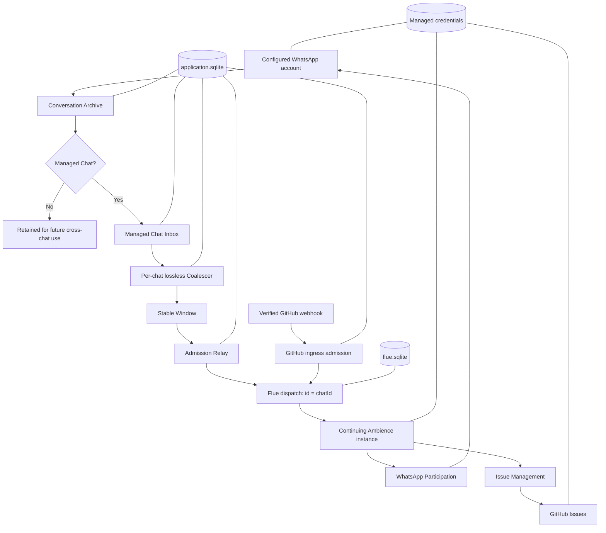

# Ambient Agent production architecture

This is the ratified architecture and implementation map for the stable base.
The complete packed, managed-OAuth, WhatsApp, GitHub, and process-replacement
receipt is recorded in
[`docs/proof/ambient-agent-stable-base-live.md`](../proof/ambient-agent-stable-base-live.md).

## Product

Ambient Agent is a continuing participant in group conversation. It observes every message available to its WhatsApp account, durably retains that history, processes every message accepted from a Managed Chat, and decides when speaking or acting would help without requiring an explicit mention.

The first complete production Capability is Issue Management. It handles bug reports, feature requests, issue discussion, and the full supported issue lifecycle. Later Capabilities may plan work, start coding or review workflows, and coordinate delivery without changing the intake, agent, or Capability interfaces established here.

Ambience is the proper name of the continuing Flue Agent. There is one Ambience instance per Managed Chat, addressed by WhatsApp `chatId`.

## Stable-base evidence

| Current code                                                                                                                                 | Mechanically verified boundary                                                                                                              | Boundary outside the receipt                                                                               |
| -------------------------------------------------------------------------------------------------------------------------------------------- | ------------------------------------------------------------------------------------------------------------------------------------------- | ---------------------------------------------------------------------------------------------------------- |
| `src/agents/ambience.ts` registers versioned WhatsApp Participation and Issue Management Skills with cohesive Tool factories                 | Two real post-setup Windows reached one continuing canonical Ambience stream and selected the supported Tools                               | Model behavior beyond the recorded journey remains evaluation- or scenario-specific                        |
| `src/app.ts` and `src/host/whatsapp-runtime.ts` consume typed configuration, credential, and path dependencies from the CLI composition root | An installed local tarball used one private managed directory, managed ChatGPT OAuth, and a real adopted WhatsApp session                   | Fresh QR pairing and provider credential portability to another host were not exercised                    |
| `src/capabilities/issue-management/` owns the supported issue journey and a durable Operation Identity ledger                                | A real report created exactly one authorized issue; a later instruction added one comment and closed it under separate completed identities | Ambiguous live-provider reconciliation was proven deterministically, not induced during the qualifying run |
| `src/github/` verifies, routes, deduplicates, and admits provider deliveries through `application.sqlite`                                    | Deterministic signed-ingress and restart suites cover the application-owned webhook path                                                    | GitHub's public webhook transport was not part of the WhatsApp-initiated #59 journey                       |
| `package.json` exposes the `ambient-agent` bin with managed `init`, `auth`, `config`, `status`, `doctor`, and foreground `start` paths       | `ambient-agent@0.1.0` exists on npm; the newer stable-base source was packed, installed, started, replaced, and diagnosed through that bin  | The newer source changes require a subsequent registry release before a bare public install contains them  |

The rollout replaces these paths. It does not layer a second production path beside them.

## Runtime map



The application database owns business and relay state. The Flue database owns canonical Agent conversation streams, accepted submissions, attachments, and Workflow records. WhatsApp and provider credentials remain separate from both databases.

## Target source structure

```text
src/
├── app.ts                              # composition root and authored HTTP routes
├── db.ts                               # Flue file-backed persistence adapter
├── agents/
│   ├── ambience.ts                    # one continuing instance per Managed Chat
│   └── ambience.md                    # short identity and standing constraints
├── capabilities/
│   ├── whatsapp-participation/
│   │   ├── SKILL.md                   # when to speak and group-chat conduct
│   │   ├── tools.ts                   # chat-bound Say, read, and search Tools
│   │   └── whatsapp-port.ts           # private provider seam used by the tools
│   └── issue-management/
│       ├── SKILL.md                   # bug and feature intake policy
│       ├── tools.ts                   # focused issue and comment Tools
│       ├── issue-repository.ts        # domain-facing issue interface
│       └── octokit-issue-repository.ts# private GitHub adapter
├── intake/
│   ├── conversation-event.ts          # normalized immutable event model
│   ├── conversation-archive.ts        # append and projection queries
│   ├── managed-chat-inbox.ts          # pending Managed Chat processing state
│   ├── coalescer.ts                   # per-chat Window formation
│   ├── admission-relay.ts             # at-least-once Flue dispatch with bounded retries
│   └── sqlite-intake-store.ts         # one transaction across archive and inbox
├── configuration/
│   ├── schema.ts                      # validated non-secret configuration
│   ├── paths.ts                       # managed-directory layout
│   ├── credential-store.ts            # credential lookup interface
│   └── file-credential-store.ts       # mode-0600 local adapter
├── github/
│   ├── ingress.ts                     # verified provider events and routing
│   └── operation-ledger.ts            # external mutation identity/reconciliation
└── cli/
    ├── main.ts                        # Commander executable
    └── commands/
        ├── init.ts                    # Clack guided first run
        ├── config.ts                  # inspect/change configuration
        ├── start.ts                   # foreground generated Flue server
        ├── status.ts                  # read-only runtime state
        └── doctor.ts                  # integrity and Uncertain-mutation diagnosis
```

Folder placement is secondary to the module interfaces. The load-bearing rule is that provider adapters remain private behind the Capability or intake module that owns the behavior.

## Flue-native agent anatomy

```ts
export default defineAgent(({ id }) => ({
  model: configuredModel,
  instructions: ambienceInstructions,
  skills: [whatsappParticipationSkill, issueManagementSkill],
  tools: [...createWhatsAppTools({ chatId: id, whatsapp }), ...createIssueManagementTools({ issues })],
  actions: [],
  durability: configuredDurability,
}));
```

- **Instructions** define Ambience's identity and standing constraints. They stay short and stable.
- **Skills** contain versioned process and policy. WhatsApp Participation governs when to speak; Issue Management governs when and how to develop an issue with the group.
- **Tools** are direct typed application functions. GitHub issue and comment operations are Tools, not Actions or Workflows.
- **Actions** are reserved for reusable agent-backed operations that need an isolated child harness. The first Issue Management slice needs none.
- **Bounded Workflows** are reserved for independent, inspectable runs such as implementation or review. They do not pause for conversation; terminal results, failures, and rare Milestones return to Ambience.

Adding a Capability means contributing a cohesive Skill and its direct Tools to the Agent. It must not require editing intake or teaching the Agent about a provider's transport mechanics.

## Issue Management interface

The Capability covers one coherent lifecycle rather than only issue creation:

```ts
interface IssueRepository {
  search(query: IssueQuery): Promise<readonly IssueSummary[]>;
  get(ref: IssueRef): Promise<Issue>;
  create(draft: IssueDraft, operation: OperationIdentity): Promise<Issue>;
  update(ref: IssueRef, patch: IssuePatch, operation: OperationIdentity): Promise<Issue>;
  changeState(ref: IssueRef, state: IssueState, operation: OperationIdentity): Promise<Issue>;
  addComment(ref: IssueRef, body: string, operation: OperationIdentity): Promise<IssueComment>;
  updateComment(ref: CommentRef, body: string, operation: OperationIdentity): Promise<IssueComment>;
  deleteComment(ref: CommentRef, operation: OperationIdentity): Promise<void>;
}
```

`IssuePatch` may apply existing labels, assignees, and milestones. Creating or administering labels, users, milestones, repositories, or projects is not Issue Management.

The Octokit adapter implements this interface with a fine-grained personal token in the first rollout. GitHub App installations later add another adapter; they do not change the Agent, Skill, or Tools.

Every external mutation carries an application-owned Operation Identity. A lost provider response triggers observation and Reconciliation, never a blind retry.

## Durable intake and admission

Archive and inbox insertion share one application transaction:

```text
receive normalized Conversation Event
  -> append immutable Archive fact
  -> update projections
  -> if Managed Chat, insert pending Inbox item
  -> commit once
```

The Coalescer claims pending items per chat and assigns each accepted event to exactly one stable Window. It cannot evict a message merely to respect a memory bound; backpressure and explicit failure are preferable to silent loss.

The Admission Relay owns the cross-database handoff. A dispatched Window is an
at-least-once wake, not exactly-once cargo (ADR 0014): the Conversation
Archive, not the Flue transcript, is Ambience's memory, so a duplicate wake is
harmless by construction and a missed wake is recoverable from the archive.

```ts
type WindowDelivery =
  | { status: "pending"; windowId: string }
  | { status: "done"; windowId: string; dispatchId: string; acceptedAt: string }
  | { status: "failed"; windowId: string; reason: string };
```

1. Include the stable `windowId` in the dispatched input.
2. Await Flue's `DispatchReceipt` with bounded retries and backoff.
3. Record `dispatchId` and `acceptedAt`, settling the Window as `done`. A lost
   `done` write only logs; the Window stays `pending` and the next startup
   re-dispatches it — the tolerated duplicate wake.
4. When the bounded retries are exhausted, settle the Window as `failed` with
   its logged cause. Failure is terminal and log-only: no chat blocking, no
   operator ceremony, and nothing is surfaced to the agent.
5. Startup re-dispatches every Window still `pending` with its original
   message timestamps; whether a delayed reading still deserves a response is
   Ambience's judgment, not infrastructure's.

After Flue returns its receipt, its file-backed persistence adapter owns queue ordering, canonical conversation state, processing recovery, and conservative handling of interrupted tool work. Exactly one live Node process owns a given Ambience instance.

## State and installation ownership

The published package and executable are both named `ambient-agent`. A normal installation needs no user-authored environment variables.

```text
~/.ambient-agent/               # default on every platform (ADR 0015); --data-dir overrides
├── config.json                 # validated non-secret settings and secret references
├── credentials/
│   ├── github.json             # fine-grained PAT, mode 0600
│   └── chatgpt-oauth.json      # complete ChatGPT OAuth record, mode 0600
├── application.sqlite         # archive, inbox, projections, relay and operation ledgers
├── flue.sqlite                # Flue canonical streams, submissions and runs
├── whatsapp/                  # whatsappd credentials
└── logs/
```

The directory is created with mode `0700`; credential files use mode `0600`.
An installation at the former platform-native default (Application Support on
macOS, XDG data home on Linux) is adopted once, atomically, at CLI entry before
any component opens a database; the completed move is recorded in
`application.sqlite`, and a machine with both directories present fails closed
with both paths named (ADR 0015).
`github.json` also holds an app-generated webhook signing secret so production
startup does not depend on an operator-authored `.env` file. A one-time atomic
migration adds it to older valid managed credentials without adopting any
machine-global state.
Ambient Agent starts the headless `openai-codex` device-code flow itself and
stores the complete provider record with lock-protected atomic replacement.
Expired credentials are refreshed once under the same lock and the rotated
record must reach disk before model authorization becomes ready. A provisional
`credentials/pi-auth.json` created by the earlier managed-installer slice may
be migrated once; global Pi state is never searched or adopted. The composition
root passes the authentication service explicitly into the Pi/Flue adapter.
Raw credentials are not added to model instructions, Tool schemas, event
payloads, diagnostics, or the Agent sandbox.

The command surface is:

```text
npx ambient-agent              # guided setup when unconfigured; help/status when configured
npx ambient-agent init         # Clack first-run setup
npx ambient-agent auth         # replace managed ChatGPT authentication only
npx ambient-agent config       # inspect or change validated configuration
npx ambient-agent start        # non-interactive foreground runtime
npx ambient-agent status       # read-only state and health
npx ambient-agent doctor       # offline configuration, credential and DB diagnostics
npx ambient-agent doctor --refresh # opt-in credential refresh verification
npx ambient-agent doctor --live    # opt-in real GitHub and model checks through production auth
npx ambient-agent doctor --retry mutation:<operationId> # explicit new Operation Identity
npx ambient-agent doctor --accept-observed mutation:<operationId>
npx ambient-agent doctor --abandon mutation:<operationId>
```

Commander 15 with `@commander-js/extra-typings` owns command parsing; Clack owns interactive prompts. The package requires Node `>=22.19.0`, the effective current Flue floor. A system process manager owns background supervision.

## Evaluation architecture

Evaluation uses the production Flue HTTP interface through `@flue/sdk` and `vitest-evals`. Each behavioral case gets a fresh Ambience instance. Deterministic correctness remains in ordinary tests; model judges never decide structural integrity.

### Deterministic module tests

- Every observed and sent message is appended to the Conversation Archive before Managed Chat filtering.
- Archive and Managed Chat Inbox insertion are atomic.
- Every accepted live message belongs to exactly one Window.
- Ordering is stable per chat and independent across chats.
- `pending`, `done`, and `failed` transitions obey their invariants across restart injection points: `done` and `failed` are terminal, and everything still `pending` re-dispatches at startup.
- A dispatch failure runs bounded retries, then settles the Window as terminally `failed` with a logged cause; the chat never blocks and the next batch dispatches normally.
- A crash between Flue's acceptance and the `done` write re-dispatches at startup: at most one duplicate wake, tolerated by ADR 0014.
- The five-state legacy admission ledger migrates losslessly: `admitted`→`done`, `abandoned`→`failed`, `pending`/`dispatching`/`uncertain`→`pending`.
- No Uncertain GitHub mutation is automatically repeated.
- `status` reads pending/failed Window batch counts and Uncertain mutation counts without opening a writable database handle or exposing stored content and errors.
- On the documented stopped-runtime boundary, `status` counts durable `attempting` mutations as degraded; `doctor` conservatively promotes them to Uncertain before provider reads and never repeats them automatically.
- `doctor` examines at most 25 mutations per invocation, rotates examination order so unresolved work cannot starve later records, caps each GitHub read at ten seconds. Provider Operation Identity reconciles automatically; desired state alone requires explicit acceptance.
- A provider-success/local-ledger-failure split remains Uncertain. It is never converted into a terminal provider failure merely because completion persistence failed.
- Explicit GitHub retry archives the prior operation and performs the same stored mutation under a fresh Operation Identity. Explicit abandonment is terminal and retained in the audit.
- These transitions prove local, single-owner process replacement only. They add no PID liveness checks, stale-lock protocol, cross-process coordinator, or cross-host recovery.
- Issue and comment Tools enforce repository scope and return structured provider state.
- Configuration rejects embedded secrets, unsafe permissions, and missing references.

### Behavioral Evaluation Scenarios

- Casual conversation is processed privately without Saying or using Issue Management.
- A direct question receives one useful Say rather than private prose alone.
- An incomplete bug report prompts for the smallest missing reproduction detail.
- A complete bug report searches for duplicates and creates a well-formed issue.
- A feature request is distinguished from a defect and captures desired outcome and motivation.
- Relevant details arriving across several speakers and Windows are combined correctly.
- A later correction updates the existing issue rather than filing another one.
- Requests to comment, edit a comment, close, or reopen use the correct Tool and issue identity.
- An unrelated chat cannot influence a Managed Chat's Agent or use its Chat-bound Tools.
- Busy conversation does not produce repetitive Say calls or one model turn per message.

### Live adapter suite

- Pair and restart a real WhatsApp account without losing archived or accepted Managed Chat work.
- Send and observe one real Say through the configured account.
- Exercise real GitHub issue search, create, update, state change, and comment operations in an authorized sandbox repository.
- Prove one ambiguous GitHub response is reconciled without repeating the mutation.
- Prove a process replacement resumes an accepted Flue dispatch from `flue.sqlite`.

Live credentials and provider availability are not CI prerequisites. Their receipts are separate from deterministic green checks.

## Growth beyond Issue Management

These are anticipated Capability seams, not designs committed by this rollout:

| Future Capability | Direct abilities                                                  | Likely independent runs                                          |
| ----------------- | ----------------------------------------------------------------- | ---------------------------------------------------------------- |
| Planning          | inspect repositories, manage milestones and structured issue sets | research or plan generation when it needs its own durable result |
| Implementation    | select an issue, inspect workspaces, report status                | coding Agent run producing commits and a pull request            |
| Review            | inspect diffs, checks, comments, and policy                       | code or pull-request review with an inspectable terminal result  |
| Delivery          | merge approved changes and report deployment state                | release preparation or deployment orchestration                  |

Future Workflows bind reusable Actions only when the same agent-backed operation genuinely needs an independent run. They do not replace Ambience's conversational judgment or turn ordinary provider calls into Workflows.

## Implementation sequence

1. **Package and configuration floor** — add the `ambient-agent` executable, managed paths, configuration schema, credential storage, and Commander/Clack commands without changing runtime behavior.
2. **Flue durability floor** — add `src/db.ts` with file-backed SQLite and prove accepted dispatch recovery across process replacement.
3. **Application intake floor** — build normalized Conversation Archive, Managed Chat Inbox, stable Windows, and one transactional SQLite store; replace the two current listeners.
4. **Admission integrity** — return and persist Flue receipts, implement the relay state machine, startup recovery, `status`, and `doctor` uncertainty reporting.
5. **Capability cutover** — add WhatsApp Participation and Issue Management Skills and Tools, replace the flat Agent configuration, and delete the former GitHub proof production path.
6. **Evaluation floor** — add deterministic failure-injection tests, HTTP-bound `vitest-evals` scenarios, and separately gated live adapter checks.
7. **Operator documentation and live proof** — rewrite the README around `npx ambient-agent`, document extension through Capabilities, and capture the real clean-install, restart, WhatsApp, and GitHub receipts.

Configuration/CLI and Capability contracts can progress in parallel once their interfaces are fixed. Intake storage precedes Admission Relay recovery, and deterministic adapter tests precede live proof.

## Stable-base definition of done

The rollout is complete only when all of the following are true:

- A clean machine can run `npx ambient-agent`, complete guided setup, and start without authoring environment variables.
- All application and Flue state is placed beneath the managed data directory with safe credential permissions.
- Every observed or sent WhatsApp message is durably archived; only configured Managed Chats enter Ambience.
- Coalescing is lossless and one stable Window is never silently abandoned.
- A returned Flue receipt is durably recorded, accepted work survives process replacement, and a Window still pending at startup re-dispatches with at most one duplicate wake (ADR 0014).
- Ambience is configured through short Instructions plus WhatsApp Participation and Issue Management Skills and Tools.
- The complete supported issue and comment lifecycle works against a scoped real GitHub repository.
- Behavior evals cover silence, timely participation, issue judgment, cross-Window context, duplicate prevention, and chat isolation.
- Production code and operator documentation no longer present Issue Management as a proof-only path.
- Deterministic checks, behavior evals, and separately classified live receipts are all recorded; one proof class is never presented as another.

## Explicitly deferred

- Media download, vision selection, blob storage, and screenshot attachment to GitHub issues.
- Upstream adoption of `whatsappd/ambient`; this application ships its single intake path first, then issue #44 replaces it once the upstream surface exists.
- GitHub App installations and multi-tenant connection ownership.
- Coding, review, planning, delivery, and deployment Workflows.
- Human suspension inside Workflows; independent runs finish or fail and return control to Ambience.
- Active-active Node ownership or horizontal failover for one Ambience instance.

The governing vocabulary is in [`CONTEXT.md`](../../CONTEXT.md), and the individual trade-offs are recorded in [`docs/adr/`](../adr/).
