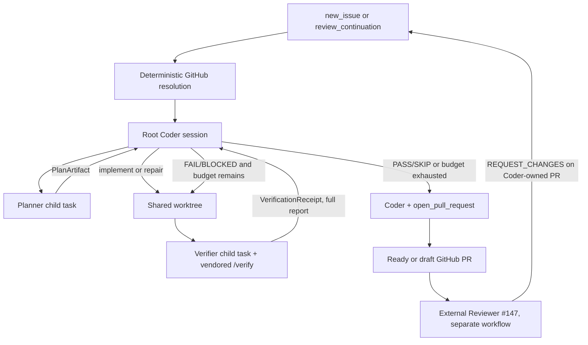
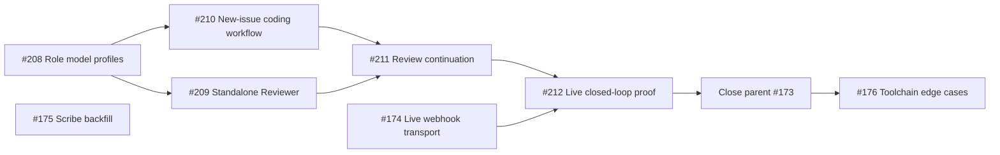

# #173 — Planner → Coder → Verifier coding workflow

Status: **ratified in the 2026-07-18 design grill**

Build status: **not implemented in this session**

Issue: [#173](https://github.com/AaronAbuUsama/ambient-agent/issues/173)

Research: [`173-flue-runtime-research.md`](./173-flue-runtime-research.md), [`173-github-review-research.md`](./173-github-review-research.md)

This is the build contract for the multi-agent coding workflow that replaces the
single-model work step inside the shipped #172 Coder. It is intentionally the minimum
code-factory floor: a deterministic TypeScript coordinator, one continuing Coder
conversation per run, two bounded specialist tasks, and GitHub as the durable boundary
between runs.

The issue's original “PR agent” is superseded by this spec. **Coder owns its PR.** The
internal Verifier is a development-loop agent, not the separate external Reviewer from
#147.

## 1. Outcome

One coding workflow invocation does the following:

1. Resolve a new issue or an existing Coder-owned PR from live GitHub state.
2. Ask Planner for one ordered implementation and verification plan.
3. Keep one root Coder conversation alive while it implements and repairs.
4. Ask a fresh Verifier task to drive the shared worktree using the vendored built-in
   `/verify` methodology.
5. Feed the Verifier's complete report back to the same root Coder conversation and
   repeat within a bounded internal verification budget.
6. Have Coder author and open or update one rich PR at the end, using #172's idempotent
   `open_pull_request` tool.
7. Publish stable `ctx.log` waypoints throughout the run.

The workflow has two modes:

- `new_issue`: create or converge on the issue's Coder branch and PR.
- `review_continuation`: start a **new** workflow run from the live branch and formal
  review state of an existing Coder-owned PR.

Workflows do not pause. External review therefore separates two finite workflow runs;
GitHub is the durable hand-off.

## 2. Foundation and non-negotiable boundaries

The build must extend, not reopen, these shipped foundations:

- **#172 Coder owns its PR:** reuse
  `packages/agents/src/capabilities/coder/{workflow.ts,tool.ts,github.ts}` and the
  idempotent `open_pull_request` natural keys. The existing `run()` seam where the model
  does the work becomes the coordinator described here.
- **#157 delegation transport:** keep the run ledger, generic `instrument()` delivery
  bridge, `specialist.result` envelope, `check_jobs`, and boot-sweep semantics.
- **Flue:** use `harness.session(name)`, `session.task()`, `subagents: AgentProfile[]`,
  structured results, and `ctx.log`. Do not introduce another agent framework.
- **External Reviewer #147:** remains a separate GitHub-App identity and a separate
  workflow. It reviews the opened PR; it does not participate inside this workflow run.
- **GitHub writes:** remain deterministic application plumbing behind narrow tools. Do
  not give Planner or Verifier general GitHub write tools.
- **Models:** runtime roles use OpenAI models only. Opus and Fable are not runtime or
  build-orchestration choices for this feature.

The installed Flue runtime establishes four constraints:

1. A programmatic `session.task()` creates a fresh child conversation.
2. Child tasks share the root harness's sandbox/worktree, not one another's transcript.
3. Programmatic tasks and arbitrary workflow TypeScript are not checkpoint-resumed.
4. `invoke()` always creates a new finite run; there is no paused/waiting workflow state.

## 3. Architecture



There is **no supervising model** inside the workflow. TypeScript owns stage order,
budgets, result validation, logging, and publication. Models own the judgment-rich work
inside each stage.

### Why Coder is the root session

The same Coder conversation must see its original implementation, every complete
Verifier report, its repairs, and final PR-authoring prompt. Planner and Verifier remain
independent child conversations so their outputs cross an explicit structured boundary.

The implementation shape is:

```ts
const coder = await harness.session("coder");

const plan = await coder.task(plannerPrompt, {
  agent: "planner",
  result: planArtifactSchema,
});

for (let round = 1; round <= maxVerificationRounds; round += 1) {
  await coder.prompt(coderPrompt({ plan: plan.data, priorVerification, round }));

  const verification = await coder.task(verifierPrompt({ plan: plan.data, round }), {
    agent: "verifier",
    result: verificationReceiptSchema,
  });

  priorVerification = verification.data; // complete report, verbatim
  if (verification.data.verdict === "PASS" || verification.data.verdict === "SKIP") break;
}

await coder.prompt(publicationPrompt({ plan: plan.data, priorVerification }), {
  tools: [openPullRequest],
});
```

`open_pull_request` is mounted only for the final publication prompt. Planner and
Verifier never receive it. The publication prompt is evidence authoring and PR
publication only: it must not modify the worktree after Verifier's final observation.

## 4. Invocation and inputs

Keep the existing Speaker tool name: **`start_coder_job`**. Do not add
`start_coding_workflow`.

Its model-facing request is one discriminated union:

```ts
type CodingJobRequest =
  | {
      mode: "new_issue";
      repository: string;
      issue: number;
      instructions?: string;
      maxVerificationRounds?: number; // default 3, range 1..5
      maxReviewCycles?: number;       // default 2, range 0..5
    }
  | {
      mode: "review_continuation";
      repository: string;
      pullRequest: number;
    };
```

For compatibility, the validation boundary accepts the shipped issue-only shape with
no `mode` and normalizes it to `mode: "new_issue"`. That is a migration shim, not a
third mode; all internal workflow code sees the discriminated union above.

The delegation transport continues to bind `chatId` and `graphContext`; the model does
not supply either. Application-generated `jobId` and webhook delivery correlation are
also internal facts, not model input.

For `review_continuation`, callers provide only repository and PR number. They must not
provide branch names, review prose, head SHAs, or a claimed author. The application
refetches all of those from GitHub at run start.

The initial workflow stores its configured budgets when the PR exists. A review
continuation inherits them from the job record; it cannot silently reset or enlarge
them.

## 5. Durable coding-job identity

Terminology is fixed:

| Term | Meaning |
|---|---|
| `coding_job` / `jobId` | The whole issue → internally verified → externally reviewed PR journey. |
| `runId` | One finite Flue invocation. A retry or review continuation gets a new one. |
| `verificationRound` | One Coder turn followed by one Verifier run inside one invocation. |
| `reviewCycle` | One external `REQUEST_CHANGES` followed by one new repair invocation. |

The minimal local registry stores only facts GitHub does not:

```sql
CREATE TABLE coding_jobs (
  job_id TEXT PRIMARY KEY,
  repository TEXT NOT NULL,
  issue_number INTEGER NOT NULL,
  pull_request INTEGER NOT NULL,
  origin_chat_id TEXT,
  max_verification_rounds INTEGER NOT NULL,
  max_review_cycles INTEGER NOT NULL,
  UNIQUE(repository, pull_request)
) STRICT;
```

The row may be inserted when the first PR is opened; before that, the initial run input
and #157 launch ledger carry the in-flight facts. Do not add stage checkpoints,
transcripts, review bodies, active-run locks, or copied GitHub counters to this table.

GitHub remains authoritative for PR state, current head, review history, unresolved
threads, and the number of qualifying external review cycles.

## 6. Planner contract

Planner returns one artifact containing both what to implement and what behavior must be
verified:

```ts
interface PlanArtifact {
  summary: string;
  implementation: Array<{
    id: string;
    objective: string;
    paths?: string[];
    acceptance: string[];
  }>;
  verification: Array<{
    id: string;
    behavior: string;
    passWhen: string[];
  }>;
}
```

Rules:

- `implementation` is ordered.
- Each item is one coherent, implementable objective, not a line-by-line edit script.
- `paths` are optional hints, never an exclusive allowlist.
- Acceptance criteria describe observable completion.
- The verification plan states behaviors and pass conditions, not commands. Verifier
  chooses the best driving method using `/verify`.
- Planner does not write files, run the implementation, or open the PR.
- In `review_continuation`, Planner receives the issue, current PR state/diff, the
  triggering formal review, and all currently unresolved review threads. It produces a
  new repair-and-verification plan for that live state.

## 7. Verifier contract and `/verify`

Verifier returns only a small control envelope plus a complete Markdown report:

```ts
interface VerificationReceipt {
  verdict: "PASS" | "FAIL" | "BLOCKED" | "SKIP";
  report: string;
}
```

The schema deliberately does not force findings into an early taxonomy. The report is
passed **verbatim** to Coder. Verifier's skill and prompt require the report to explain:

- what it drove or exercised;
- expected versus observed behavior;
- commands, runtime surfaces, and evidence used;
- exact reproduction and observed output for each failure;
- concrete repair advice for Coder;
- why a result is `BLOCKED` or legitimately `SKIP`, when applicable.

The coordinator reads only `verdict`. It does not summarize, classify, or truncate the
report.

### Vendored methodology

Vendor the **built-in Claude Code `/verify` methodology** from Anthropic's published,
platform-specific npm artifact. The inspected source is pinned to Claude Code `2.1.214`:

```text
package: @anthropic-ai/claude-code-darwin-arm64@2.1.214
tarball: https://registry.npmjs.org/@anthropic-ai/claude-code-darwin-arm64/-/claude-code-darwin-arm64-2.1.214.tgz
npm integrity: sha512-z99kjSImARBWdE6lGoCXSi83tbiabtIv7vtFyuwrHD56WZTFSguedBb9F8wlUncEEfUVtqHKa9nCZ55j6spiIA==
package/claude SHA-256: 59796dd18e9d77f1256f367db6d28ce4bd9cd5968e402ad3a327aac36abc6dec
```

The implementation ticket must fetch that exact public artifact (for example with
`npm pack @anthropic-ai/claude-code-darwin-arm64@2.1.214`), let npm verify the pinned
SRI, extract `package/claude`, and verify the binary SHA-256 above before locating and
vendoring the built-in methodology. In that verified binary, `strings -a package/claude`
emits the skill source between these stable bundle markers:

```text
start marker:
var vPf=`---
name: verify

end marker:
`;var EPf=
```

The same bundle maps `vPf` to exported `SKILL_MD`. Decode the emitted JavaScript escapes
(for example `\u2014`) when writing `SKILL.md`. Fail the vendoring step if either marker is
absent or non-unique instead of guessing at a replacement source.

The hash matches the originally inspected local binary byte-for-byte; the local absolute
path is evidence only, not an input to the build. Preserve the vendored methodology as a
skill owned by the Verifier under the Coder capability and record its source package,
version, and binary hash beside it so a clean checkout can repeat the provenance check.
It is executed by the configured OpenAI Verifier model.

Do **not** substitute the repository's current `.claude/skills/verify/SKILL.md`. That is
an ambient-agent-specific live-rig recipe; it may be useful evidence input, but it is not
the general development-loop methodology being vendored.

## 8. Internal verification loop

One internal verification round is exactly:

```text
Coder implements or repairs → Verifier drives/exercises → structured receipt
```

Defaults and limits:

```ts
const DEFAULT_MAX_VERIFICATION_ROUNDS = 3;
// accepted range: 1..5
```

Control policy:

| Verdict | Rounds remain | Coordinator action |
|---|---:|---|
| `PASS` | any | Stop looping; publish ready. |
| `SKIP` | any | Stop looping; publish ready with the report's justification. |
| `FAIL` | yes | Feed the full report to the same Coder conversation; next round. |
| `BLOCKED` | yes | Feed the full report to Coder; next round may remove the blocker. |
| `FAIL` / `BLOCKED` | no | Publish or update a rich draft PR containing the unresolved evidence. |

The workflow does not ask Planner to re-plan between internal rounds. Coder receives the
same plan plus the latest full report. A new external review continuation is a new run
and therefore starts with Planner again.

## 9. Publication and PR evidence

Coder performs the final publication turn in the same root conversation and calls the
existing idempotent `open_pull_request` tool. The tool converges on the issue branch and
one open head→base PR; it is extended only as required to update the existing PR's draft
lifecycle and evidence.

Publication happens at the end of every normally completed run:

| Final internal state | PR state |
|---|---|
| `PASS` | Ready for review. |
| Legitimate `SKIP` | Ready for review, with the reason explicit. |
| `FAIL` after budget | Draft. |
| `BLOCKED` after budget | Draft. |

An existing draft may be marked ready after a successful continuation. An existing
ready PR may be converted to draft when verification or the external-review budget is
exhausted. Use GitHub's draft lifecycle APIs; do not encode “draft” only in prose.

The PR body is the canonical current engineering record and is rewritten on every
publication. Coder authors it; application code does not template prose beyond the
existing deterministic `Closes #N` guarantee. It must cover, as applicable:

- intent and plan;
- implementation summary and meaningful design decisions;
- verification rounds, final verdict, commands, observations, and evidence;
- external review findings addressed in a continuation;
- known failures or blockers for a draft;
- screenshots, recordings, diagrams, or artifact links when those were genuinely
  produced and are GitHub-addressable.

No evidence type is mandatory when it would be theatre. Never invent evidence or claim
a surface was exercised when only static checks ran.

Maintain one idempotent lifecycle status comment per coding job, located by a stable
hidden job marker. Update that comment for blocked, exhausted, and recovered states.
Do not create a new comment for every internal round.

## 10. External Reviewer continuation

The external Reviewer from #147 is independent:

- It automatically reviews every eligible non-draft PR under its own GitHub App.
- It submits a formal `APPROVE`, `REQUEST_CHANGES`, or `COMMENT` review.
- It is idempotent per PR head SHA.
- It has no knowledge of Coder's internal workflow or job registry.

The deterministic GitHub ingress coordinator connects the two systems:

```text
pull_request_review.submitted
  → verify Reviewer App identity
  → verify PR exists in coding_jobs
  → refetch live PR + reviews + unresolved threads
  → count qualifying review cycles
  → REQUEST_CHANGES within budget: invoke review_continuation
  → REQUEST_CHANGES over budget: draft PR + update lifecycle comment
  → APPROVE or COMMENT: no repair run
```

Only a formal `REQUEST_CHANGES` review by the configured Reviewer App can launch an
automatic repair. Loose PR conversation comments and individual inline-comment events
are not automatic completion signals.

### Review snapshot

The webhook is a wake-up edge, not trusted hand-off state. At run start fetch and
paginate:

- PR state, draft state, base, head repository/ref/SHA;
- submitted reviews;
- inline review comments and replies;
- GraphQL review threads, including `isResolved` and all thread comments.

The Coder-facing feedback bundle is:

1. the triggering/latest submitted formal review; and
2. every currently unresolved review thread.

Ordinary Conversation-tab comments are excluded from the automatic repair contract.

Automatic mutation is restricted to PRs registered in `coding_jobs`. External
contributor PRs are still eligible for the standalone Reviewer, but never for automatic
Coder repair. Because Coder-owned branches are same-repository branches, reject a
registered PR whose live head repository unexpectedly differs from the target
repository.

Existing ingress delivery deduplication handles webhook redelivery. #147's one-review-
per-head rule prevents competing repair launches for one head; the existing non-force
GitHub ref update remains the final protection against overwriting a concurrently moved
branch. Do not add a scheduler or locking subsystem in #173.

### External review budget

```ts
const DEFAULT_MAX_REVIEW_CYCLES = 2;
// accepted range: 0..5
```

The initial run has `reviewCycle: 0`; the first automatic repair has `reviewCycle: 1`.
Count unique qualifying Reviewer `REQUEST_CHANGES` reviews from GitHub. For the current
review, that count is the proposed `reviewCycle`: launch when
`reviewCycle <= maxReviewCycles`. Webhook redeliveries do not consume another cycle.
`APPROVE` and `COMMENT` do not consume a cycle.

When the proposed cycle would exceed the maximum, do not start another coding run.
Convert the PR to draft and update the one lifecycle status comment with the remaining
formal review evidence. Thus the default `maxReviewCycles: 2` permits two repair runs;
the third qualifying rejection drafts without launching.

## 11. Live waypoint contract

Use human-readable messages plus stable structured attributes:

```ts
interface CodingWaypoint {
  event: "coding.waypoint";
  schemaVersion: 1;
  jobId: string;
  mode: "new_issue" | "review_continuation";
  stage: "workflow" | "planner" | "coder" | "verifier" | "publication";
  status: "started" | "completed" | "failed";
  reviewCycle: number;
  maxReviewCycles: number;
  verificationRound?: number;
  maxVerificationRounds: number;
  verdict?: "PASS" | "FAIL" | "BLOCKED" | "SKIP";
  pullRequest?: number;
  draft?: boolean;
}
```

Required waypoints:

1. workflow started;
2. Planner started and completed;
3. Coder started and completed for every round;
4. Verifier started and completed for every round;
5. publication started and completed;
6. workflow completed.

An operational exception logs the failing stage as `failed`, logs workflow `failed`,
then rethrows. A valid Verifier `FAIL` is `status: "completed", verdict: "FAIL"`; it is
not an operational failure.

Do not put plan artifacts, review bodies, Verifier reports, prompts, code, or command
output in log attributes. Those belong in task results, the PR, and durable GitHub
evidence. Flue supplies run ID, timestamp, event index, persistence, and the SSE stream.
Waypoints are observability events, not chat milestones.

## 12. Model policy

Model and reasoning effort are installation-managed role policy. Capabilities must not
import Speaker's model or hardcode a generation-specific ID.

```ts
interface AgentModelProfile {
  id: string;
  thinkingLevel: "off" | "minimal" | "low" | "medium" | "high" | "xhigh" | "max";
}

interface ManagedModelProfiles {
  speaker: AgentModelProfile;
  scribe: AgentModelProfile;
  planner: AgentModelProfile;
  coder: AgentModelProfile;
  verifier: AgentModelProfile;
}
```

Central installation defaults:

```ts
{
  speaker:  { id: "gpt-5.6-luna", thinkingLevel: "low" },
  scribe:   { id: "gpt-5.6-luna", thinkingLevel: "minimal" },
  planner:  { id: "gpt-5.6-sol",  thinkingLevel: "xhigh" },
  coder:    { id: "gpt-5.6-sol",  thinkingLevel: "high" },
  verifier: { id: "gpt-5.6-sol",  thinkingLevel: "xhigh" },
}
```

These are defaults in one replaceable configuration location, not constants scattered
through agent definitions. Terra is a supported operator choice. Per-job callers cannot
override model or effort.

Generalize the ChatGPT subscription connector and readiness receipt to register and
check the distinct configured OpenAI model IDs. Keep any Luna-only request adaptation
conditional on the selected model; do not make Luna the provider-wide assumption.

The managed-config addition should preserve existing installations through schema
defaults rather than forcing a credential/config migration solely for #173.

## 13. Failure and interruption

Business outcomes and transport failures remain separate:

```ts
// Normal completed run, even though the change is red:
{ status: "ok", result: { /* draft PR + final FAIL/BLOCKED evidence */ } }

// Model/tool/runtime exception or process interruption:
{ status: "interrupted" }
```

Operational failures do not consume `verificationRound` or `reviewCycle`, fabricate a
Verifier verdict, or automatically relaunch.

Keep #157 unchanged:

- an errored terminal run is delivered as `specialist.result(status:"interrupted")`;
- the boot sweep converts every pre-boot unsettled launch to the same interrupted result;
- the originating Speaker reports the interruption and asks before an explicit retry;
- a retry is a new `runId` and converges on live GitHub natural keys.

A review-continuation interruption leaves the existing PR and review state as they
actually are. Do not build workflow checkpointing, silent restart, or a manager agent
into the boot sweep.

## 14. Result returned to Speaker

Keep the #157 transport envelope. The workflow-specific result remains nested:

```ts
interface CodingWorkflowResult {
  outcome: "opened-pr" | "updated-pr" | "no-op" | "blocked" | "failed";
  prUrl?: string;
  prNumber?: number;
  branch?: string;
  summary: string;
  testsPassed?: boolean;
  jobId: string;
  finalVerdict?: "PASS" | "FAIL" | "BLOCKED" | "SKIP";
  verificationRounds: number;
  reviewCycle: number;
  draft?: boolean;
}
```

The Speaker receives a concise outcome for narration. Full plans, reports, and review
snapshots stay out of the chat transport; they are represented in the run record and
rich PR body.

## 15. Acceptance criteria

The build is complete when automated tests and evals prove:

1. Both input modes validate; the shipped no-`mode` issue shape normalizes to
   `mode: "new_issue"`.
2. Planner produces the exact `PlanArtifact`; malformed structured results fail the run.
3. One root Coder session persists across implementation, repair, and publication turns.
4. Planner and each Verifier invocation are fresh child tasks sharing the same worktree.
5. `PASS`/`SKIP` stop the loop; `FAIL`/`BLOCKED` feed the full report back until the
   configured bound.
6. The number of Coder and Verifier turns never exceeds `maxVerificationRounds`.
7. Coder alone authors and calls `open_pull_request`, only in the publication turn.
8. PASS/SKIP produces a ready PR; exhausted FAIL/BLOCKED produces a rich draft.
9. Existing ready/draft PRs transition to the correct real GitHub lifecycle state.
10. The PR body includes truthful current evidence and is updated on continuation.
11. Every required waypoint has the stable schema, correct cycle/round numbers, and no
    artifact leakage.
12. `pull_request_review.submitted` is refetched from GitHub; unresolved threads are
    obtained through paginated GraphQL rather than inferred from REST comments.
13. Only the configured Reviewer App's `REQUEST_CHANGES` on a registered Coder PR can
    start automatic repair.
14. External contributor/fork PRs are never mutated by Coder.
15. Review redelivery is idempotent; external cycle exhaustion drafts and comments
    without launching another run.
16. Operational throws still reach #157 as `interrupted`, and the existing boot-sweep
    behavior remains green.
17. Role model/effort policy comes from managed configuration; Planner/Coder/Verifier do
    not import Luna or Speaker constants.
18. The vendored built-in `/verify` skill is present only on Verifier and its prose is
    eval-gated for actionable, evidence-backed feedback.
19. Repository typecheck, tests, and relevant Flue agent evals are green.

## 16. Deliberately out of scope

- A manager/supervisor model or general code-factory control plane.
- Paused workflows, stage checkpoint/resume, or automatic operational restart.
- Parallel Coder writers or more than one Planner/Verifier per round.
- Automatic repair of external-contributor PRs.
- Loose PR conversation comments as a repair-completion protocol.
- Replacing the standalone Reviewer #147.
- A dedicated PR-writing agent.
- A new artifact-upload service or mandatory screenshot/video schema.
- A new scheduler, queue, or GitHub dependency.

## 17. Delivery DAG

Implementation lives in GitHub milestone
[#9 — Coding workflow & the closed loop](https://github.com/AaronAbuUsama/ambient-agent/milestone/9).
Issue [#173](https://github.com/AaronAbuUsama/ambient-agent/issues/173) remains the
parent; its five implementation tickets are native GitHub sub-issues with native
`blocked_by` relationships.



| Ticket | Blocked by | Complete behavior delivered |
|---|---|---|
| [#208 — Configure OpenAI model and effort by agent role](https://github.com/AaronAbuUsama/ambient-agent/issues/208) | None | Installation-managed OpenAI role profiles and a model-generic subscription connector, preserving current Speaker/Scribe defaults. |
| [#210 — Run new issues through Planner, continuing Coder, and Verifier](https://github.com/AaronAbuUsama/ambient-agent/issues/210) | #208 | One new issue traverses the bounded internal multi-agent loop and produces one rich ready/draft Coder PR with live waypoints. |
| [#209 — Implement the standalone external Reviewer workflow](https://github.com/AaronAbuUsama/ambient-agent/issues/209) | #208 | The separately authenticated Reviewer exercises every eligible PR head and submits one formal GitHub verdict. |
| [#211 — Repair Coder-owned PRs after formal Reviewer feedback](https://github.com/AaronAbuUsama/ambient-agent/issues/211) | #210, #209 | A formal `REQUEST_CHANGES` starts a bounded repair continuation from live GitHub state without mutating external contributors' PRs. |
| [#212 — Prove the complete issue-to-reviewed-PR coding loop live](https://github.com/AaronAbuUsama/ambient-agent/issues/212) | #211, #174 | The real authorized rig proves issue → internal verification → PR → external rejection → repair → re-review with durable evidence. |

Existing milestone work composes with this graph:

- [#174 — GitHub webhooks via Cloudflare](https://github.com/AaronAbuUsama/ambient-agent/issues/174)
  is a frontier ticket and now carries `issues`, `pull_request`, and
  `pull_request_review` events. It blocks only the final live proof, so code work can
  proceed in parallel with infrastructure activation.
- [#175 — Scribe backfill](https://github.com/AaronAbuUsama/ambient-agent/issues/175)
  remains an independent frontier.
- [#176 — Coder toolchain edge cases](https://github.com/AaronAbuUsama/ambient-agent/issues/176)
  remains blocked by parent #173 and begins only after the core workflow is proven.

Work only the live frontier: a ticket is takeable when every native blocker is closed
and it is unclaimed. Start each implementation ticket in a fresh context/worktree. Use
no more than six workers, preserve concurrent edits, and integrate through the contracts
in this spec. Build and review agents use OpenAI models; runtime role defaults remain the
separately configurable policy in §12.
