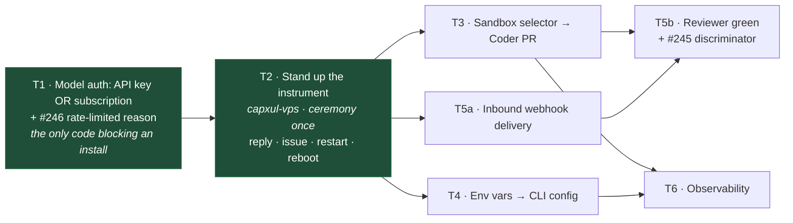

# One box, working end to end — THE plan

**2026-07-21, revision 4.** This is the **only active plan**. **The go-forward is § _Revision 4_ below — read it first; it supersedes the T1–T6 stage sections on scope.** Every other document under
`docs/planning/` is either findings (evidence, which accumulates) or superseded (bannered). If a
document tells you what to build and it is not this one, it is wrong.

Revision 3 applies an adversarial verification pass (four independent lenses: DAG validity,
decision consistency, reference integrity, completeness). It fixed three blockers and eleven
errors. What changed is recorded at the end.

**Document policy, adopted after measuring the root cause of this repo's disorientation** (four
unreconciled plans layered on one tree — `ARCHITECTURE-ASSESSMENT-2026-07-19.md`):
**findings accumulate; plans are singular.** A scope change edits this file in place, re-derives
the DAG, and re-checks every gate — it does not spawn a new document.

## The goal

**One VPS, one instance, one operator. A message in WhatsApp produces a real reply, files a real
GitHub issue, and opens a real PR — and survives a reboot.**

**T2 and T3 green together constitute the goal**; `docs/proof/coder-green-local.md` is the
milestone receipt.

**Status (revision 4, 2026-07-21): this milestone is MET**, including the `kill -9` → `interrupted`
leg (owner-run 2026-07-21). **§ Revision 4** is the go-forward and the current authority on scope.

Deferred: multi-tenancy (dropped), the web app, E2B (config flip), billing, backup/restore, two
GitHub orgs (#243/#249 — **no second company chat before #249**, it is a live cross-company leak),
the graph viewer, the ADR-0020 self-approval 422 configuration test (#242), subscription token
refresh (#248).

## Revision 4 — the go-forward (2026-07-21): relocation, rebrand, dashboard-ready

**The milestone is MET.** T1+T2+T3 are green together on capxul-vps — a WhatsApp message produced a
real reply, a real `ambient-planner[bot]` issue (#262) and a real green Coder PR (#269 from
Planner-issue #267); it survived reboot and a hard `kill -9` (the interrupted leg, owner-run
2026-07-21). **This section is the authority on scope; where the T1–T6 sections below disagree with
it, this wins.**

**What changed (owner, 2026-07-21).** The permanent home moves off capxul-vps to the **code-factory
VPS** (`ssh code-factory`, already provisioned). We **rebrand ambient-agent → "coworker"** (surface
only) and reuse the **co-worker.tech** domain. Ingress becomes a **Cloudflare Tunnel** — no
Dokploy/Traefik. The bot pairs a **new WhatsApp number**. Model selection gets real: any OpenAI
model, any reasoning level, an interactive **API-key-vs-subscription** choice — **no fallback**.

### North star (future — NOT this plan)
A hosted **web dashboard** for coworker: fully configurable and observable — add/remove chats
(groups), enable repos per chat, configure each agent, watch live activity; possibly multiple
instances later. We do **not** build it now — we build so it stays **additive**.

### Non-goals for this plan (explicit)
The dashboard itself; multi-instance / tenancy (standing decision: **one instance, multi-chat** —
unchanged); the **deep rename** (repo, npm packages, and the `ambient-*[bot]` App logins all stay);
model **fallback**; the Planner-identity redesign (**parked** — below).

### Seams we preserve so the future is a UI, not a rewrite
1. **Config is the single source of truth.** Every agent/chat/repo setting flows through the managed
   config schema + `writeManagedConfiguration` (atomic, re-validated — `configuration.ts:66`). A
   dashboard is just another writer of the same validated config. → this is why **T4 (env→CLI) is
   load-bearing, not an optional nicety.**
2. **The runtime already has the HTTP+SSE surface** (`/health`, participation port, the dark
   `/runs/:runId` + `/agents/:name/:id` routes). **T6** lights these read-only; the dashboard later
   *consumes* them. Do not invent a parallel telemetry path.
3. **The Cloudflare Tunnel is the hosting surface.** It fronts the box for the webhook today; the
   same tunnel can route `agent.coworker.tech` to the runtime for the dashboard later. No new infra.
4. **Multi-chat is already the grain** — `managedChats` and `reviewRepositories` are lists. Keep new
   config as lists/maps keyed by chat, never singletons, so "more groups / enable repos per group"
   is additive.
5. **Model config stays through `config.model` + per-agent `profiles`** (`schema.ts:80`) so a
   dashboard can later expose per-agent model/reasoning without a schema change.

### The re-derived DAG
```
  ── code track (box-independent, parallel; PRs → claude/single-box-working) ──
  C1  model + reasoning + auth selection ─┐
  C2  surface rebrand → coworker ─────────┤   land BOTH before M (the new box inits once)
  T4  env → CLI config (#252) ────────────┤
                                          ▼
  ── on code-factory VPS ───────────────► M  relocate + stand up the BRANDED instrument
                                          │   (new number, real pairing, re-run T2 gates;
                                          │    kill the co-worker.tech container, KEEP the zone)
                                          ▼
                                   T5a  Cloudflare Tunnel → agent.coworker.tech
                                          /channels/github/webhook   (#254a)
                                          ▼
                            ┌─────────────┴─────────────┐
                          T5b  Reviewer's first review    T6  observability
                          (#245 + reviewRepos; +T3)       (needs T4 + T3)
```
**Critical path: C1·C2 → M → T5a → T5b / T6.** T4 is parallel but gates T6.

### New / changed stages
**C1 · Model & reasoning selection + interactive auth choice.** The config *already* carries
provider + OpenAI model id + `thinkingLevel` + profiles (`schema.ts:46-80`); the gap is the
**interactive surface**. In the first-run wizard and the `config` command add: (a) an
API-key-vs-subscription `select` — today it is a silent subscription default gated on the
`--model-provider` flag (`program.ts:276-278`); (b) a provider-catalog model picker
(`pi-ai/dist/providers/openai.models.js`); (c) a reasoning-level `select` from
`MODEL_THINKING_LEVELS`. **No fallback logic.** _Acceptance:_ each choice round-trips into
config.json and back; the non-interactive flag path is unchanged; a bad model id / level is rejected
by the schema. **No gate** (code-level). Parallel-safe.

**C2 · Surface rebrand → coworker.** Product/CLI name, help text, the bot's presented persona/name,
docs, and the tunnel hostname (`*.coworker.tech`). **Unchanged:** repo `AaronAbuUsama/ambient-agent`,
npm package names, the `ambient-*[bot]` App logins — renaming any of these breaks the Apps' install
target, the Coder's PR base, and every ticket URL. _Acceptance:_ no functional change; grep shows no
user-facing "ambient-agent" left in CLI / persona / docs; build + tests green. Parallel-safe.

**M · Relocate & stand up the branded instrument — the new measuring instrument.** On
`ssh code-factory`: deploy the post-C1/C2 tarball; run `init` with the **new number** (real pairing
ceremony — never simulated), pick the managed chat, install the three Apps; then **re-run the full
T2 gate suite here** (reply, issue, reboot, kill-9). Tear down the stale **co-worker.tech** Dokploy
container; **keep the Cloudflare zone.** This replaces capxul-vps as the instrument for every gate
below. _Gate:_ the T2 suite, green, on code-factory under the new number.

**T5a (rewritten) · Inbound webhook via Cloudflare Tunnel.** A `cloudflared` systemd unit beside the
runtime: `agent.coworker.tech` → `127.0.0.1:<port>/channels/github/webhook`; point the **Planner
App** webhook at it. App code is unchanged (signature verify + `ensureManagedGitHubWebhookSecret`
already exist). Zero inbound ports; Tailscale-only SSH stays. The proven shape, gate, and negative
in the T5a section below are unchanged — only the middle proxy box changed.

### Parked (follow-ups — NOT this plan)
- **Identity/naming smell: the "Planner" is overloaded** — runtime identity + issue-writer + the
  single webhook sink. The WhatsApp voice (Speaker, non-blocking) is arguably the identity the
  inbound door should wear. Revisit the naming *and* the identity model together. File a ticket; do
  not act now.
- **Speaker tool-authority** — narrate + delegate vs. execute inline; create-issue as a handoff.
  Earlier board item, still open (see #265 for the ack-then-act half).
- **The web dashboard + multi-group / repo / instance configurability** — the north star above.

## Acceptance vs gate — the distinction the last revision lacked

- **Acceptance** is code-level: runnable by the implementing agent with no install, no paired
  phone, no secrets. Typecheck, tests, config round-trips, negative assertions.
- **Gate** is a real-world proof run **against the live instance**.
- **Pre-flight** is a narrow real proof that claims nothing beyond what it exercised (e.g. one real
  model call asserting non-empty output, with no transport claim). It de-risks a deploy. It is
  never a substitute for a gate.

**The one rule governs gates.** Acceptance and pre-flights are how we avoid debugging through a
deploy; they never stand in for the live proof.

## The ordering principle — build the instrument first

Every gate is verified by observing a live, paired, installed instance. That instance is not a
late-stage deliverable — it is the **measuring instrument**. The previous revision had the first
gate requiring an install scheduled four stages later; that cycle is why acceptance criteria kept
mutating ad hoc. **T2 stands up the instrument, immediately after the one code stage (T1) that
currently makes an install impossible.**

Code for later stages can be written in parallel at any time. Only **gates** wait for the
instrument.

## Owner decisions this plan encodes

Confirmed directly, 2026-07-19 → 2026-07-20:

1. **Single instance.** No tenants. Two companies as chats + GitHub orgs inside it.
2. **No environment variables for runtime config.** CLI into managed config. Test harness gates
   (`AMBIENT_AGENT_LIVE_*`) stay env vars by design.
3. **The instrument lives on capxul-vps.** The code-factory rig keeps its proven webhook path
   undisturbed; pairing happens once, where the session will live.
4. **One sandbox**, shared, selectable `local | e2b`. Local accepted for single-operator use
   **including unattended operation** — authorized 2026-07-20, see Resolved decisions D-1
   (exposure documented in #251).
5. **Model auth is API key OR subscription — neither required.** Currently an OpenAI API key with
   limited funds; mid-tier models (`gpt-5.4-mini` / `gpt-5.1-codex-mini` class) are capable of
   small diffs, PRs and reviews — do not scope down on the assumption they are not.
6. **No fakes, anywhere.** A rig that injects the inbound message and captures the outbound reply
   is real-model-but-fake-world — what `tests/fixtures/speaker` is, inadmissible for the same
   reason. **A receipt caveat does not legitimize a fake.**
7. **Ceremonies are prerequisites, never gate content, never simulated.** WhatsApp pairing needs a
   human and a phone, once (`first-run.ts:233-235` hard-aborts non-interactive pairing by design).
8. **Filing a real GitHub issue from chat is part of "working"**, not an extra.

## Ground truth — measured, not assumed

| Claim | Reality |
|---|---|
| "The Reviewer uses a Docker sandbox" | **False.** `bc93fb9` deleted `reviewer-docker-sandbox.ts` + test. Zero docker sandbox references remain. |
| "Coder and Reviewer need unifying" | **Already unified.** `apps/runtime/src/app.ts:112-113` passes one factory to both; the runtime contracts are byte-identical on the sandbox field. |
| "The Coder is blocked on the E2B key" | **False.** `local()` (`@flue/runtime/node`, `dist/node/index.d.mts:45`) is a complete `SandboxFactory`, installed, zero imports. `bc93fb9` deleted its call site. |
| "The CLI depends on the web/SaaS stack" | **False.** 48-file transitive trace from `apps/cli/src/main.ts` reaches only `apps/cli`, `packages/engine`, `packages/installation`, `packages/agents`. |
| "A tunnel is needed to demo" | **False for outbound.** WhatsApp → Speaker → issue-filing → Coder → PR is entirely outbound. |
| "`init` works with an API key" | **False.** `init` hard-requires the ChatGPT device flow. This is the single code defect blocking the instrument — T1's core. |
| "It has been run end to end" | **False.** Every receipt is piecemeal, on the rig, via a packed tarball. No completed install exists anywhere. |

## The one rule

**Every gate is a real-world proof, run against the live instance, and asserts a negative that can
actually fail.** The dominant failure mode is silent degradation. A negative that cannot fail is
not a negative.

---

# The DAG



Edges are **gate** dependencies. T3/T4 **code** is parallel-safe today; only their gates wait for
the instrument. **#246 is inside T1's scope** (same file T1 already edits) — without it every live
gate from T2 onward misreads a rate limit as a regression. **#245 is inside T5b's scope** — without
it a fabricated review passes as a real one.

**How INCONCLUSIVE surfaces:** the `rate-limited` reason reaches a gate runner through the
structured log stream (`operatorEvent`, `speaker/activity-reporter.ts:48-71`), which every gate
transcript must capture. A rate-limited run is **INCONCLUSIVE — never PASS, never FAIL** — and is
re-run, not investigated as a regression.

---

# The instrument is LIVE — T2 (#253) done 2026-07-20

Verified independently of the implementing agent (GitHub API, SSH to the box, the kernel boot clock):

- **Host:** `capxul-vps` (Tailscale `100.80.138.56`, user `abuusama`), systemd unit `ambient-agent`
  enabled + active on **port 3737**. `curl localhost:3737/health` → `ok:true`, `whatsapp.phase:online`.
- **Identity:** commit `6c6067d` on `claude/single-box-working`, tarball SHA-256
  `e311b6e4…13ab402`. Model `openai/gpt-5.4-mini`, managed chat `Tst` (`120363410063306573@g.us`),
  repo `AaronAbuUsama/ambient-agent`.
- **Gate — every leg exercisable without a Coder run PASSED:** real reply · real
  `ambient-planner[bot]` issue (#262) · reboot-without-re-pair (box boot clock 16:28:41, unit back
  16:28:51) · conversational memory across reboot (DB-verified) · negatives observed
  (absence-of-silence, second-instance loud exit-1 with survivor uncorrupted, post-reboot-reply-not-process).
- **Deferred, honestly marked ❌:** the `kill -9` → `interrupted` leg — needs an in-flight Coder run,
  so it re-runs as a T2 gate leg after **T3 (#251)** lands.

**The instrument earned its place immediately.** The T2 blocker (#261) was a real bug only a live
deploy could surface: the runtime restart hung 60s waiting for a conversation-sync batch that a
whatsappd *reconnect* never emits, failing a healthy session. `createWhatsAppAccount` — the module
the architecture assessment flagged as riskiest (cyclomatic 50, zero live coverage) — had never been
run live until now. This is exactly the class of defect the instrument-first ordering exists to find.

**Follow-ups filed** (not blockers): #264 (setup lock orphans on a killed `init`), #265 (Speaker
silent ~15s on action turns), whatsappd#4 (`link-preview-js` missing from bundled baileys).

Receipt: `docs/proof/one-box-instance-live.md`.

---

# Stages

## T1 · Model auth is API key OR subscription — #250 · ✅ DONE (merged #257)

The only code standing between us and an instrument. Three parts:

**a. Provider binding.** `model.provider` accepts a pi provider id;
`credentials/model-api-key.json` (`{schemaVersion:1, provider, apiKey}`, mode 0600, referenced by
name); `modelSpecifier(provider, id)` replaces the hardcode at `pi-subscription.ts:40`;
`connectPiApiKeyProvider` via `registerProvider` only — provider apis are built-in Flue api ids
(`pi-ai/dist/compat.js:136`), so no `registerApiProvider`.

**b. The `init` fix** — the defect that makes (a) usable. First-run setup accepts the provider
choice and an API key and does **not** force the ChatGPT device flow. **This is a widening:
subscription setup keeps working; neither mode is required.**

**c. #246 — the `rate-limited` reason.** Split it out of `request-failed` at
`pi-subscription.ts:247` and add it to the union at `:84`. Every live gate from T2 onward depends
on this to distinguish a rate limit from a regression.

The Codex subscription path (`connectPiChatGptSubscription`, and the Luna rewrite at
`pi-subscription.ts:116-190`, gated on the Codex URL and model id) is untouched **per boot**.
Known limitation, tracked in **#248**, not fixed here: the subscription apiKey is captured once at
boot (`pi-subscription.ts:300,309`) and never refreshed, so a long-lived subscription instance goes
stale at token expiry until restart. The API-key path is the active one and is unaffected.

**Acceptance — all runnable by the implementing agent; no install, no phone, no secrets:**
- `pnpm typecheck && pnpm test` green.
- `config --model-provider <id>` round-trips config + credential file.
- A **structural** exercise of the real `init` code path **up to and not including** the pairing
  step. It must **not** stub the PTY, fake the prompt loop, or simulate the pairing abort; its
  receipt is labelled structural-only. **The auth claim is proven solely by T2's first reply.**
- **Negative (API-key mode):** config selects an API-key provider whose referenced credential file
  is absent → runtime exits **non-zero** *and* emits the credential-specific message, asserted on
  an otherwise-ready seeded managed directory missing **only**
  `credentials/model-api-key.json`. Exit code alone is insufficient — an unconfigured install
  already exits 1 (`tests/managed/cli.test.ts:312-318`).
- **Mirror positive (decision 5):** a **subscription-configured** runtime with **no**
  `model-api-key.json` **starts normally**. This asserts the widening rather than assuming it.
- **Negative:** provider/credential mismatch refused at **config-write** time
  (`configuration.ts:68`, which re-validates and rolls back both files), not at first inference.
- **Negative (#246):** a synthetic 429 classifies as `rate-limited`; a genuine network failure
  still classifies as `request-failed`.

**Pre-flight (owner, one command, fractions of a cent):**
`AMBIENT_AGENT_LIVE_MODEL=1 OPENAI_API_KEY=… pnpm vitest run tests/speaker/pi-subscription.test.ts`
asserting the reply text is **non-empty** — `request:"complete"` alone passes on an empty response
(`pi-subscription.ts:214-245`).

**T1 has no gate.** Its end-to-end proof is T2's first reply.

## T2 · Stand up the instrument — capxul-vps — #253 · ✅ DONE (incl kill-9, 2026-07-21) — instrument now RELOCATING to code-factory, see § Revision 4 (M)

**Depends on #250 only.** T3's gate depends on this ticket, not the reverse.

The tarball is the proven unit; `apps/runtime/Dockerfile`'s `CMD` is the deleted provisioner's
setup entry and a Docker build costs 5-6 GB on a box at ~80% disk.

1. **Pack from a commit containing #250 and #246.** Record **both the commit SHA and the tarball
   SHA-256** in the receipt. If packed before #250 merges, `init` still hard-requires the device
   flow and the install fails at the model step; without #246 the instrument cannot report
   INCONCLUSIVE without a redeploy.
2. `npm install -g` the tarball on capxul-vps.
3. **`ambient-agent init` inside `tmux` over SSH** — SSH allocates a PTY
   (`program.ts:173-175`), the QR renders as terminal ASCII (`qr.ts:12`), the T1 API-key path makes
   the model step a paste. `tmux` because `authenticationSignal()` is a 20-minute timeout.
4. `config --port <p>` — the default 3000 collides with the compose `api` service on this box.
5. **A single-instance lock** on the data directory at runtime start (~10 lines; nothing enforces
   this today and Flue forbids two replicas on one volume).
6. **systemd unit** (~12 lines, does not exist): `Type=simple`, `Restart=always`,
   `ExecStart=… start --log-format json`. `stopRuntimeOnSignal` already handles SIGTERM cleanly.

**Prerequisites (ceremony, not gate content):** the owner's phone scans the QR once; three GitHub
App triples ready for the guided paste; the OpenAI key.

**Gate (re-runnable thereafter; re-running must not re-pair):**
1. A real message from the owner's phone produces a **real reply**.
2. "File an issue for X" produces a **real GitHub issue** authored by `ambient-planner[bot]`.
3. `systemctl restart`, then **reboot**: the agent returns **without re-pairing** and replies.
4. **Conversational memory across restart** — establish a fact in the thread, restart, ask for it
   in the same thread, get it back. "State is still there" is not observable; this is.

**Negatives:**
- Drive an input whose reply is mandatory and assert the **absence of silence** — a
  configured-but-inert agent must read FAIL, not pass vacuously.
- A second instance against the same data directory **refuses or fails loudly** (item 5 is the
  code that makes this assertable).
- Post-reboot, assert the **reply**, not the process state — a live unit with a dead agent is the
  silent failure this catches.
- **`kill -9` during an in-flight run** → the run settles as `interrupted`, the message reaches the
  thread, and **no relaunch happens without a user turn** (`sweepUnsettledLaunches`,
  `apps/runtime/src/app.ts:187-199`). Relocated here by the grill; it is a restart-integrity proof,
  not a tenancy one. *(Requires T3 for a Coder run to interrupt — run this leg after T3 lands, as a
  T2 gate re-run.)*

**Receipt:** `docs/proof/one-box-instance-live.md` — commit SHA, tarball SHA-256, unit file, full
transcript.

**This single event is what the old plan split into "M1's gate" and "M4's install".**

> **STATUS: DONE 2026-07-20** — see "The instrument is LIVE" above. The `kill -9` leg is the only
> deferred negative; it re-runs here after T3 (#251) produces a Coder run to interrupt.

## T3 · Sandbox selector → the Coder's first green PR — #251 · ✅ DONE (merged #266; Coder green PR #269)

**Code parallel-safe now; the gate runs on the instrument (#253).**

`runtime.sandbox = {kind:"local"|"e2b", template?}`, default `local`; the resolver returns
**sandbox + workspacesRoot together** (`E2B_WORKSPACES_ROOT` = `/home/user/…` does not exist on a
host; local uses `paths.workspaces`); `local(options?)` from `@flue/runtime/node` — exactly what
`bc93fb9` deleted — not `bash(factory)`; explicit `apiKey` into `Sandbox.create`; the #172 `TMPDIR`
fix carries into the local branch (workspace-local, `mkdir` before first use — deleting it once
already caused a regression).

**Silent-disable removal — all five paths, not two.** `apps/runtime/src/app.ts` has **four**
warn-and-continue paths: `:51` and `:73` (sandbox, deleted by the selector, closes #247) **and
`:58` and `:87` (missing Coder/Reviewer App credential)**, plus the CLI-side sibling
`lifecycle.ts:35-42` (`resolveAgentSandbox` returning `undefined`). A mispasted App credential
currently boots green with a dead Coder — the same configured-but-inert failure T2's negative names
for the Speaker. Missing credential → non-zero exit or config-write refusal, consistent with T1.

**Pre-flight:** the self-cleaning live-test pattern from
`tests/speaker/issue-management.live.test.ts` driving the Coder against a **throwaway repo** — real
GitHub, real model, real local sandbox, no WhatsApp claim.

**Gate (on the instrument):** from the managed chat, a small well-specified task produces a real
**non-draft PR** by `ambient-coder[bot]` with a **non-empty diff**, `verdict === "PASS"`, in a local
sandbox with **no E2B key present** — **and the PR references the real GitHub issue filed by the
same chat request.** One run therefore proves the whole goal sentence (reply → issue → PR) rather
than leaving the issue leg asserted once in T2 and never again.

**Negatives:** `PASS` **and** non-empty diff asserted together — a legitimate `SKIP` also yields a
non-draft PR, so draft-ness alone proves nothing. The process must not boot green with the sandbox
or an App credential misconfigured.

**Recorded alongside, so a failure names its layer:** whether sandbox `exec` succeeded, and
`mount | grep /tmp` from inside the sandbox. A green run on an exec-mounted `/tmp` proves nothing
about #172; a red run is only useful if we know whether the shell or the model failed.

**Receipt:** `docs/proof/coder-green-local.md`. **This is the path that has never worked, and T2 +
T3 green together are the goal.**

## T4 · Env vars → CLI config — #252

**Code parallel-safe now; the gate runs on the instrument (#253).**

Six vars move: `E2B_API_KEY` → `credentials/e2b.json`; `E2B_TEMPLATE` →
`runtime.sandbox.template`; `BRAINTRUST_TRACING` → `runtime.tracing.enabled`; `BRAINTRUST_API_KEY`
→ `credentials/braintrust.json`; `BRAINTRUST_PROJECT_NAME/_ID` → `runtime.tracing.project`.
Everything else is test-only (stays env) or dies with the provisioner.

Follow the `runtime.port` pattern verbatim (validator → creation default → **`CONFIG_ISSUE_PATHS`,
the forgotten step** → CLI flag + merge → runtime read). One structural change: `braintrust.ts:7,9,22`
reads env at module load; becomes `configureBraintrustTracing(...)` called from
`startGeneratedRuntime` beside `configureLogging`. Migration: none — all additions are
`v.optional(…, default)`.

**Gate:** `env -i HOME="$HOME" PATH=/usr/bin:/bin "$(command -v ambient-agent)" start` — an
environment empty of every `E2B_*`, `BRAINTRUST_*` and `OPENAI_*` var — runs fully configured from
`config.json` + `credentials/`. (`env -i` alone strips `PATH` and the gate would fail for the wrong
reason.)

**Negatives — both must be able to fail:**
- `runtime.sandbox.kind = e2b` with `credentials/e2b.json` **absent** and `E2B_API_KEY=garbage` in
  the environment → startup **fails at config validation** rather than silently adopting the env
  value.
- `BRAINTRUST_TRACING=1` in the environment with `runtime.tracing.enabled = false` → tracing stays
  **off**, observable in the logs and in Braintrust.

*(The previously drafted negative — "setting `E2B_API_KEY` changes nothing" — was vacuous: on a
`kind=local` box the env path is already dead after T3, so it could not fail.)*

## T5a · Inbound webhook delivery — #254

> **Rev 4:** ingress is a **Cloudflare Tunnel** on code-factory (`agent.coworker.tech` →
> `127.0.0.1:<port>/channels/github/webhook`), **not** Traefik/Dokploy — see **§ Revision 4**. Zero
> inbound ports. The proven shape, gate, and negative below are unchanged; only the middle proxy box
> changed. "What owns 443 on the box" no longer applies.

Only the **Planner** App sends webhooks; Coder/Reviewer are actors. Proven shape: Cloudflare
proxied record → reverse proxy → `127.0.0.1:<port>`, route `/channels/github/webhook`,
`X-Hub-Signature-256` over exact bytes before parse, secret auto-managed
(`ensureManagedGitHubWebhookSecret`, `lifecycle.ts:71`).

**Discovery on the box, not assumption:** what owns 443 (Dokploy/Traefik almost certainly); whether
Traefik proxies this or Caddy is added. **Use a new hostname** — `ambient-agent.co-worker.tech`
points at the code-factory rig and repointing it kills the one proven webhook path.

**Gate:** a real issue opened in a real repo is delivered, **signature-verified**, settles in the
ledger, reaches the chat.
**Negative:** an unsigned probe returns **401 and lands no row** — a 401 with a side effect is the
failure this catches.

## T5b · The Reviewer's first real review — #254 (second half)

**Needs T5a (PR events must arrive) and T3 (a Coder PR must exist).** Reviewing a hand-made PR
instead would be exactly the fake-world substitution decision 6 bans.

Scope: **#245 — the fallback discriminator on `ReviewerResult`** (`reviewer/schemas.ts:31-38` has
no such field today, and `workflow.ts:143-153` still fabricates a review on model silence), plus
one config line deriving `reviewRepositories` from the reviewer role's selections — it defaults to
`[]`, so automatic review is **dead by configuration** today.

**Gate:** a real review by `ambient-reviewer[bot]` on the Coder's PR, citing a real finding, **with
the discriminator confirming a genuine model verdict**.
**Negative:** the fabricated-review fallback must **not** satisfy the same predicate — assert the
discriminator rejects it. Any APPROVE is attributed to an identity distinct from the PR author.

## T6 · Observability — #255

**Needs T3** (no Coder run can occur before the sandbox resolver exists) **and T4** (Braintrust
needs `runtime.tracing`).

Flue ships **no admin HTTP surface** (`docs-api-routing-api.md:92`). Three nearly-free layers:
1. **Braintrust** — already wired at `app.ts:3`, gated at `braintrust.ts:7`; T4's config turns it
   on. Runs, model turns incl. the full prompt, tool calls. Richest surface, ~zero code.
2. **Three exports** — `export const runs` on coder + reviewer workflows, `export const route` on
   the Speaker → `GET /runs/:runId` (SSE + `?meta`) and `GET /agents/speaker/:chatId`. Zero hits
   repo-wide today.
3. **Logs** — the `operatorEvent` field is already structured
   (`speaker/activity-reporter.ts:48-71`).

**Gate:** a Coder run is observable end to end from an external surface **while it happens**.
**Negative:** dispatch a Coder task against a repository the Coder App installation **cannot
access**, then assert the surface renders that run as **failed**. An observability layer that
renders everything green is the silent-degradation trap with a dashboard.

**Not here:** the graph viewer. No viewer exists (`graph/store.ts:152-178`); the only readers are
`computeGraphDigest` and the agents' own lookup tools (`graph/tools.ts:145-165`). Smallest
high-value thing after the milestone; not on the critical path.

---

# Resolved decisions

**D-1 · Unattended local-sandbox operation — AUTHORIZED by Aaron directly, 2026-07-20.**

Decision 4 originally covered *attended* single-operator use. T2 installs a systemd unit with
`Restart=always` surviving reboot, so the Coder answers chat tasks with nobody at a terminal,
running model-directed bash as the same uid in the same mount namespace as
`~/.ambient-agent/credentials/` (three GitHub App private keys, the model token) and `whatsapp/`
(session = account takeover). `cat credentials/github-coder.json` is a successful command, not an
exploit; `LocalSandboxOptions.env` restricts environment inheritance only and does nothing about
the filesystem.

Aaron authorized this explicitly in chat on 2026-07-20, in response to a question that named the
exposure and offered three options (accept until E2B / restrict the unit / isolate credentials
first). **Scope of the authorization: unattended `local` sandbox operation, single operator, on
capxul-vps, until the E2B key arrives.** Flipping to `e2b` is a one-line config change
(`runtime.sandbox.kind`), which is why the selector was built as a choice rather than a swap.

**This authorization does not extend to:** a second operator or any additional party with chat
access; a second company's chat (already blocked on #249's routing leak); or a publicly reachable
instance. Any of those re-opens the decision.

> Recorded here rather than inferred from a document. An agent writing "the owner confirmed this"
> is what produced this repo's worst regression; this line exists because Aaron said it in chat, on
> the date shown, to a question that spelled out what he was accepting.

# Known risks

- **T3 may fail for the original reason.** #172's `TMPDIR` fix is restored but never observed
  green. T3's layer-naming instrumentation makes its failure diagnostic rather than ambiguous.
- **capxul-vps is unexercised.** ~80% disk, port 3000 collision, 443 ownership unknown. T2/T5a
  surface these while someone is at a terminal.
- **`createWhatsAppAccount`** — cyclomatic 50, zero live coverage, every test fakes it. T2's
  reboot gate is its first honest exercise.
- **Subscription token staleness (#248)** — a long-lived subscription instance dies at token expiry
  until restart. Not on the API-key path; do not switch to subscription for a standing instance
  before #248.

# What changed in revision 3

Verification found three blockers and eleven errors. T1's absent-credential negative made an API
key mandatory, violating decision 5 — now scoped to API-key mode with a mirror positive proving the
subscription path still boots. #246 had a stated binding but no owner — folded into T1's scope; #245
likewise — folded into T5b. T5 split into T5a/T5b with a **T3 → T5b** edge, because the Reviewer
gate needs a Coder PR that only T3 produces — the old M1/M4 deadlock recurring one layer down.
Added **T3 → T6** for the same reason. T2's second-instance negative gated on enforcement nothing
built — the lock is now T2 scope. T4's negative was vacuous and is replaced by two that can fail;
its `env -i` command would have failed on `PATH`. T3's gate gained the issue leg (decision 8), so
one run proves the whole goal sentence. Restored two restart-integrity proofs the grill relocated
and this plan had dropped (conversational memory across restart; `kill -9` → `interrupted` with no
unattended relaunch). T3 now removes **five** silent-disable paths, not two — the two credential
ones survived. T2 must pack from a commit containing #250 and #246. Acceptance/gate/pre-flight
defined. Corrected `configuration.ts:66→68`, `routing-api.md:98→92`, the "sole reader" claim about
the graph store, and the receipt filename. Recorded #248, #242 and D-1 rather than losing them.

# Superseded documents

**To be bannered in the commit that finalizes this plan** (kept for their findings):
`REBUILD-PLAN-2026-07-19.md`, `GRILL-HANDOFF-2026-07-19.md`, `DEPLOY-RUNBOOK.md`,
`SAAS-MVP-PLAN.md`, `SAAS-WEBAPP-HANDOFF.md`. Bannering quarantines their internal `S`-stage
references, which would otherwise dangle.

**To be deleted in that same commit** (dead within hours, never executed):
`SPEC-S0.5-boot-and-lock.md`, `SPEC-S7a-web-app-demo.md`.

**Findings, authoritative as evidence:** `ARCHITECTURE-ASSESSMENT-2026-07-19.md`,
`GRILL-REPORT-2026-07-19.md`.
