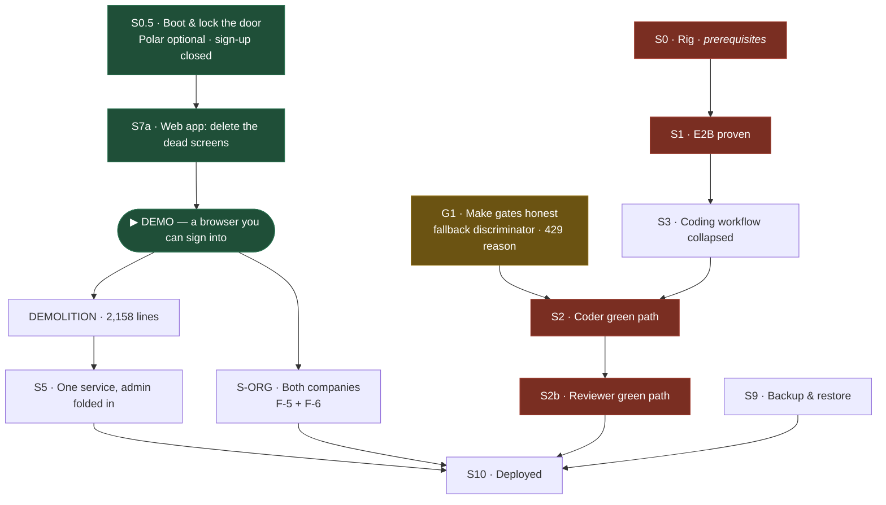

# Rebuild plan — one operator-managed instance

**Revision 3.** Written 2026-07-19 against ADRs 0020, 0021, 0024 and the grill report
`GRILL-REPORT-2026-07-19.md`. Supersedes revision 2 and `REBUILD-HANDOFF.md`.

**Revision 3 exists because the owner dropped multi-tenancy.** Confirmed directly on 2026-07-19:
one instance, one WhatsApp account, one process, one config. The two companies are different
**chats** and different **GitHub orgs** inside that single instance. Nothing is keyed by tenant.
The web app **stays** — it is how the operator signs in and operates (ADR 0024).

ADR 0022 (per-tenant sqlite) and ADR 0023 (tenants are rows) are **both retired** by this decision.
ADR 0022 was also factually unbuildable — see the grill report, Q3.

## The one rule

**Every stage gate is a real-world proof.** Real WhatsApp client, real GitHub, real E2B micro-VM,
real model. `pnpm test` stays a *merge* gate and is never a stage gate.

- **`tests/fixtures/speaker` is never admissible as a stage gate**, including with
  `SPEAKER_FIXTURE_LIVE_MODEL=true`. Real model, fake world.
- **Every gate must assert a negative.** The dominant failure mode is silent degradation. Each gate
  below names the thing that must *not* happen.
- **A gate must be re-runnable.** A ceremony performed once (pairing a phone) is a *prerequisite*.

### Two silent-degradation traps found by the grill — fix before any live gate is trusted

1. **The Reviewer fabricates a review on model silence.** `reviewer/workflow.ts:143-153` — if the
   model never calls `submit_review` (what a mid-run rate-limit looks like), it posts a real GitHub
   review anyway with `missingModelVerdict = true` and returns **non-error success**, shaped
   identically to a genuine COMMENT. Any gate asserting "a review exists" goes green on a run that
   reviewed nothing.
2. **No 429 handling exists anywhere.** `pi-subscription.ts:247-257` classifies only
   401/403/unauthorized/revoked; a 429 falls through to `request-failed`, indistinguishable from a
   network blip. Live gates run on one human's flat-rate subscription.

Both are fixed in **G1** below, which gates everything live.

---

## What is proven live

| Capability | Receipt |
|---|---|
| WhatsApp pairing, real send to the canary group, real provider ack | `smoke-battery.md` |
| Paired session surviving restart with no re-QR | `ambience-hard-cut-live.md` |
| Real GitHub webhook delivery, signature-verified, settled in the ledger | `github-webhook-live.md` |
| A real draft PR opened by `ambient-coder[bot]` | `behavior-battery.md` A4 |
| Issue lifecycle against real GitHub, self-cleaning and re-runnable | `tests/speaker/issue-management.live.test.ts` |

Not proven, despite earlier claims: **a review by the Reviewer workflow** (`behavior-battery.md:77`
— *"auth only; no behavior exists"*), and **live model inference** (the smoke `chatgpt` station is a
connectivity probe).

## What has never worked

- **The Coder green path.** Root cause known: `/tmp` is `noexec` on the rig, so spawning a binary
  from the temp dir fails `EACCES` (#172). The workspace-local `TMPDIR` fix is **restored and
  verified present** at `packages/installation/src/e2b-sandbox.ts:146,214` — verified as *present*,
  not as *working*; that needs S1.
- **The Reviewer workflow.** Zero receipts, and dead by configuration — `reviewRepositories`
  defaults to `[]` and the wizard never populates it.
- **E2B.** Zero live evidence.
- **Any deploy.** Nothing has ever run on the VPS.

## Blockers carried forward from revision 2

| | Finding | Evidence | Status |
|---|---|---|---|
| **F-3** | **The service will not boot with billing "disabled".** Three Polar vars are required; `createCustomerOnSignUp: true`; `getEntitlementSnapshot` catches **only 404**, so an unconfigured Polar returning 401 or refusing the connection **re-throws** — the wizard's 3s poll 500s rather than degrading. | `packages/env/src/server.ts:11-13`, `packages/auth/src/index.ts:41,78` | **live** |
| **F-4** | **Sign-up is open to the internet.** `useState(false)` renders the *sign-up* form first. Deploying to a public hostname hands an account to anyone. | `apps/web/src/app/login/page.tsx:9` | **live** |
| ~~F-1~~ | ~~Two tenants cannot run in one process~~ | — | **void** — no tenants |
| ~~F-2~~ | ~~The API contract has no tenant dimension~~ | — | **void** — no tenants |

## The new blocker revision 3 introduces

| | Finding | Evidence |
|---|---|---|
| **F-5** | **Two GitHub orgs cannot coexist.** `PRIMARY KEY(tenant_id, role)` allows exactly one installation per role. A second org's install does not add a row — the upsert **overwrites** it and deletes the first org's repositories. The local runtime is worse: `installationId` is a **scalar** per role, so one Octokit serves both companies and Org B returns 404. | `packages/db/src/schema/control-plane.ts:378`, `migrations/0000_melted_silver_sable.sql:152`, `packages/db/src/github-control.ts:430,434-442`, `packages/installation/src/schema.ts:100-105`, `apps/runtime/src/app.ts:122` |
| **F-6** | **GitHub events broadcast to every managed chat.** Company A's PR notifications land in Company B's thread. No per-chat repo scoping either — B's Speaker can file into A's repos and defaults to A's repo. | `packages/engine/src/github/ingress.ts:515-529`, `packages/agents/src/capabilities/issue-management/runtime.ts:15-31` |

F-5 and F-6 are what "multi-tenancy" turned into. They are strictly smaller than the tenant work —
no de-globalisation, no per-tenant durable state, no second phone — but they are not free, and
**F-6 is a confidentiality leak between the owner's two companies.**

---

# The DAG

**Critical path to something you can look at: `S0.5 → S7a → DEMO`.** Two stages. No E2B, no second
phone, no VPS, nothing from the owner.

**S-ORG is no longer on the demo path.** The demo is one company, one chat, one org.

---

# Stages

## S0.5 · Boot, and lock the door ✅ unblocked — **next**

Fixes F-3 and F-4. Make the three Polar vars optional and the plugin conditional; make
`getEntitlementSnapshot` return always-entitled when Polar is unconfigured **without calling it**;
close sign-up; seed one operator account.

**Gate:** the service starts with **no Polar credentials in the environment**. `curl` the admin
route with no session → **401**; with a session → 200. Registering a second account → **refused**.
**Negative:** an unauthenticated request must not reach an admin route, and the boot must not
succeed while silently retaining a live Polar call — assert `POLAR_ACCESS_TOKEN` unset *and* no
outbound request to `api.polar.sh` during a full wizard poll cycle.
**Receipt:** `docs/proof/operator-auth-live.md`. **Rollback:** revert; nothing else depends on it yet.

Full spec: `SPEC-S0.5-boot-and-lock.md`.

## S7a · Web app — delete the dead screens ✅ unblocked

Not a rewiring. With tenancy dropped there is **no `tenantId`, no tenant list, no switcher** — the
21 oRPC call sites keep their present signatures. This stage only deletes what has lost meaning:
the subscription stage (`onboarding.tsx:325-350`), the `preparing` stage (`:386-424`, and the
`ensureSetup` verb behind it), all **3** reconcile buttons (`onboarding.tsx:409-417`, `:748-756`,
`dashboard.tsx:646-660`), `runtime.restart` (`dashboard.tsx:414`), and the **9** `uncertain`
branches.

The bidirectional redirect (`onboarding.tsx:121-124` ↔ `dashboard.tsx:98-102`) **stays** — with one
instance it is correct behaviour, not a defect.

**Gate:** in a real browser, sign in and walk model auth → chat selection → GitHub config →
activate → `status='active'`, with Polar absent from the environment.
**Negative:** no screen renders a subscription, a reconcile control or an `uncertain` state; and
activating with a stale `basisFingerprint` is refused with a **visible** message.
**Prerequisite (ceremony, not a gate):** the account is paired once.
**Receipt:** `docs/proof/operator-demo-live.md`.

Full spec: `SPEC-S7a-web-app-demo.md`.

## G1 · Make the gates honest ✅ unblocked — **do before any live gate is trusted**

New in revision 3. Neither item is rebuild work; both are the difference between a gate that can
fail and a gate that cannot.

1. Add a discriminator to `ReviewerResult` so a caller can distinguish a real model verdict from the
   `missingModelVerdict` fallback (`reviewer/workflow.ts:143-153`). One field.
2. Split a `"rate-limited"` reason out of `request-failed` at `pi-subscription.ts:247` and add it to
   the union at `:84`. Live gates assert `reason !== "rate-limited"` → **INCONCLUSIVE**, never PASS
   and never FAIL — a rate-limited gate must stay re-runnable, not read as a regression.
3. Turn the `console.warn` + `return` paths that silently disable the Coder and Reviewer
   (`apps/runtime/src/app.ts:50-53,73-75`) into a **boot failure** unless an explicit opt-out is set.

**Gate:** merge-gate plus one drive — force a fabricated-review path and assert the discriminator
reports it; boot with the Coder unprovisioned and assert the process **exits non-zero**.
**Negative:** the process must **not** boot green with a specialist absent.

## S-ORG · Both companies in one instance ⚠️ new, replaces S4/S6/S8

Fixes F-5 and F-6. Ordered smallest-first; items 1–3 are schema, 4 is the real work.

1. `PRIMARY KEY(tenant_id, role, installation_id)`; drop the redundant identity unique index
   (`control-plane.ts:378-379` + a migration; SQLite means a table rebuild).
2. Stop the destructive upsert and repository wipe on a second install
   (`packages/db/src/github-control.ts:430,434-442`).
3. Scope `github_repository_one_default_per_role` per installation, or drop the single-default
   concept (`control-plane.ts:409-411`).
4. **The real work.** The per-role credential becomes a *list* of `{installationId, privateKey}`,
   plus a repo-owner → installation resolver so the Octokit is chosen **per call**
   (`packages/installation/src/schema.ts:99-106`, `github-app-client.ts:16`, `app.ts:122`).
5. Per-chat repository scoping, and `defaultRepository` becomes per-chat
   (`issue-management/runtime.ts:15-31`, `app.ts:124-127`).
6. Return-address resolver: repo → chat, replacing `managedChats[0]`
   (`packages/installation/src/specialist-return.ts:13-17`).
7. Route GitHub events by repository owner instead of broadcasting to every chat
   (`packages/engine/src/github/ingress.ts:515-529`).

**Gate:** both companies' Apps installed on **two real orgs** at once; an issue in org A's repo and
an issue in org B's repo each produce a real reply in that company's own chat.
**Negative — this is the whole point of the stage:** an event from org A must **not** appear in
company B's thread, and company B's Speaker must be **refused** when it tries to file into an org A
repository. Assert both directions.
**Receipt:** `docs/proof/two-companies-live.md`.

## S0 · The rig — prerequisites only ⛔ owner

E2B key into Infisical then env. A throwaway repo with the three Apps installed — destructive writes
must not touch the production repo. Confirm whether the Apps are on both orgs. Document
`ISSUE_MANAGEMENT_SANDBOX_TOKEN` / `_REPOSITORY` in `.env.example`.
**Receipt:** `docs/proof/rig-2026.md`.

## S1 · E2B proven for real ⛔ blocked on the E2B key

A standalone script that boots a real sandbox and runs a real repo's install and test. Settles the
six assumptions guessed in `e2b-sandbox.ts`. **Must run `mount | grep /tmp` inside the VM and record
the flags** — a green run on an exec-mounted `/tmp` proves nothing about #172.
**Deliverable:** the `pnpm e2b:probe` harness, which does not exist.
**Gate:** exits 0 having run install+test in a real micro-VM; prints wall time and mount flags.
**Negative:** with `TMPDIR` forced to a `noexec` mount, the probe **fails**.
**Receipt:** `docs/proof/e2b-live.md`. **Fallback:** revert `bc93fb9`, or author a custom E2B
template. Budget for the latter.

## S3 · Coding workflow collapsed — before S2

Three model turns, a plain `openPullRequest()` call, PR title and body on the verifier receipt.
Touches nothing E2B-related. Landing it first means S2 debugs the never-green path **once**.
**Gate:** merge-gate only. S2 records the baseline.

## S2 · The Coder green path, once ⛔ blocked on S1, G1, throwaway repo

**Deliverable:** the `pnpm coder:live` harness — reuse the self-cleaning pattern in
`tests/speaker/issue-management.live.test.ts`.
**Gate:** `verdict === "PASS"` from the receipt **and** non-draft **and** a non-empty diff. Draft-ness
alone is insufficient — a legitimate `SKIP` also yields non-draft. Record turns, tokens, wall time,
and flake rate over ≥3 runs. **Assert `reason !== "rate-limited"` (G1) → INCONCLUSIVE.**
**Negative:** kill the process between a GitHub mutation and its settle, restart, and assert the
issue is **not** double-created — the only live proof of `uncertain-work`. Also: `kill -9` mid-run,
restart, assert the `interrupted` message reaches the thread and **no relaunch happened without a
user turn** (moved here from revision 2's S6; it was never a tenancy proof).

## S2b · The Reviewer green path ⛔ blocked on S2

The Reviewer is **dead by configuration**: `reviewRepositories` defaults to `[]` and the wizard never
populates it. One line in `applyGitHubConfiguration` derives it from the reviewer role's selected
repositories — the data is already there.

**Gate:** the PR the Coder opened in S2 receives a real review authored by `ambient-reviewer[bot]`
citing a real finding from the diff, **and the G1 discriminator confirms a genuine model verdict**.
**Negative (corrected in revision 3):** the APPROVE is attributed to `ambient-reviewer[bot]`, an
identity **distinct from the PR author** `ambient-coder[bot]`.

> Revision 2's negative — *"the Reviewer must refuse to self-approve a PR authored by the Coder
> App"* — **can never fire**. A different App is a different actor, so that is not self-approval and
> GitHub permits it; that is precisely what the three-App split is *for*. Testing ADR 0020's real
> claim requires deliberately pointing the Reviewer at the **Coder credential** and asserting a
> **422**. That is a configuration test, not a green-path test, and it is its own ticket.

**Receipt:** `docs/proof/reviewer-green-live.md`.

## Demolition — only after the replacement is proven

**2,158 source lines**, not the ~1,800 revision 2 estimated. The gap was
`packages/db/src/provisioner-control.ts` (457), whose sole importer is the provisioner.

| File | Lines |
|---|---|
| `apps/api/src/provisioner.ts` | 822 |
| `apps/api/src/provisioner-providers.ts` | 507 |
| `apps/api/src/provisioner-hosted.ts` | 133 |
| `apps/api/src/tenant-bridge.ts` | 128 |
| `apps/runtime/src/host/bridge-route.ts` | 111 |
| `packages/db/src/provisioner-control.ts` | 457 |
| **total** | **2,158** |

Plus **1,859 test lines** — 4,017 all in. The "reconciliation loop" is not a separate file; it is
`provisioner-hosted.ts:102-128`, already counted. `bridge-contract.ts` and `runtime-health.ts`
**survive** (13 non-test importers, including all of `apps/cli`).

**~397 lines of collateral rewrite, not deletion**, which revision 2 never named:
`coworker-hosted.ts:8` (171), `github-hosted.ts:9` (86), `apps/api/src/index.ts:19` (140) all import
`tenantBridge` and must be re-pointed in-process.

Also dies: Turso lifecycle, the setup/operate dual entries. Polar code is **retained but disabled**.
`apps/web`, `packages/auth` sign-in and the oRPC contract are **not** demolished.

> **Naming, to prevent a destructive grep.** Two unrelated `uncertain` concepts.
> `OperationStatus.uncertain` in `packages/api/src/coworker.ts` is provisioning state and dies here.
> `packages/installation/src/uncertain-work.ts` is operator-facing reconciliation for GitHub
> mutations whose outcome is unknown — **it stays**, and the smoke `backlog` station depends on it.

## S5 · One service, admin API folded in ✅ toolchain risk retired

`apps/runtime` and `apps/api` are both Hono. **Proven possible by spike** — a Flue root mounting the
real `auth.handler` and the real oRPC `RPCHandler` built and served correctly (grill report Q1). The
node target *externalizes* dependencies rather than bundling them, and the runtime already mounts
caller-owned Hono routes (`app.ts:167-180`).

**Keep the three injected interfaces** — `CoworkerRuntimeSource`, `CoworkerModelSource`,
`CoworkerLifecycleSource` — and implement them in-process. They are the one genuinely good seam in
this codebase.

Three wiring risks the spike surfaced:
1. `apps/api/src/index.ts:129-140` calls `serve()` itself — **delete** it, do not move it.
2. `apps/api/src/index.ts:101` is an `app.use("/*")` catch-all; mount it **before**
   `app.route("/", flue())` or `/agents/*` and `/runs/*` stop resolving.
3. `apps/runtime/src/setup-server.ts` is a **second** non-Flue entry with its own `serve()`. This
   stage must state which entry survives.

**Prerequisite:** re-point the three GitHub Apps' webhook URLs — the proven webhook path is mounted
on `apps/api` and this moves it.
**Gate:** one process serves health, the agent runtime and the admin API; **re-deliver a real GitHub
webhook and watch it settle in the ledger**.
**Negative:** the webhook is rejected when its signature is wrong.

## S9 · Backup and restore ✅ unblocked, do it early

Runnable locally against a Docker volume before the VPS is involved. ADR 0022's backup story was
"snapshot the volume" and no step created one. With one instance this is a single managed root.
**Gate:** destroy the volume, restore from backup, watch the instance come back with its session and
conversations intact.
**Negative:** a restore from a **truncated** archive must fail loudly, not boot half-populated.

## S10 · Deployed

One-service Dockerfile, supervision, rollback, the disk problem (19 GB free at 81%). Replaces
`DEPLOY-RUNBOOK.md`, which describes the architecture being deleted.
**Gate:** the instance is live on the VPS; `pnpm coder:live` passes **against the deployed service**.
**Negative:** **never run two replicas against one volume** — Flue's durability forbids it. Assert a
second replica against the same volume is refused, not silently corrupting.

---

# Standalone bugs found by the grill — not rebuild work

- **The ChatGPT apiKey never refreshes after boot.** `apps/runtime/src/app.ts:102` is the only call
  to `connectPiChatGptSubscription`; `pi-subscription.ts:300` captures the key once and freezes it at
  `:309`. Refresh machinery exists at `chatgpt-authentication.ts:511-548` and **nothing on the model
  path ever calls it again** — when the OAuth token expires the registration is stale until process
  restart. Bites any long-running instance. Own ticket.
- **ADR 0020's self-approval claim is untested.** Point the Reviewer at the Coder credential, assert
  a 422. Own ticket; a configuration test, not a green-path test.

# What could still sink this

- **The Coder green path may not be fixable.** The `TMPDIR` restoration is a strong hypothesis with a
  documented root cause, not a certainty. S1 is the measurement.
- **S-ORG item 4** (per-call installation resolution) is the largest single work item left and has no
  precedent in the tree.
- **F-6 is a live confidentiality leak** the moment a second company's chat is added. Do not add the
  second chat before S-ORG item 7.
- **Rate limits on one subscription** make live gates flaky; G1 makes them *legible*, not immune.

# What changed in revision 3

Multi-tenancy dropped by owner decision — S4, S6, S6b, S8 and the D-1 durable-state question all
deleted; F-1 and F-2 voided. ADRs 0022 and 0023 retired. F-5 and F-6 added: two GitHub orgs are
blocked by a primary key, and GitHub events currently broadcast to every managed chat. New stage
S-ORG replaces the tenant stages. New stage G1 makes gates capable of failing. S7 became S7a and
lost all `tenantId` work. S2b's negative assertion replaced — the old one could never fire. Two
proofs moved from S6 to S2 where their subject lives. S5's toolchain risk retired by spike.
Demolition corrected from ~1,800 to 2,158 source lines plus ~397 of collateral rewrite. Two
standalone bugs split out.
