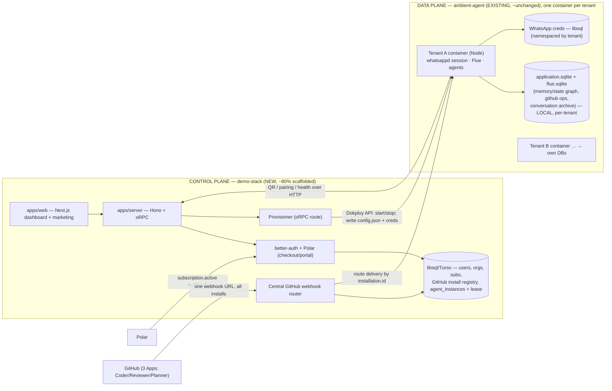

# Ambient Agent → SaaS: MVP Plan (ratified decisions)

**Status:** ratified brainstorm, ready for `/wayfinder`.
**Date:** 2026-07-18. **Branch:** `worktree-saas`. **Boilerplate:** `demo-stack/` (in-repo).

Turn the self-hosted WhatsApp+GitHub ambient agent into a multi-tenant SaaS.
Users sign up, pay (Polar), install our GitHub App on their repos, pair a
WhatsApp number, choose which chats the agent may operate in, and bring their
own model credentials. It should feel like **hiring a coworker**, not
self-hosting a bot.

---

## The shape: two planes, never merged

**Control plane = the SaaS** (demo-stack). **Data plane = the agent runtime**
(ambient-agent), one process/container per tenant. Both are Hono, both Node —
but they are **separate deployables** that talk only over: libsql (control
state), the Dokploy API (lifecycle), and a thin HTTP bridge (QR/health/config).
No code merge.

---

## Ratified decisions

### 1. Process-per-tenant, NOT in-process multi-tenant
Each tenant gets one long-lived agent container. This is not a compromise —
it is what `whatsappd` (our own package) is designed for. Its README:
*"Process-per-account is a feature, not a limitation … (An in-process
multi-account supervisor used to live here; it was removed)."* We already built
and killed the in-process version.

### 2. The long-lived BYO-number process works — verified in compiled code
Read `whatsappd@0.2.1/dist/adapter-*.mjs`, not just the docs:
- `supervise()` is a real reconnect loop: `runOnce()` opens the socket and
  pumps events; on drop it re-enters the `while`, waits the exponential backoff
  (`backoffDelay = min(max, base·2^attempt)`, 1s→30s), applies `retry_due`, and
  re-dials. Transient drops never bubble up.
- Only two terminal sinks stop it: `logged_out` (401/440/connection_replaced/
  pairing_rejected — **store is wiped**) and `suspended` (403/411/500).
- Restart resumes from persisted creds with **no re-pair** (existing creds →
  straight to `online`; QR only fires when creds are absent).
- **BYO-number is orthogonal to all of this**: pairing is a one-time QR scan;
  who owns the number changes nothing about the runtime.

### 3. Single-owner invariant (hard control-plane rule)
Two processes on the same account trigger `440 connection_replaced` → mapped to
`logged_out` → **creds store wiped**. The provisioner MUST guarantee exactly
one live container per tenant creds-store, ever. Enforce with a lease row in
the control-plane DB. Cheap to honor, catastrophic to violate.

### 4. One database technology: libsql/SQLite everywhere. No Postgres.
- **Why not Postgres:** the control-plane store is a handful of small related
  tables, one writer, tiny volume. SQLite/libsql does relational+joins fine;
  better-auth + Drizzle + Polar all support it. Postgres only earns its keep
  with multiple control-plane replicas — not an MVP concern. The boilerplate
  defaulted to PG from a template, not from the workload.
- **Done:** demo-stack swapped to `@libsql/client` + `drizzle-orm/libsql`
  (dialect `turso`), better-auth `provider: "sqlite"`, runtime → Node.
- **The count is not "3 databases":** per-tenant data-plane DBs are the
  *isolation model* (one DB per isolated container), not a tech choice. There
  is exactly ONE new store — the control plane.

### 5. Data-plane DBs stay per-tenant and LOCAL — do not consolidate
Never pull the per-tenant `application.sqlite`/`flue.sqlite` into one shared
store. That would collapse per-tenant isolation and force rewriting every
`node:sqlite` store to a network DB. Keep them local; they ship and die with
the container.

### 6. Memory/state graph stays in per-tenant application.sqlite
The milestone-7 graph (`graph_entities`/`relations`/`identities`,
`graph/store.ts:8`) is cross-**agent** (Scribe/Speaker/Coder/Reviewer/Planner
within one tenant), never cross-**tenant**. It lives as tables inside
`application.sqlite` (wired at `app.ts:59-90`). Stays put.

### 7. Bring-your-own model credentials, per user
The runtime already uses per-install ChatGPT OAuth (`model.provider:
"openai-codex"`, `credential: "chatgpt-oauth"`, stored at
`credentials/chatgpt-oauth.json`, `paths.ts:89`). This IS the BYO economics we
want ($20/mo from us + their subsidized subscription). Reuse it: onboarding
captures the user's ChatGPT OAuth (or their own API key) via the dashboard and
writes it into their tenant creds. We never hold a shared model key.

### 8. BYO WhatsApp number for MVP; managed numbers = separate V2
"No phone number" necessarily means WE provision WhatsApp-registerable numbers —
an ops pipeline (SIM/eSIM inventory, ban rotation), ban-prone, ToS-risky, NOT a
weekend feature. MVP: tenant brings a dedicated number, pairs once via QR in the
dashboard ("your coworker gets its own line"). **Managed-number provisioning is
its own future wayfinder.** (Commercial Baileys is a WhatsApp ToS violation
regardless — numbers can be banned; this is accepted operational reality.)

### 9. GitHub: control plane owns the install lifecycle + webhook routing
GitHub Apps are structurally web-centric — can't be "kept separate":
- **Install** is a web redirect (`installation_id` comes back to a URL) → needs
  the control plane's web surface.
- **One App = one webhook URL for all installations.** Deliveries currently hit
  the agent's Flue endpoint (`handleGitHubDelivery`, `ingress-runtime.ts:34`);
  with N tenants, a central receiver must read `installation.id` and route to
  the right tenant's container.

So: install registry (tenant ↔ installationId ↔ `allowedRepositories`) lives in
the **control-plane libsql**; a **central webhook router** in demo-stack routes
by `installation.id`. The agent barely changes — it already mints tokens via
`createAppAuth` (`github-app-client.ts`) and ingests deliveries via
`handleGitHubDelivery`; it just consumes the installationId and *routed*
deliveries. Reuse the 3 already-provisioned Apps (creds at
`~/ambient-agent-apps/apps.json`).

---

## Work breakdown

### Data-plane (ambient-agent) changes — all small, seam-supported
1. **Data-root env override.** `paths.ts:52` hardcodes `~/.ambient-agent`;
   generalize to an env-set root (WHATSAPP_STORE_DIR already overridable).
2. **QR + model-OAuth capture over HTTP.** Currently stdout only
   (`whatsapp-runtime.ts:247-253`); expose so the dashboard renders the QR and
   polls pairing/health status.
3. **WhatsApp creds via `libsqlStore`.** Inject through the existing
   `sessionFactory` seam (`whatsapp-account.ts:72,119`); `libsqlStore({ url,
   authToken, account })` namespaces creds per tenant in one Turso DB.
4. **Control-plane-written config.** managedChats, github installationId, repos
   written into the tenant store before container start (already file-based).
5. **Consume routed GitHub deliveries** instead of the raw webhook front door.

### Control-plane (demo-stack) net-new
1. **Schema:** `tenant` / `agent_instances` + single-owner **lease** (on top of
   the better-auth + Polar tables already there).
2. **Provisioner oRPC route:** on Polar `subscription.active` → write tenant
   config/creds → call **Dokploy API** to start the container (idempotent,
   honors the lease).
3. **GitHub:** App install callback (store installationId + repos) + **central
   webhook router** (route by installation.id to tenant container).
4. **Dashboard flows:** pair WhatsApp (QR + status), pick managed chats, connect
   model creds, install GitHub App + pick repos, subscription state.
5. **Turso hosting:** self-host on Dokploy or Turso cloud (Neon already removed).

### Infra steps (Cloudflare + Dokploy + Polar)
Cloudflare domain → `app.` / `api.` subdomains → Dokploy (control-plane app +
per-tenant agent container template + libsql/Turso) → Polar product + webhook →
3 GitHub Apps get public install URLs.

---

## Open questions for the wayfinder to grill
1. **managedChats selection UX:** dashboard lists the tenant's actual WhatsApp
   groups to tick (needs the agent to enumerate + report groups — more code) vs
   the cheap MVP ("add the agent to a group → it registers as pending → approve
   in dashboard"). Leaning cheap for the weekend.
2. **Webhook delivery mechanism:** control plane POSTs to the tenant container's
   HTTP endpoint vs writes to the tenant's libsql/queue the agent drains. (Push
   is simpler if containers are addressable on the Dokploy network.)
3. **Turso topology:** one Turso DB with per-tenant namespaces vs a DB per
   tenant vs local libsql files on volumes.

## Explicitly deferred (V2, separate wayfinders)
- Managed WhatsApp number provisioning + ban-rotation pipeline.
- Pooled / in-process multi-tenant runtime (only if container-per-tenant cost
  ever bites — it won't at MVP scale).
