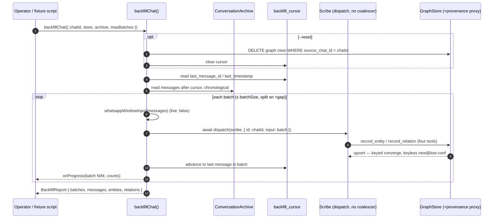

# Spec: Scribe backfill — replay a chat's history into the graph (#175)

**Status:** design spike, ready for ratification. No product code written.
**Source ticket:** [#175](https://github.com/AaronAbuUsama/ambient-agent/issues/175).
**Derives from:** MEMORY-STATE-SPEC §4 (the Scribe), §4 D4 (resolution policy), §11
(the parked consolidation "fog").

---

## 1. The problem, in code

The Scribe only ever sees **live** traffic. It is offered inputs at the funnel,
after the Speaker's receipt, detached:

```ts
// packages/agents/src/speaker/dispatch.ts:21-29
export const dispatchSpeaker = async ({ id, input }) => {
  const enriched = attachGraphContext(input);
  const receipt = await dispatch(speaker, { id, input: enriched });
  speakerActivity.accepted(receipt, enriched);
  scribeCoalescer.offer({ id, input }); // Scribe — debounced + detached
  return receipt;
};
```

Everything the chat said **before** the Scribe was watching is already sitting in
the Conversation Archive (`conversation_messages`, `conversation-archive.ts:136-150`)
— but it never reaches the extraction path. A freshly-connected chat therefore has
an empty slice of the graph even though its whole history is on disk.

**Backfill** closes that gap: read a chat's archived history and drive it through the
**same four ontology tools** (`graph/tools.ts:62-169`) the Scribe already uses —
deterministic, re-runnable, no Speaker, no coalescer, no live traffic. This is the
payoff of the memory system and, per #175's DoD, the fixture source that un-skips the
`SCRIBE_FIXTURE_READY` eval battery (`graph-extraction.eval.ts:38`).

### What it touches (blast radius)

Backfill is **purely additive and read-mostly**:

- **Reads** `conversation_messages` via `ConversationArchive.readThread` /
  a new chronological reader (`conversation-archive.ts:261-271`).
- **Writes** only through the existing `GraphStore` upsert path
  (`graph/store.ts:258-369`) — the same code the live Scribe writes through.
- Both databases are the **same file**, `application.sqlite`
  (`installation/src/paths.ts:91`, `apps/server/src/app.ts:93`,
  `conversation-archive.ts:113`) — the graph and the archive already coexist.
- It **does not touch** the funnel, the Speaker, the coalescer, or any live dispatch.
  It bypasses `scribeCoalescer` entirely (§4.2) and calls `dispatch(scribe, …)`
  directly.

Nothing live changes. The only new surface is one function + one thin CLI wrapper.

---

## 2. Ratified shape (recommendations)

### 2.1 Invocation — a one-shot function, with a thin CLI wrapper (NOT a workflow)

**Options graded:**

| Option | Floor-first | Reversibility | Blast radius | Fit |
|---|---|---|---|---|
| **`defineWorkflow`** | ✗ implies a Speaker launch-tool + durable run-ledger it will never use | med | med | ✗ workflows are chat-triggered Specialist jobs (`coder/workflow.ts:171`); backfill is offline & operator-driven |
| **exported one-shot fn** `backfillChat()` | ✓ the real engine, callable by CLI + eval | ✓ delete one file | tiny | ✓ |
| **CLI subcommand only** | ✓ but logic trapped in the CLI, not reusable by the fixture builder | ✓ | small | partial |

**Recommendation:** a **one-shot exported function** is the engine; a **thin CLI
subcommand** is a ~15-line wrapper over it. Not a workflow.

```ts
// packages/agents/src/scribe/backfill.ts  (NEW — the engine)
export interface BackfillOptions {
  readonly chatId: string;
  readonly store: GraphStore;
  readonly archive: ConversationArchive;
  readonly batchSize?: number;       // default 50 (matches the live cap)
  readonly gapBoundaryMs?: number;   // default 6h — a long silence ends an episode
  readonly maxBatches?: number;      // cost cap; undefined = whole history
  readonly onProgress?: (p: BackfillProgress) => void;
  readonly dispatchBatch?: DispatchScribeBatch; // injected for tests
}
export const backfillChat = (opts: BackfillOptions): Promise<BackfillReport> => { /* §3 */ };
```

The CLI wrapper mirrors the existing command pattern
(`apps/cli/src/program.ts:206-234`), opening the two adapters from `managedPaths`:

```
ambient-agent backfill <chatId> [--reset] [--max-batches N] [--batch-size N]
```

It targets **one chat** by design (deterministic, inspectable, resumable). "All
chats" is a trivial outer loop over the archive's distinct `chat_id`s, deferred
until an operator actually wants it (YAGNI).

### 2.2 Batching — contiguous count, split on time-gap

The live coalescer batches on **wall-clock quiet periods** (30s / 3min / 50,
`scribe/config.ts:10-14`) because it is racing arrival. Backfill has the whole
history at rest, so wall-clock windows are meaningless — a 200-message thread would
collapse into one giant turn.

**Recommendation:** walk `conversation_messages` in **chronological order** and cut a
new extraction batch when **either**:

1. the batch reaches **`batchSize`** messages (default **50**, matching the live
   `cap` so batch shape stays comparable to live turns), **or**
2. the gap to the next message exceeds **`gapBoundaryMs`** (default **6h**) — a long
   silence is a natural conversation boundary, so episodes don't bleed together.

Count is a cheap, deterministic proxy for the real bound (token budget). A token
ceiling is the honest upgrade knob — flagged as a `ponytail:` ceiling in the code,
added only if 50-message batches measurably blow the context window.

Each batch is composed into a **`whatsapp.window` input** — the exact shape the live
Scribe reads — via `whatsappWindowInput` (`inputs.ts:178-186`), mapping each
`ProjectedConversationMessage` (`conversation-archive.ts:8-17`) to a window message
(`id`, `chatId`, `from = senderId`, `text`, `timestamp`, `fromMe` from `direction`,
`live: false`). No new input type; the Scribe cannot tell a backfilled window from a
live one.

### 2.3 Ordering & provenance

- **Order:** strictly chronological by `(timestamp_ms, message_id)` — the archive's
  natural index (`conversation-archive.ts:148-149`). Determinism falls out of this
  plus a fixed batch cut and a temperature-pinned model.
- **Provenance:** every graph row already carries `source_chat_id` /
  `source_message_id` (`graph/store.ts:127-129, 157`), but provenance is a
  **model-supplied, optional** tool argument (`schemas.ts:32-38`) — nothing forces
  the Scribe to stamp it, and it does not reliably today.

  **Recommendation:** wrap the `GraphStore` passed into the backfill with a ~15-line
  proxy that **defaults `provenance.chatId` to the chat being backfilled** whenever
  the model omits it. `chatId` is safe to default (the whole run is one chat) and is
  exactly what the reset/scoping in §2.4 needs. `messageId` stays model-supplied (only
  the model knows which message a fact came from). See open question Q1.

### 2.4 Idempotency — checkpoint cursor + optional scoped reset

Re-running must **converge, not duplicate**. The two entity classes behave differently
(`SKILL.md:12-16`, §4 D4):

- **Keyed** (person, agent, thread, GitHub objects) converge for free: a natural key
  in `graph_identities` means re-recording updates in place and *raises* confidence
  via noisy-OR (`graph/store.ts:182, 264-296`). Re-run is a no-op-plus-confidence.
- **Keyless** (topic, commitment) have no key. Same exact phrasing reuses a node;
  otherwise the Scribe writes a **new** node at reduced confidence
  (`SKILL.md:15`). A re-run *can* duplicate.

**Recommendation — two mechanisms, both cheap:**

1. **Resume cursor (the common case).** Persist a one-row-per-chat checkpoint —
   `scribe_backfill_cursor(chat_id PK, last_message_id, last_timestamp, updated_at)`,
   one new table beside the graph — advanced after each committed batch. A resumed or
   repeated run **skips already-processed messages**, so it writes nothing new and
   cannot duplicate. This is idempotency for the everyday "run it again / it crashed
   halfway" path.

2. **`--reset` (authoritative rebuild).** Before replaying from zero, delete the
   chat's graph slice by provenance: `DELETE FROM graph_relations/graph_entities
   WHERE source_chat_id = ?` (needs §2.3's provenance stamping). Then a single
   deterministic replay produces no cross-run duplicates.

**The residual keyless duplication *within* one replay** — batch 2 says "the launch
plan", batch 9 says "launch planning" → two topic nodes — is the **known fog**, and
§4 D4 + §11 already rule that it is resolved **later, by consolidation**, not at write
time. Backfill inherits that ruling; it does **not** ship a consolidation pass (§2.7).

### 2.5 Cost & scale

A long chat is many batches × one LLM extraction call each. Bounds:

- **`--max-batches N`** — hard cap on LLM calls per run; resume the rest later.
- **Resume cursor** (§2.4) — crash/interrupt continues where it stopped; no re-spend.
- **Progress reporting** — `onProgress({ batch, totalBatches, messagesProcessed,
  entitiesWritten, relationsWritten })`, derived from store-count deltas around each
  batch; the CLI prints `batch N/M`.
- **Sequential, awaited** dispatch (§4.2) bounds concurrency to 1 — a backfill cannot
  stampede the credential.

### 2.6 Fixture output — un-skip `SCRIBE_FIXTURE_READY`

The battery skips today because the fixture app (`tests/fixtures/speaker/src/agents/`)
ships **only** `speaker` + `rubric-judge` — **no scribe agent and no graph store
behind `getGraphStore()`** (verified: `tests/fixtures/speaker/src/db.ts` is a bare
sqlite handle, no graph wiring). The eval header names exactly this gap
(`graph-extraction.eval.ts:8-12`).

**Recommendation — backfill is the fixture *source* in two committed artifacts:**

1. Commit a **small curated seed archive** (a synthetic ~40-message thread exercising
   the ratified policy: liberal `mentions`, conservative `discusses`, force-line vs
   hedged commitments, an ownerless promise, a GitHub-anchored auto-close — the exact
   scenarios the eval asserts, `graph-extraction.eval.ts:41-68`).
2. A `pnpm backfill:fixture` script replays it via `backfillChat` and **snapshots**
   (i) the resulting graph slice as the seed store the eval wires behind
   `getGraphStore()`, and (ii) the per-batch `input → toolCalls` transcripts, which
   become the faux-model scenarios the fixture `scribe` agent replays.
3. Add the `scribe` agent to the fixture app and set `SCRIBE_FIXTURE_READY=true`.

Step 3 (wiring the fixture app's scribe agent + faux model) is **small harness work
adjacent to backfill, not delivered by backfill alone** — called out honestly here.
See open question Q2.

### 2.7 Consolidation — deferred, per §11

Backfill will produce keyless duplicates (the fog). §11 explicitly parks
keyless-entity consolidation as "deliberately unbuilt until honest-recording proves
insufficient." **This spec defers it too.** Backfill's job is faithful replay;
convergence of keyed types + the resume cursor + `--reset` cover idempotency, and
confidence carries the keyless ambiguity exactly as the live path intends. Building a
consolidation pass now would be solving a problem the spec says to leave parked.

---

## 3. A backfill run, in sequence



---

## 4. Design notes grounded in the code

### 4.1 Reuse, don't rebuild

- **Batch → input:** `whatsappWindowInput` (`inputs.ts:178-186`) already parses a
  window into the Scribe's input; backfill only maps archive rows into its message
  shape. No new input type (`input.ts:14-22` `scribe.batch` stays live-only, or is
  reused verbatim — either works; the window path is closer to live parity).
- **Extraction:** unchanged. The Scribe agent (`scribe/agent.ts:13-25`) and its skill
  (`graph-extraction/SKILL.md`) are the extraction path; backfill just feeds it.
- **Write + converge:** unchanged. `GraphStore.upsertEntity/upsertRelation`
  (`graph/store.ts:258-369`) already carry keyed convergence and noisy-OR confidence.

### 4.2 Bypass the coalescer

The live coalescer exists to collapse N serialized admissions into one turn for cost
(`scribe/coalescer.ts:2-14`) and is **best-effort, detached, never awaited**
(`coalescer.ts:90-98`). Backfill wants the opposite: **deterministic, awaited,
back-pressured** batching that it controls. So it calls
`dispatch(scribe, { id, input })` directly — the same call the coalescer's
`defaultDispatchBatch` makes (`coalescer.ts:44-45`) — and never touches
`scribeCoalescer`. Its own batching (§2.2) replaces the debounce entirely.

### 4.3 `live: false` is safe here

`IncomingMessage.live = false` marks history-backfill messages that the *WhatsApp
coalescer* filters out upstream (`coalescer/events.ts:36`). Backfill never goes
through that coalescer — it reads the archive and dispatches the Scribe directly — so
setting `live: false` on replayed window messages is honest metadata, not a filter
that would drop them.

---

## 5. Definition of done

- [ ] `backfillChat()` replays a chat's `conversation_messages` chronologically through
      the Scribe's four tools; graph populated with entities/relations/identities/
      commitments from history.
- [ ] Deterministic given a fixed model + seed archive (chronological order, fixed
      batch cut).
- [ ] Idempotent: resume cursor skips processed messages; `--reset` rebuilds cleanly;
      keyed types converge (verified by re-run leaving entity count flat, confidence up).
- [ ] Provenance: replayed graph rows carry `source_chat_id` (defaulted) and, where the
      model supplies it, `source_message_id`.
- [ ] Bounded: `--max-batches`, resume-from-checkpoint, progress reporting.
- [ ] CLI subcommand `ambient-agent backfill <chatId>` over `application.sqlite`.
- [ ] One runnable check: replay a tiny in-memory archive → assert expected entities/
      relations + a second run leaves counts flat (idempotency).
- [ ] Fixture: seed archive + `backfill:fixture` snapshot committed; fixture `scribe`
      agent wired; `SCRIBE_FIXTURE_READY` flips the battery green
      (`graph-extraction.eval.ts:38`).

## 6. Deferred (explicitly out of scope)

- **Keyless consolidation / the "fog" pass** — §11, stays parked.
- **Token-budget batching** — count + gap ships now; token ceiling is the upgrade knob.
- **All-chats bulk backfill** — trivial outer loop, added when an operator needs it.
- **GitHub-event replay** — the archive holds WhatsApp messages; replaying historical
  GitHub webhooks (issue/PR opened) is a separate source and a separate spike.

---

## 7. Open questions for Aaron

**Q1 — Provenance stamping.** Accept the ~15-line store proxy that defaults
`provenance.chatId` to the backfilled chat (recommended — gives `--reset` a scope and
fixtures a stable `source_chat_id`), or keep strict live-parity where provenance is
whatever the model emits (lower fidelity, no reliable reset scope)?

**Q2 — Fixture ownership.** Does un-skipping `SCRIBE_FIXTURE_READY` belong in #175
(backfill delivers the seed archive **and** wires the fixture `scribe` agent + faux
model), or does #175 deliver only the backfill engine + seed-archive snapshot and a
sibling eval-harness ticket owns the fixture-app wiring? The eval header frames the
fixture wiring as separately "deferred (eval-harness work)"
(`graph-extraction.eval.ts:10-12`), which suggests a seam.
