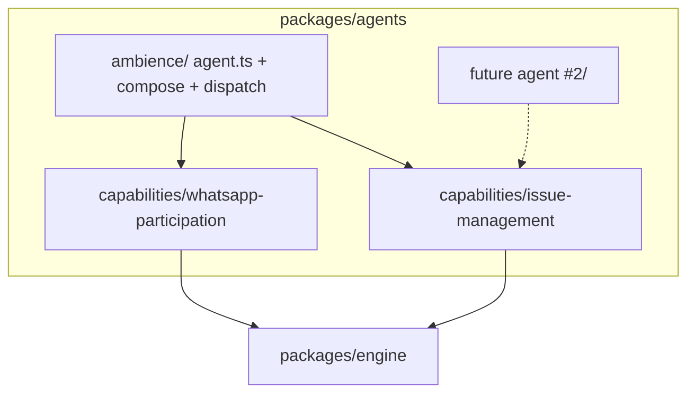

# Spec: skills/capabilities become shared across agents

**Status:** Phase 1 IMPLEMENTED 2026-07-17 (commit 3f3fe42 on `feat/117-monorepo-split`,
pushed): move + all reference sites + capabilities→agent import ban, full suite green
(377 passed), boundary rule tripwire-verified. Phase 2 (agent-neutral wording) still open.
**Supersedes:** the #131 nesting of capability bundles inside `ambience/` ("one folder per
agent... layered domain skills" — that part of #131's recorded design is overturned; the rest
of #131 stands). Also corrects the same-day "skills stay inside each agent" note in
`LEGACY-AUDIT-2026-07-17.md` — Aaron explicitly rejected that reading: *"skills can be shared
across agents."*
**Sequencing:** land AFTER the in-flight `station` → `installation` rename PR. One PR, tiny
commits, every commit green (same delivery convention as #131).

## Intent

Agents remain self-contained identities — each agent folder owns who it is (`agent.ts`
instructions, model, composition, dispatch, observers). But the capability bundles
(SKILL.md + tools + ports + runtime) are product-level, reusable units: agent #2 must be able
to mount `issue-management` without reaching inside `ambience/`. Today both bundles live at
`packages/agents/src/ambience/skills/`, which makes them look agent-private and forces every
external consumer (installation, server, test-support, tests) to import through one agent's
namespace.

This matches the ratified glossary (`CONTEXT.md:15-16`): **Capability** — "a cohesive kind of
work the Ambient Agent can perform... the canonical way the product grows." A **Skill**
(`CONTEXT.md:61`) is only the policy packet *inside* a capability. The shared directory is
therefore named `capabilities/`, not `skills/` — the bundle is the capability; its SKILL.md is
the skill.

## Target structure

```
packages/agents/src/
├── capabilities/                      # shared across agents; agent-agnostic
│   ├── issue-management/
│   │   ├── SKILL.md, references/
│   │   ├── tools.ts, runtime.ts, issue-repository.ts
│   └── whatsapp-participation/
│       ├── SKILL.md, references/
│       ├── tools.ts, whatsapp-port.ts
├── ambience/                          # the agent: identity + composition only
│   ├── agent.ts                       # skills: [...], tools: [...] ← imports ../capabilities/*
│   ├── compose.ts, dispatch.ts, observer.ts, activity-reporter.ts
└── flue-skill.d.ts
```



**New invariant (enforced, see § Boundary test):** `capabilities/**` never imports from an
agent folder (`ambience/**` or any sibling). Arrows point agent → capability → engine, only.

## Phase 1 — pure move (behaviour identical, evals must not move)

No string, prose, or logic changes. Every commit green.

1. `git mv packages/agents/src/ambience/skills packages/agents/src/capabilities`
2. Internal imports inside `packages/agents`:
   - `src/ambience/agent.ts` — 4 imports `./skills/...` → `../capabilities/...`
   - `src/ambience/compose.ts` — 4 imports (`issue-repository.ts`, `runtime.ts`,
     `whatsapp-port.ts` ×2) → `../capabilities/...`
   - Capability-internal relative imports (`./issue-repository.ts` etc.) unchanged.
3. Export map `packages/agents/package.json:13-15` — 3 entries:
   `./ambience/skills/<cap>/<file>` → `./capabilities/<cap>/<file>` (path AND specifier).
4. Package-name importers (5 files):
   - `packages/installation/src/uncertain-work.ts:14`
   - `packages/installation/src/issue-operation-footer.ts:1`
   - `packages/installation/src/github-issue-repository.ts:11`
   - `apps/server/src/app.ts:6`
   - `apps/server/src/host/whatsapp-runtime.ts:13`
   All become `@ambient-agent/agents/capabilities/<cap>/<file>`.
5. Relative white-box importers (test-support + tests + fixture):
   - `packages/test-support/src/fake-whatsapp-host.ts:6`
   - `packages/test-support/src/fake-issue-repository.ts:11-12`
   - `packages/test-support/src/evals/rubric-judges.ts:8-9` (readFileSync URLs)
   - `tests/fixtures/ambience/src/app.ts:15,17`
   - `tests/ambience/dispatch.test.ts:10,14`
   - `tests/ambience/participation.test.ts:10,12` + string paths `:40,84,85`
   - `tests/ambience/issue-management.test.ts:13,18,19` + string path `:953`
   - `tests/ambience/issue-management.live.test.ts:7-8`
   - `tests/ambience/whatsapp-runtime.test.ts:34`
6. `.fallowrc.json` — no change needed for this move (capabilities are reached via imports);
   land the separate validated config fix from `LEGACY-AUDIT-2026-07-17.md` independently.

### Boundary test (same commit as the move)

`tests/ambience/hard-cut.test.ts` already enforces package arrows (`:98-106`); add one
directory-level rule inside `packages/agents/src`:

- files under `src/capabilities/` must not import `../ambience/` (generally: `../<agent>/`) —
  regex over `sourceFiles("packages/agents/src/capabilities")`, same technique as the
  existing package rules.

This is the invariant that makes "shared" true rather than aspirational.

### Verification gate

- `pnpm test` (includes hard-cut) green per commit.
- Eval battery at the #113 baseline, unchanged — Phase 1 moves no prompt-visible text
  (SKILL.md content, tool descriptions, instructions all byte-identical), so any eval movement
  is a bug in the move.

## Phase 2 — agent-neutral wording (behaviour-adjacent, eval-gated, separate PR)

The capabilities currently name Ambience in prompt-visible text, which contradicts
"shared" and would leak one agent's identity into another's prompts:

- `capabilities/whatsapp-participation/tools.ts:45` — outbound sender label `"Ambience"`
- `tools.ts:53,66,78,92` — tool descriptions: "...the WhatsApp chat bound to this Ambience
  instance"
- `whatsapp-port.ts:51` — error: "The WhatsApp Participation port is not configured for
  Ambience."
- Both SKILL.md files + references/ — Ambience-voiced prose throughout.

Because tool descriptions and SKILL.md feed the model, rewording is a behaviour change and
must ride the eval battery, not the move. Options when we get there: neutral wording ("this
agent's bound chat") or injecting the agent's display name the way `createWhatsAppParticipationTools(id)`
already injects the chat binding. **Deferred; do not fold into Phase 1.**

## Explicitly out of scope

- A separate `packages/capabilities` package — rejected in
  `PACKAGE-TAXONOMY-HANDOFF.md`: no consumer needs one capability without the other, no
  dynamic loading; directory-level sharing is the real seam today.
- Package-per-capability — same reasoning, stronger.
- Activity-reporter placement (`ambience/activity-reporter.ts`) — separate question parked in
  `LEGACY-AUDIT-2026-07-17.md`; unaffected by this move.
- Export-surface curation beyond the 3 renamed entries — the wildcard-exports cleanup is its
  own pass (already noted out-of-scope in the taxonomy handoff).

## Definition of done

- Tree matches **Target structure**; `ambience/` contains only identity + composition files.
- All 30 reference sites above updated; repo-wide grep for `ambience/skills` returns nothing.
- New capabilities→agent boundary rule in hard-cut passes and fails-if-violated
  (verify by temporarily adding a bad import).
- Evals at #113 baseline; `pnpm test` green.
- CONTEXT.md needs no edit (the glossary already describes this shape); #131's recorded
  "layered domain skills inside the agent" note is superseded by this spec.
