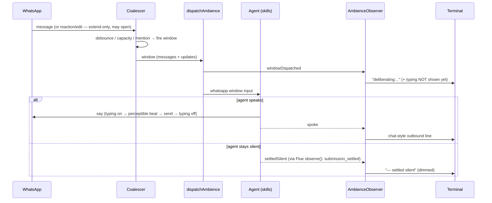
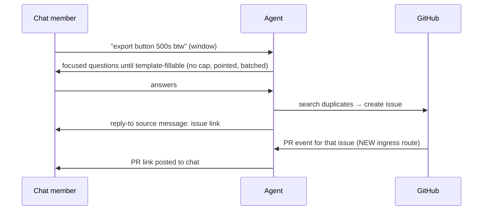

# Tightening-pass spec (2026-07-16)

The master spec for the ambient-agent tightening pass. Synthesized from the completed
wayfinder map ([MAP.md](wayfinder/MAP.md), all 8 decision tickets resolved with Aaron
in-session) and the ratified [participation rubric](PARTICIPATION-RUBRIC.md). This
document is the shared-context block: **the master GitHub issue and every child issue
carry this narrative, the end-state description, and the diagrams below** — no bare
title+acceptance-criteria tickets.

## Problem Statement

The agent is live (one managed WhatsApp chat, wired to one GitHub repo) and works —
but we can't *see* it working, can't *measure* whether its judgment is right, and
can't *restructure* it safely:

- **No evals.** "We have no evals, we don't know how any of this is working" — the top
  complaint. The agent answers more than expected and nothing measures that.
- **Invisible operation.** The default console shows no chat traffic; the agent's
  replies are never logged anywhere; deliberate silence is indistinguishable from a
  hang; the typing indicator doesn't visibly work.
- **A restructure is queued behind this.** The target is a monorepo split
  (`packages/{core,cli,server,test-support}`) so a future frontend can consume core —
  but cutting packages without a regression harness is how live behavior quietly breaks.
- **Accumulated over-engineering.** ~600 lines of dead/duplicated code identified by
  two independent audit passes.

## Solution (the two-liner)

Ship the measuring stick first, then restructure against it: build the eval battery
that grades the live agent's judgment against a ratified participation rubric, make its
operation visible on the terminal, land the small mechanical cleanups and the two
ratified features (reactions, richer windows) — and only when evals are green, cut the
monorepo.

## End state

When this pass is done:

- `pnpm evals` runs two suites: **deterministic mechanics** (faux model, exact asserts
  over the real coalescer→window→tools pipeline) and **live judgment** (real model,
  real prompt, LLM-judge scorers grading transcripts against the same skill text the
  agent reads, rates tracked in Braintrust). "Answers more than expected" is a number.
- The default terminal reads like a chat: inbound and outbound message text as
  chat-style lines, deliberations and deliberate-silence visible
  (`— settled silent`), protocol noise dimmed. ADR 0016 amended accordingly.
- The agent behaves per the ratified rubric — teammate, not bot: silent on chatter,
  always answers when addressed (briefly honest when it has nothing), elicits until a
  report is template-fillable, replies with the issue link, posts the PR link when the
  fix lands, reacts and quote-replies like a person.
- Windows carry everything: reactions/edits/revocations flow through the coalescer
  (extend-only; may open a window) and render in the agent's window input.
- Policy lives in layered skill bundles: a main ambience skill (identity + WhatsApp
  behavior) with domain skills beneath it (issue-management first). Extension = adding
  a skill bundle, never rewiring the agent.
- The repo is four packages — `core` (composeAmbience + agents + capabilities +
  coalescer), `cli`, `server`, `test-support` — with core importing nothing internal,
  cli ⊥ server, and one `ambient-agent smoke` command proving the live pipeline
  end-to-end via a canary group.
- ~600 lines of dead/duplicated code are gone (both projection tables, the legacy
  ATTACH cutover, env loaders, the D6–D13 batch).

## Architecture (end state)

```mermaid
graph TB
  subgraph core ["packages/core"]
    compose[composeAmbience adapters-in, Hono-out]
    agent[ambience agent]
    subgraph skills ["skill bundles (policy)"]
      mainskill[main ambience skill: identity + WhatsApp behavior]
      issueskill[issue-management bundle: templates, labels, lifecycle]
    end
    coal[coalescer: message|update union windows]
    obs[AmbienceObserver: windowDispatched/spoke/settledSilent/settledFailed]
    tools[tools: say+replyTo, react, whatsapp_read/search, github_*]
  end
  subgraph server ["packages/server"]
    http[HTTP app: /health + flue routes]
    ingress[GitHub ingress: issue + PR events]
  end
  subgraph cli ["packages/cli"]
    cmds[init/auth/config/repair/start/status/doctor/smoke]
    console[chat-visible console]
  end
  subgraph ts ["packages/test-support"]
    fakes[fake hosts + fixture app]
    harness[eval harness: prompt | window input]
  end
  agent --> skills
  agent --> tools
  coal --> agent
  obs --> console
  ingress --> agent
  compose --> http
  harness --> compose
  cmds --> compose
```

## Key flows (sequence)

**A window's life, with the observer (W-observer, W-windows-everything):**



**Capture is a conversation (rubric axis 3 + W-pr-ingress):**



## User Stories

1. As the operator, I want the default terminal to show inbound and outbound chat text as chat-style lines, so that I can watch the agent converse without `--debug`.
2. As the operator, I want deliberate silence to render as a dimmed settled-silent line, so that "chose not to answer" is distinguishable from "hung".
3. As the operator, I want one `smoke` command with per-station pass/fail, so that I can verify every promised path after any deploy in seconds.
4. As the operator, I want the smoke battery to send a `SMOKE <nonce>` canary into a dedicated group and assert it settles silent, so that the live pipeline is proven end-to-end.
5. As a chat member, I want the agent silent during casual conversation, so that the group doesn't feel surveilled or spammed.
6. As a chat member, I want the agent to always respond when I address it directly — briefly and honestly even when it has nothing — so that it behaves like a teammate, not a broken bot.
7. As a chat member, I want unaddressed room questions answered only when the agent can cite a retrievable fact, so that it never pads the chat with generic opinions.
8. As a chat member reporting a bug, I want the agent to ask focused questions until it can file a proper report, so that thin tickets never reach the repo.
9. As a chat member, I want the filed issue linked back in a threaded reply to my report, so that I know capture happened and where to follow it.
10. As a chat member, I want the PR link posted when a fix lands for an issue captured from our chat, so that the loop closes where it started.
11. As a chat member, I want the agent to react (👍 etc.) and quote-reply to specific messages, so that its participation reads like a person's.
12. As a chat member, I want each concern in a busy window answered as its own threaded message, so that replies never arrive as a bot digest.
13. As the agent, I want reactions/edits/revocations delivered inside my window input, so that my deliberations see everything that happened, not just message text.
14. As the developer, I want deterministic eval suites asserting pipeline mechanics through the real coalescer path, so that restructuring can't silently break message flow.
15. As the developer, I want live LLM-judged suites grading transcripts against the skill text with rates tracked in Braintrust, so that judgment regressions are numbers, not vibes.
16. As the developer, I want the eval harness to accept window input through the fixture's real coalescer endpoint, so that evals exercise debounce/admission/rendering, not a hand-formatted string.
17. As the developer, I want all participation policy in layered skill bundles, so that tuning behavior is prompt engineering with a measurable feedback loop, never a code change.
18. As the developer, I want one `composeAmbience(adapters)` composition root shared by production and fixture, so that tests can never drift from the wired production machine.
19. As the developer, I want the four module-level `let` singletons normalized to the Symbol.for pattern, so that the CLI and server bundles can never see different state.
20. As the developer, I want the dead code gone (projection tables, ATTACH cutover, env loaders, D6–D13), so that the split moves less mass.
21. As a future frontend developer, I want core exposed as a package with an observer event feed, so that a UI can consume the agent without touching CLI or server internals.
22. As the developer, I want the monorepo cut gated on green evals, so that the restructure provably changed structure and not behavior.

## Implementation Decisions

All decisions below were ratified in the wayfinder session (per-ticket detail and
rejected alternatives live in the linked wayfinder tickets).

- **Skill layering** — tools are code; ALL policy is markdown skills; skills are
  layered bundles (Flue PackagedSkillDirectory): main ambience skill (identity +
  rubric axes) + issue-management domain bundle (elicitation, linking, lifecycle;
  technical references like label taxonomies as bundle files). Extension = new bundle.
- **Rubric** — six ratified axes ([PARTICIPATION-RUBRIC.md](PARTICIPATION-RUBRIC.md));
  two speech categories: conversational interjection (default silence) vs task
  workflow speech (always allowed).
- **Evals** — harness gains an additive window-input variant that drives the fixture's
  real coalescer endpoint and polls admission; deterministic suites assert mechanics
  on the faux responder; live suites judge against the skill text; Braintrust installed
  via the official Flue blueprint; evals-green is the hard gate on the package cut.
- **Observer** — a named AmbienceObserver seam (windowDispatched / spoke /
  settledSilent / settledFailed) adapting Flue's observe() lifecycle events, correlated
  by dispatchId; consumed by the console now, a frontend later. Implementation starts
  from the existing semantic-terminal-reporter branch, aligned to this seam.
- **Typing** — wraps sends only (dispatch-spanning rejected); the send-side indicator
  becomes perceptible (a beat between typing-on and send inside the say port).
- **Console** — chat-visible by default, both directions, at info level; protocol noise
  dimmed/debug; amends ADR 0016's "message text is logged at debug level only" clause.
- **Windows carry everything** — the coalescer event type widens to a message|update
  union; reaction/edit/revocation participate extend-only (never immediate-fire, never
  count toward capacity, MAY open a cold window); receipts excluded; window input
  renders updates alongside messages.
- **Outbound surface** — say gains optional replyTo (transport-native quote); react is
  a sibling tool (messageId + free-form emoji, no remove in v1); outbound @mentions
  deferred.
- **PR ingress** — GitHub ingress routes PR events for captured issues back to the
  originating chat as a new ambience input kind, enabling the posted-PR-link behavior.
- **Composition** — composeAmbience(adapters): issue repository, operation store,
  policy, ingress settings + dispatch, optional participation port, optional health
  probes in; Hono app out. Coalescer wiring stays in the WhatsApp host (production)
  and the fixture (tests) until the cut.
- **Storage** — both reaction/receipt projection tables delete; the journal remains the
  source of truth (ADR 0008). Deletion path (PR-review finding): the installation
  diagnostics require these tables as core schema and reject unknown tables, so the
  tables first move to the optional-schema catalogue (the existing readable-until-
  migration pattern), projection stops, and a one-way migration with a schema-version
  bump drops them — keeping `status`/`doctor` green on upgraded installs. The legacy
  ATTACH cutover and the three env-config loaders delete together (they interlock);
  the in-place status-vocabulary migration stays.
- **Bundle-safety** — the four unsafe module-level lets normalize to the existing
  Symbol.for-on-globalThis pattern.
- **Split** — packages/{core,cli,server,test-support}; core imports nothing internal;
  cli ⊥ server; dispatch and agents stay together in core.
- **Untouchables** (ratified, do not revisit): operation-store health states
  (ADR 0004), coalescer Effect seams, installation-inspection paranoia, the globalThis
  defer handshake.

## Testing Decisions

Tests assert external behavior at the highest existing seams; the pass adds exactly
two new seams, both ratified:

1. **The fixture HTTP boundary** (existing, highest) — `/test/coalescer`,
   `/test/admission`, `/test/whatsapp/events`, `/test/github/operations`. Evals and
   integration tests drive the whole machine through it; the harness window variant
   extends the eval side onto the same seam. Prior art: the persisted-ambience
   integration suite and the existing eval files.
2. **AmbienceObserver** (new) — deterministic tests fake the observer to assert
   windowDispatched/spoke/settledSilent ordering; the smoke battery asserts
   settledSilent live. Prior art: the semantic-terminal-reporter branch's reporter
   tests.
3. **composeAmbience** (new) — the fixture consuming it IS the test that production
   wiring and test wiring cannot drift.

Deterministic suites test mechanics only (exact asserts, faux responder, TestClock
where the coalescer is involved — never weaken those seams). Live suites test judgment
only (LLM-judge criteria quoting the rubric axes; thresholds/rates, not exact asserts).
Deletion tickets ship with their test deletions; behavior-preserving refactors
(program.ts split, composeAmbience) must not change any existing test's assertions.

## Out of Scope

- The frontend itself (core merely becomes consumable).
- Outbound @mentions; remove-reaction; media send tools.
- Multi-repo / multi-chat routing beyond today's one-repo→one-chat wiring.
- Any change to the untouchables listed above.
- Upstream whatsappd/Flue changes (the observer adapts what observe() already emits).

## Further Notes

- Ticket graph and per-ticket rationale: [T8 — the ratified DAG](wayfinder/tickets/T8-dag-ratification.md);
  decisions index: [MAP.md](wayfinder/MAP.md).
- Filing requirements: master + every child issue self-contained — this spec's
  narrative, end-state, and diagrams included or inlined, plus per-ticket
  problem/blast-radius/blocking-edges. Blocking edges use GitHub's native relationships.
- Live rig: code-factory (tmux validate-88), full authority; how-to in
  [TIGHTENING-PASS-HANDOFF.md](TIGHTENING-PASS-HANDOFF.md).
