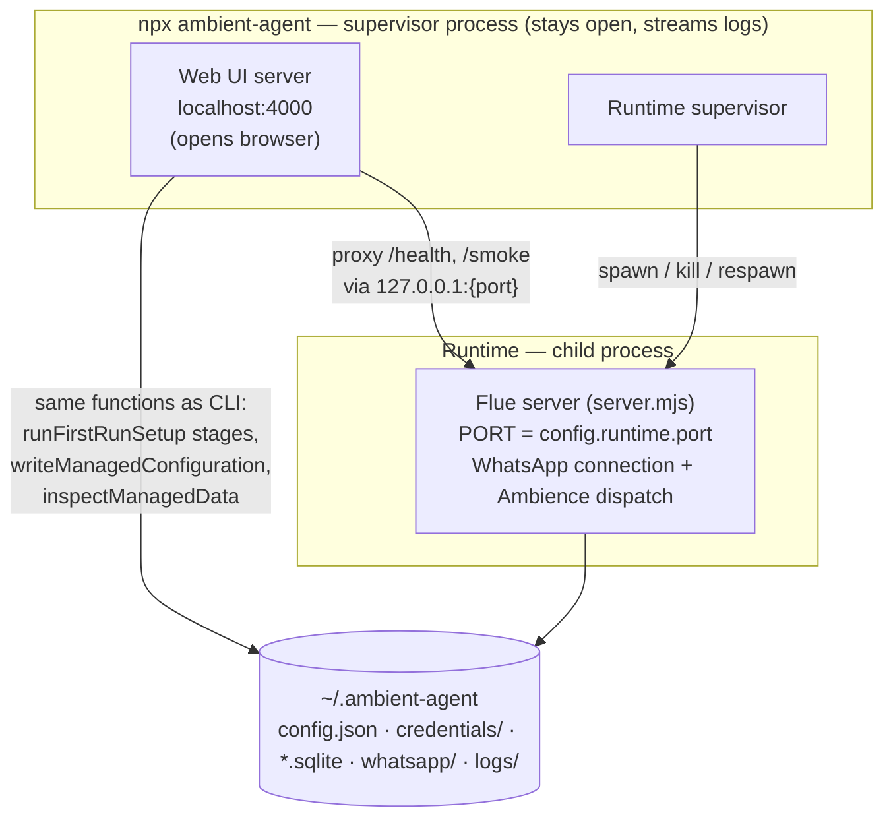
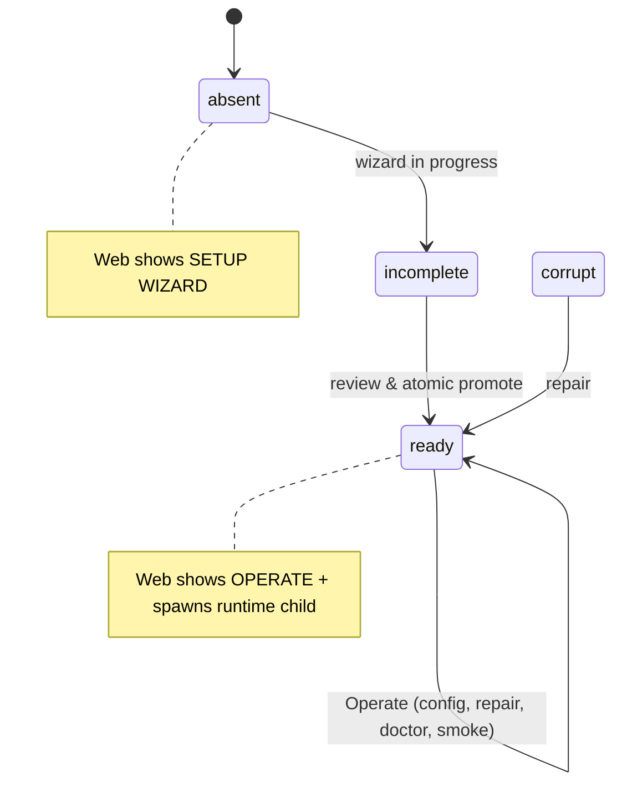
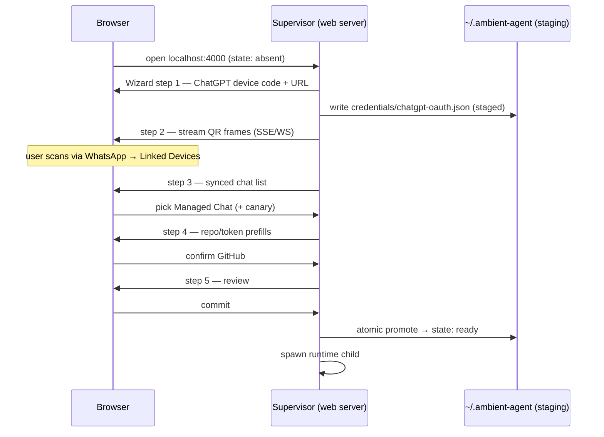

# Web App — Information Architecture

**Status:** Ratified 2026-07-17 (Aaron). Structure only — no implementation started.

## What this is

A web application for setting up and configuring Ambient Agent — a second head on the
same body the CLI uses. There is no "CLI vs web app" split: `npx ambient-agent` boots one
supervisor process that serves the web UI, supervises the runtime, and streams logs to the
terminal. The web page is the face; the terminal process is the host.

The old subcommands (`init`, `config`, `doctor`, `start`, …) remain for scripting and
headless use. The bare invocation — which today auto-selects a subcommand at
`apps/cli/src/program.ts:599-624` — becomes "boot the whole thing and open the browser."

## Ratified decisions

| Decision | Choice |
|---|---|
| Process model | One supervisor process (`npx ambient-agent`) = web server + runtime supervisor. Not routes on the runtime server (can't serve `init` — no server exists yet — or `repair` — server must be stopped, `program.ts:445-450`). Not a remote app + daemon (YAGNI). |
| v1 scope | Setup Wizard **and** Operate surface. Every screen is a thin skin over an existing CLI command. |
| Runtime lifecycle | Owned by the supervisor. The UI can stop/start/restart the runtime. |

## Process topology

The supervisor decides what to show from the installation state machine
(`InstallationState = absent | incomplete | corrupt | ready`,
`packages/installation/src/installation.ts:42,415`):

## The IA

Two modes keyed on `InstallationState`, not a nav-first structure.

### Mode 1 — Setup Wizard (state: absent/incomplete)

Linear, mirrors `runFirstRunSetup` (`packages/installation/src/first-run.ts:200-291`).
All stages run inside the existing filesystem setup lock (`installation.ts:393`) and stage
into a temp root, promoted atomically at the end (`installPreparedManagedData`,
`installation.ts:581`).

| Step | Screen | Backing code |
|---|---|---|
| 1 | **Model auth** — ChatGPT device-code OAuth: show user code + verification URL, poll for completion | `first-run.ts:207-215`, `chatgpt-authentication.ts` |
| 2 | **WhatsApp pairing** — live QR streamed to the page (QR rotates), or import an existing store | `first-run.ts:217-239`, `installation/src/qr.ts` |
| 3 | **Managed chat** — pick from the synced chat list; optional canary group | `first-run.ts:240-253` (`selectChat`) |
| 4 | **GitHub** — repo (prefilled from `git remote origin`) + token (prefilled from `gh auth token` / env), verified live via Octokit | `first-run.ts:147-198`, `setup/github.ts:35-102` |
| 5 | **Review & commit** — confirmation, then atomic promote | `first-run.ts:268-288` |

### Mode 2 — Operate (state: ready)

Sidebar nav. Every screen maps 1:1 to an existing CLI command — no new domain concepts,
no new config shape.

| Screen | Contents | Backing code / feed |
|---|---|---|
| **Overview** | Installation state, component checks, runtime health + WhatsApp phase, **runtime control (running / stopped / restart)** | `status --json`, `doctor --json`, `GET /health` (`apps/server/src/app.ts:49-57`), supervisor child state |
| **Chats** | `managedChats` list, add/remove, set canary group | `config --chat / --canary-chat` (`program.ts:282-420`) |
| **GitHub** | `defaultRepository`, `allowedRepositories`, token rotate | `config --repository / --github-token-file` |
| **Model** | ChatGPT credential status, re-auth | `auth` (`program.ts:259-280`) |
| **Repair** | WhatsApp re-pair: supervisor stops runtime child, stages fresh pairing (QR again), verifies managed chat visible, promotes, respawns runtime | `repair whatsapp` (`program.ts:422-490`) |
| **Doctor** | Component diagnostics; uncertain-mutation resolution (retry / abandon / accept-observed) | `doctor --retry/--abandon/--accept-observed` (`program.ts:559-597`), `uncertain-work.ts` |
| **Smoke** | Trigger live canary, show stage results | `POST /smoke` HMAC-gated (`apps/server/src/host/smoke-route.ts:16-55`) |

## The one real refactor

Today `start` imports the server bundle **in-process** and never returns
(`apps/cli/src/lifecycle.ts:33-81`, import at `:64`), and the WhatsApp host calls
`process.exit` on terminal logged-out (`apps/server/src/host/whatsapp-runtime.ts:277-288`).
A supervisor cannot survive either. The runtime therefore moves to a **child process**
(`spawn(node, [server.mjs])`) the supervisor can kill and respawn — needed for repair
(runtime must be stopped) and for applying config changes (port, chats). The
`ManagedRuntimeDependencies` handoff currently rides a `globalThis` symbol across bundles
(`apps/cli/src/runtime-dependencies.ts:22-32`); as a child process this becomes env/argv +
the existing file-based config, which the server path already knows how to read.

Everything else reuses `packages/installation` as-is: same valibot schemas
(`schema.ts:21-72`), same atomic writer (`writeManagedConfiguration`,
`configuration.ts:63-91`), same lock, same inspectors.

## Deliberately not in v1

- Logs viewer (terminal streams them; `logs/` dir exists for later)
- Conversation-archive / inbox / window browser
- Capability management
- GitHub App installation (deferred per ADR 0012 — personal token only)
- Remote/hosted access, auth, multi-tenant — the app binds localhost on the
  installation machine, full stop

Each is addable later as an Operate tab without touching the IA skeleton.
