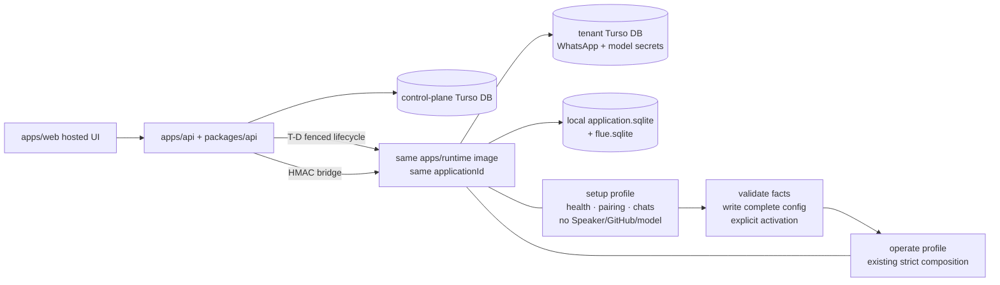

# T-G · Hosted SaaS onboarding + operate state machine

**Issue:** [#187](https://github.com/AaronAbuUsama/ambient-agent/issues/187), part of [map #165](https://github.com/AaronAbuUsama/ambient-agent/issues/165)<br>
**Artifact status:** decision-ready product/IA prototype; no production UI or API implementation<br>
**Recommendation:** **Guided setup → explicit activation → operate dashboard**, backed by an independent capability ledger and the same tenant container in `setup` or `operate` mode.

## Run the prototype

From the repository root:

```bash
node docs/planning/wayfinder/t-g-hosted-saas-state-machine/validate.mjs
python3 -m http.server 4173 --directory docs/planning/wayfinder/t-g-hosted-saas-state-machine
```

Then open <http://127.0.0.1:4173>. The wireframe is intentionally standalone under `docs/`; it is not a route in `apps/web` and does not create a second product or supervisor.

The executable contract lives in [`model.mjs`](./t-g-hosted-saas-state-machine/model.mjs). It is the exhaustive source for every screen's persisted state, owning operation, tenant bridge call, error/retry behavior, visible state, and underlying ticket.

## The problem, in the current code

The imported SaaS shell already supplies the right account/billing/control-plane floor. The dashboard authenticates, reads Polar customer state, and uses the protected oRPC client:

```tsx
// apps/web/src/app/dashboard/page.tsx:8-32
const session = await authClient.getSession(/* ... */);
if (!session?.user) redirect("/login");
const { data: customerState } = await authClient.customer.state(/* ... */);
return <Dashboard session={session} customerState={customerState} />;

// apps/web/src/app/dashboard/dashboard.tsx:26-31
const privateData = useQuery(orpc.privateData.queryOptions());
const hasProSubscription = (customerState?.activeSubscriptions?.length ?? 0) > 0;
```

The control API is deliberately still a scaffold; all hosted coworker operations are net-new behind the existing authenticated procedure:

```ts
// packages/api/src/routers/index.ts:5-15
export const appRouter = {
  healthCheck: publicProcedure.handler(() => "OK"),
  privateData: protectedProcedure.handler(({ context }) => ({
    message: "This is private",
    user: context.session?.user,
  })),
};
```

The full runtime cannot be used as its own onboarding process. `ManagedConfig` requires a non-empty Managed Chat set and non-empty GitHub repository set before boot:

```ts
// packages/installation/src/schema.ts:26-44
v.strictObject({
  schemaVersion: v.literal(1),
  managedChats: v.pipe(v.array(ManagedChat), v.nonEmpty()),
  model: v.strictObject({ /* required provider + credential */ }),
  github: v.strictObject({
    /* required GitHub App credential */
    allowedRepositories: v.pipe(v.array(Repository), v.nonEmpty()),
  }),
})
```

Full app composition then connects the model and GitHub client before it starts WhatsApp with the frozen Managed Chat set:

```ts
// apps/runtime/src/app.ts:52-60, 74-87, 114-120
const subscription = await connectPiChatGptSubscription({ authentication });
const app = composeSpeaker({
  issues: createOctokitIssueRepository(githubAppClient(githubCredential)),
  policy: createIssueManagementPolicy(
    configuration.github.defaultRepository,
    configuration.github.allowedRepositories,
  ),
  ingress: { settings: { managedChats: configuration.managedChats } },
});

startWhatsAppRuntime({ managedChats: configuration.managedChats, /* ... */ });
```

But the selected JIDs can only come from an already authenticated WhatsApp account:

```ts
// packages/installation/src/whatsapp-account.ts:331-351
synchronizedChats: async (signal) => {
  if (authenticated === undefined) {
    throw new WhatsAppAccountError(
      "not_authenticated",
      "Authenticate WhatsApp before discovering chats.",
    );
  }
  await waitForInitialSync(signal);
  return [...chats.values()].map(/* real group/direct candidates */);
}
```

The lower runtime seam already preserves the integrity boundary we need: it creates one WhatsApp account and explicitly stays fail-closed when there is no Managed Chat target.

```ts
// apps/runtime/src/host/whatsapp-runtime.ts:217-245
const gate = makeManagedChatGate(options.managedChats);
const account = createWhatsAppAccount(/* ... */);
if (!gate.hasTarget) {
  yield* Effect.logWarning(
    "No managed WhatsApp chat is configured; ingress remains fail-closed.",
  );
}
yield* Effect.promise(() => account.authenticate({ onPairing: /* ... */ }));
```

That makes the bootstrap loop concrete:

```text
full operate boot needs Managed Chats + GitHub + model
Managed Chat IDs need paired WhatsApp
paired WhatsApp needs one live tenant process
```

Weakening `ManagedConfig` or fabricating placeholder chats/repositories would punch through the fail-closed boundary. Moving pairing into `apps/api` would pool tenant WhatsApp sessions in the control plane. Both are rejected.

## Architecture held constant for every flow option

Use one tenant image, one Dokploy `applicationId`, one tenant credential database, and two mutually exclusive boot profiles:

```ts
type TenantRuntimeBoot =
  | {
      mode: "setup";
      runtimeId: string;
      tenantDb: ScopedTenantDb;
      bridgeSecret: SecretRef;
    }
  | {
      mode: "operate";
      runtimeId: string;
      tenantDb: ScopedTenantDb;
      bridgeSecret: SecretRef;
      config: ManagedConfig;
    };
```



`setup` is not a supervisor, second app, or second process. It is a narrow composition inside the same tenant runtime. It mounts unauthenticated `GET /health` plus HMAC-authenticated `GET /pairing` and `GET /chats`, using the tenant's one WhatsApp credential store. Managed Chat ingress remains fail-closed and the Speaker/GitHub/model composition does not start.

Activation validates the capability facts transactionally, renders the first complete `ManagedConfig`, and restarts the same leased Dokploy service into `operate`. The existing strict schema remains unchanged.

## Persisted state machine

The control plane persists independent authorities, not a wizard cursor as truth:

```ts
type CoworkerSnapshot = {
  subscription: "inactive" | "active" | "past_due" | "canceled";
  tenant: "onboarding" | "active" | "suspended" | "archived";
  instance: {
    desiredMode: "stopped" | "setup" | "operate";
    observed: "absent" | "provisioning" | "starting" | "healthy" | "degraded" | "stopped" | "failed" | "uncertain";
    configRevision: number;
    appliedRevision?: number;
  };
  model: "missing" | "validating" | "ready" | "invalid" | "revoked";
  whatsapp: "unpaired" | "pairing" | "paired" | "online" | "re_pair_required" | "failed";
  managedChats: "pending" | "selected";
  github: "uninstalled" | "installed" | "repositories_selected" | "revoked" | "failed";
  deliveryRoute: "pending" | "ready" | "degraded";
  nextAction: HostedStep; // derived presentation only
  readiness: "onboarding" | "healthy" | "degraded" | "suspended"; // derived
};
```

Control-plane rows hold subscription entitlement, tenant, agent instance, lease/fencing token, sanitized capability status, selected Managed Chats, GitHub installations/repositories, config revisions, and durable operation receipts. WhatsApp and model secrets live only in the per-tenant Turso DB per T-B [#167](https://github.com/AaronAbuUsama/ambient-agent/issues/167)/[#182](https://github.com/AaronAbuUsama/ambient-agent/issues/182). `application.sqlite` and `flue.sqlite` remain local to the tenant runtime.

The QR/pairing code is an expiring response, never a control-plane row, log field, or unauthenticated health field.

The recommended happy-path transitions are:

```text
account
  → active subscription
  → tenant draft
  → setup profile healthy
  → model ready
  → WhatsApp online
  → ≥1 Managed Chat selected
  → GitHub installation + repositories selected
  → revision-bound activation
  → operate health observed
```

An operating coworker does not rewind onboarding when a capability degrades. The dashboard shows the named repair path. Subscription loss sets desired mode to `stopped` without deleting tenant credentials. WhatsApp re-pair temporarily re-enters the same setup profile and returns to `operate` after the previously selected Managed Chats are confirmed.

## Whole-diagonal screen contract

| Screen | Persisted control state | Owner | Tenant bridge | Visible failure/retry | Underlying ticket |
|---|---|---|---|---|---|
| Account | Better Auth `user` + `session` | existing `/api/auth/*` | — | Inline sign-in/up errors | #186; new auth/billing |
| Subscription | `subscription_entitlement.status`, replay-safe `last_event_id` | Better Auth/Polar checkout, state, webhook | — | Checkout canceled; webhook-confirming; past-due suspend | #186; new auth/billing |
| Coworker | `tenant=onboarding`, instance `desired_mode=stopped` | `coworker.create`, `coworker.snapshot` | — | Idempotent duplicate create; validation | #187; new control schema |
| Preparing | instance `desired_mode=setup`, observed lifecycle, lease, operation receipt | `coworker.ensureSetup`, operation reconciliation | `GET /health` | Lease busy; Dokploy/Turso failure; uncertain result; health timeout | #166, #167, #169; new setup profile |
| Model | sanitized model status/version; secret only in tenant DB | `coworker.model.beginAuth/completeAuth/verify` | — | Expired device code; invalid credential; tenant DB unavailable | #167, #182; new model capture |
| WhatsApp | pairing/online/re-pair status + observed timestamp; no challenge persisted | `coworker.whatsapp.pairing/retrySetup` | HMAC `GET /pairing`; `GET /health` | QR expiry; HMAC failure; `440`/logged-out; runtime unavailable | #171, #181, #182 |
| Managed Chats | selected JID rows + config revision | `coworker.chats.list/replace` | HMAC `GET /chats` | Sync pending; zero-selection reject; lost auth; later edits deferred | #170, #180, #179 |
| GitHub | App-role installation IDs, selected/default repos, delivery-route status | install URL, Hono callback, repo query/select | — during install; #168 decides delivery | State mismatch; canceled/zero grant; duplicate callback; revoked | #168; new callback/router |
| Activate | desired `operate`, config/applied revisions, activation receipt | `coworker.activation.review`, `coworker.activate` | `GET /health` after restart | Stale revision; config write fail; uncertain Dokploy result; health timeout | #169, #181; new orchestration |
| Operate | active/suspended tenant, last live observations, capability receipts; readiness derived | dashboard, restart, re-pair, credential replace, billing portal | health; pairing only during repair; #168 delivery | Capability-specific degraded card and idempotent repair | #168, #169; new operate dashboard |

The model file expands every cell into the exact states, operation names, retry rules, visible controls, and ticket links used by the prototype.

## Flow option 1 — Guided setup → operate (recommended)

The browser shows one current action and one safe retry. A dedicated onboarding route resumes at the first incomplete capability. The capability ledger—not `onboarding_projection`—guards activation. When healthy, those same facts collapse into the permanent operate dashboard.

```ts
type HostedOnboarding = {
  snapshot(tenantId?: string): Promise<CoworkerSnapshot>;
  advance(input: OnboardingInput): Promise<CoworkerSnapshot>;
  retry(operationId: string): Promise<CoworkerSnapshot>;
};
```

This hides the infrastructure best, provides the clearest BYO-number/model education, and maps cleanly to the old setup tasks without carrying over its rejected local-supervisor architecture. Independent facts keep schema, bridge, provisioner, GitHub, and UI work parallelizable.

## Flow option 2 — Parallel readiness board

After naming a coworker, Model, GitHub, and runtime setup appear as independent cards. Managed Chats remains blocked on WhatsApp pairing. A single explicit activation action appears when the predicate is satisfied.

```ts
type ReadinessBoard = {
  facets: Record<Capability, FacetState>;
  blockers: ReadonlyArray<[Capability, Capability]>;
  activationReady: boolean;
};
```

This exposes useful concurrency and is almost as safe, but it makes partial states, dependencies, and recovery visible to a user who is still learning what they hired. It is a strong later optimization if hosted setup time becomes material.

## Flow option 3 — Operate-first dashboard

There is no onboarding route. Signup lands directly on `/dashboard`; incomplete cards expand into setup actions and later collapse into status/repair cards.

```ts
type CoworkerConsole = {
  capabilities: Record<Capability, CapabilityState>;
  nextAction?: ConsoleAction;
  readiness: "onboarding" | "healthy" | "degraded";
};
```

This reuses the current dashboard shell most literally and makes every pixel floor-first. It also mixes first-run explanation, dependency gates, and daily operation on one surface. The state authority is still correct, but the interaction is easier to misuse or misread.

## Six-factor rubric

Scores are 1–5. For blast radius, **5 means smaller/safer**.

| Option | Floor-first | Reversibility | Blast radius | Correctness/integrity | Parallelizability | Existing fit | Total |
|---|---:|---:|---:|---:|---:|---:|---:|
| **Guided setup → operate** | **5** | **5** | **4** | **5** | **5** | **5** | **29/30** |
| Parallel readiness board | 5 | 5 | 4 | 5 | 5 | 4 | 28/30 |
| Operate-first dashboard | 4 | 5 | 4 | 4 | 4 | 5 | 26/30 |

The score difference is a presentation judgment, not an architecture fork. All three reuse the same capability ledger, setup profile, bridge, tenant secret boundary, strict operate config, and lease.

## Blast radius and implementation ownership

```text
apps/web
  hosted onboarding presentation + permanent operate dashboard

apps/api + packages/api
  authenticated coworker projection/mutations
  Polar state integration
  tenant bridge client
  GitHub install callback + delivery router

packages/db
  control-plane tenant, instance, lease, capability, selection,
  GitHub registry, config revision, operation receipt schema

apps/runtime
  one boot-profile dispatch before createAmbientAgentApp
  setup composition reusing one WhatsApp account
  #180/#181 bridge routes

unchanged integrity cores
  ManagedConfigSchema operate invariant
  fail-closed Managed Chat gate
  application.sqlite / flue.sqlite locality
  Speaker/Coalescer/Graph composition
```

## Concurrent T-C/T-D inputs

- **T-C [#168](https://github.com/AaronAbuUsama/ambient-agent/issues/168):** push vs pull changes only the delivery-route adapter and the GitHub card's operational status. Push adds HMAC `POST /deliveries` to the T-F bridge; pull adds a tenant drain/lag health fact. Installation, repository selection, and every onboarding step remain unchanged.
- **T-D [#169](https://github.com/AaronAbuUsama/ambient-agent/issues/169):** the UI names `provision_setup`, `activate`, `restart`, and `repair` operations plus `healthy/failed/uncertain` receipts. T-D owns the exact lease row/protocol and Dokploy reconciliation behind them. No UI action may blindly repeat a lifecycle mutation.

## Tickets to graduate after ratification

The implementation backlog should be filed as whole-diagonal tickets with native dependencies:

1. Control-plane tenant/subscription/instance/lease/capability/operation schema.
2. Hosted auth + billing entitlement projection and suspension/resume behavior.
3. Same-tenant runtime `setup` boot profile (the bootstrap-loop seam exposed above).
4. Hosted onboarding UI + API orchestration, including model credential capture.
5. Operate dashboard with health, billing, repair, and re-pair.
6. GitHub App install callback, repository registry, and T-C delivery router.
7. Provisioner integration using the ratified T-D lease/reconciliation protocol.
8. Cloudflare/Dokploy/Turso/Polar deployment and end-to-end tenant proof.

Existing build seams [#180](https://github.com/AaronAbuUsama/ambient-agent/issues/180), [#181](https://github.com/AaronAbuUsama/ambient-agent/issues/181), and [#182](https://github.com/AaronAbuUsama/ambient-agent/issues/182) remain inputs, not replacements for those whole-diagonal owners.

## Narrow ratification

**Ratify `Guided setup → explicit Activate Ambience → operate dashboard` as the hosted MVP presentation?**

This is the only remaining product choice in this prototype. The persisted capability ledger, same-container setup profile, strict operate config, T-B/T-E/T-F decisions, and T-C/T-D adapter boundaries remain the same whichever presentation is chosen.
