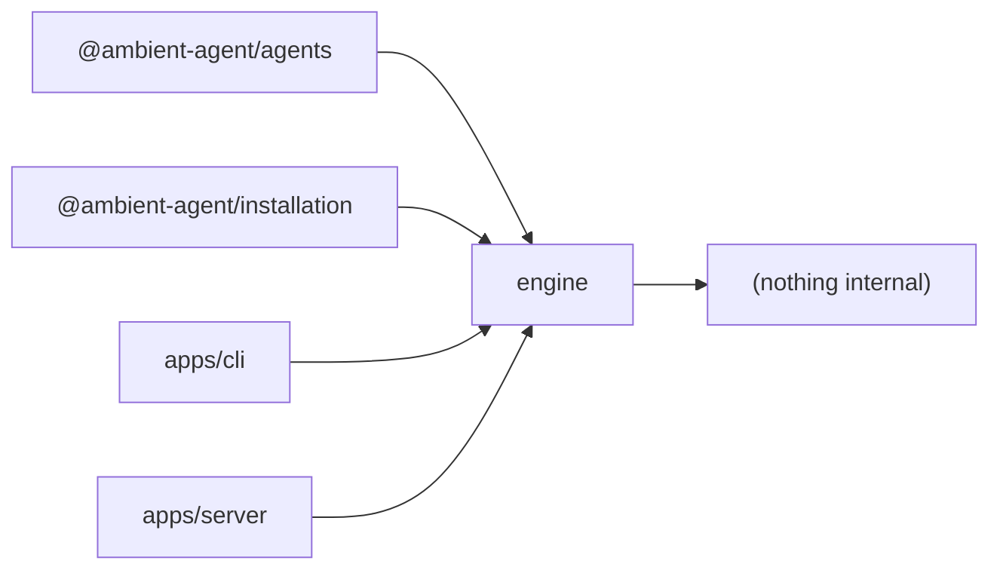

# @ambient-agent/engine

Agent-agnostic conversation machinery. The one package every arrow may point at — it
imports nothing internal (enforced by `tests/speaker/hard-cut.test.ts`).

If a thing is needed by *any* agent — not just Speaker — it belongs here. Precedent:
the issue operation store and the agent input contracts moved down here in #131.

## What it owns

| Concern | Exports | What's behind them |
|---|---|---|
| **Coalescer** | `coalescer/{coalescer,events,ports,config,chat-gate,whatsapp}.ts` | The Window timing pipeline: one actor fiber per `chatId`, throttle-with-settle-window flush (design: `docs/COALESCER-DESIGN.md`). Ports (`WindowDispatcher`, `WindowStore`, `EventSource`) are `Context.Service` seams with real second adapters in test-support. `chat-gate` holds the fail-closed Managed Chat policy. |
| **Intake** | `intake/{conversation-archive,conversation-event,managed-chat-inbox,admission-relay,database-versions}.ts` | The append-only Conversation Archive (SQLite), the Conversation Event union, the Managed Chat Inbox (admission bookkeeping), and `admitWindow` — one function hiding retry, settlement, and at-least-once semantics. |
| **GitHub ingress** | `github/{ingress,ingress-runtime,ingress-store,operation-store,repository}.ts` | Webhook delivery dedup/correlation and the Operation Identity store (`attempting → completed / uncertain / failed / abandoned`). |
| **Model glue** | `model/{chatgpt-authentication,pi-subscription}.ts` | ChatGPT OAuth credential store + device flow; the pi-ai subscription and `SPEAKER_MODEL_SPECIFIER`. |
| **Logging** | `logging/logging.ts` | The application-owned Pino root (ADR 0016): every runtime voice — Effect, whatsappd, Flue — routes through one logger. |
| **Inputs / shared** | `inputs.ts`, `shared/{errors,whatsapp-jid}.ts`, `braintrust.ts` | Valibot schemas for every agent input (the engine produces these contracts, so it owns them), error helpers, Braintrust tracing wiring. |

## Glossary terms implemented here

Coalescer, Window, Conversation Archive, Conversation Event, Managed Chat Inbox,
Admission, Operation Identity (see root `CONTEXT.md` for definitions).

## Dependency arrows

## Tested by

`tests/coalescer/`, `tests/intake/`, `tests/logging/`, and most of `tests/speaker/`.
The boundary rules live in `tests/speaker/hard-cut.test.ts`.
